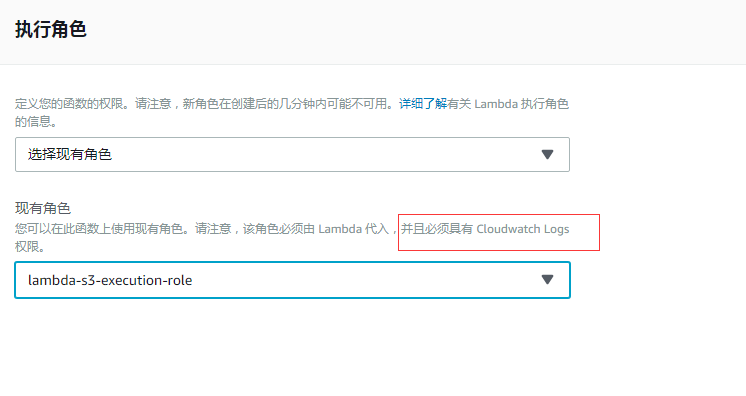
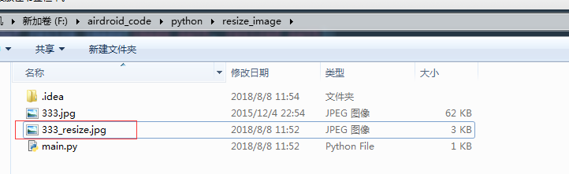

## 前因
之前有一个go服务会经常重启，后面看了一下 error log：

goroutine 1355656 [IO wait, 594 minutes]:
net.runtime_pollWait(0x7fb7417c3b78, 0x72, 0xf)
    /usr/local/go1.7.6/src/runtime/netpoll.go:160 +0x59
。。。
uc.airdroid.com/utils.GenS3Thumbnail(0xc42020124a, 0xc, 0xc42044f380, 0x2d, 0xc4218e8dc0, 0x159, 0xc4201e1ab4, 0xc, 0xc42021a000, 0x0, ...)
    /data/code/go/src/uc.airdroid.com/utils/thumbnail.go:52 +0x296
created by main.getKeyDownloadUrl
    /data/code/go/src/uc.airdroid.com/web/common.go:261 +0x76b

<!--more-->
发现竟然是因为 goroutine 太多了，竟然有 135w 个，然后程序就重启了。 而且竟然已经等待了将近 600 分钟了？？？
后面找了一下，到底是什么原因，导致 goroutine 这么多，原来是有一个 s3 缩略图的功能， 在  common.go 的 261 行：

func getKeyDownloadUrl(cloud string, key string, filetype string, expireTime int64, realfilename string) (downloadUrl, thumbnailUrl string) {
   if cloud == S3CloudShort {
      downloadUrl = S3Config.GenS3DownloadUrl(key)
      S3Config.DownloadExpire = expireTime
      if utils.BoolGenThumbnail(filetype) {
         thumbName := fmt.Sprintf("%s_50x50.%s", strings.Split(key, ".")[0], filetype)
         //thumbnailUrl = fmt.Sprintf("%s?key=%s", Conf.TbThumbnail, thumbName)
         thumbnailUrl = fmt.Sprintf("%s/%s", Conf.TbThumbnail, thumbName)
         go utils.GenS3Thumbnail(Conf.BucketS3, thumbName, downloadUrl, Conf.ThumbnailPathPrefix, S3Config)
      }
      //七牛
   } else if cloud == QNCloudShort {
      downloadUrl = sdk.Gen7NiuDownloadUrl(Conf.QiNiuUrl, key, expireTime, realfilename)
      if utils.BoolGenThumbnail(filetype) {
         thumbnailUrl = fmt.Sprintf("http://%s/%s%s", Conf.QiNiuUrl, key, Conf.QiThumbnailSuffix)
      }
   } 
   return
}

这边有用一个 goroutine， go utils.GenS3Thumbnail， 然后去生成 s3 的缩略图

//产生缩略图
func GenS3Thumbnail(bucket, thumbName, url, pathprefix string, config *sdk.S3Config) string {
   var httpClient = &http.Client{
      Transport: &http.Transport{
         ResponseHeaderTimeout: time.Second * 10,
         Dial: func(network, addr string) (net.Conn, error) {
            return net.DialTimeout(network, addr, time.Second*30)
         },
         DisableKeepAlives: true,
      },
   }
   log.Debug("s3 thumbnail gen source url:" + url)
   resp, err := httpClient.Get(url)
   if err != nil {
      log.Error("NewRequest error! ", err)
      return ""
   }
   defer resp.Body.Close()
   outBytes, err := Thumbnail(resp.Body, 50, 50,20)
   if err != nil {
      log.Error(err)
      return ""
   }
   filename := pathprefix + "/" + thumbName
   log.Debug("Get Thumbnail name:" + filename)
   err = sdk.UploadDataFile(filename, outBytes, config)
   if err != nil {
      log.Error(err)
      return ""
   }
   return filename
}

然后生成缩略图的这个方法也有问题，就是会先从存放原图的bucket先把原始图拉下来，然后在服务器上进行裁剪，裁剪成 50*50，最后再把他上传到这个bucket 的 thumbnailexp 目录下。这样其实非常的耗性能，和耗资源。
而且代码是直接先把缩略图的url先得到，然后再用 goroutine 去裁剪缩略图。 这样子如果请求比较多的情况下，就会导致goroutine 非常多，并且一直在等待中，最后就直接挂掉重启了。
## 七牛的缩略图
我们的这个项目会根据用户的位置来判断是用传到七牛还是传到aws 的s3，如果是国内的用户，那么就是上传到七牛，如果是国外的用户，那么就是上传到aws 的s3 bucket
我们从上面的代码可以看到，如果上传方式是七牛的话，那么是可以直接通过配置url后缀的方式来获取这张图片的缩略图的，而不用再去对图片进行裁剪。

if cloud == QNCloudShort {
   downloadUrl = sdk.Gen7NiuDownloadUrl(Conf.QiNiuUrl, key, expireTime, realfilename)
   if utils.BoolGenThumbnail(filetype) {
      thumbnailUrl = fmt.Sprintf("http://%s/%s%s", Conf.QiNiuUrl, key, Conf.QiThumbnailSuffix)
   }

这个是因为七牛的bucket，他是有自带缩略图的功能的。它不需要我们程序单独对图片进行处理，是由七牛的bucket服务去处理就行了，不过裁剪的图片还是会放在这个bucket里面，只不过会有一个我们所设置的一个后缀名。我们只要给它设置规则就行了。

具体设置页如下：

也就是，我们如果要使用这个bucket的缩略图功能，只需要将 原始图上传到 bucket上，然后只要在原图的url后面加上我们设置的后缀，就可以得到这一张缩略图了
## 使用lambda服务生成s3的缩略图
那么我们有没有办法让 s3 上 bucket 的缩略图也跟七牛的服务一样，不需要我们去处理，而是让s3 的服务去处理。
后面有找了一种解决方法是可以处理的：[就是配合aws lambda 的服务](https://docs.aws.amazon.com/zh_cn/lambda/latest/dg/with-s3-example.html)。
假设要为将上传到存储桶的每个图像（.jpg 和 .png 对象）创建一个缩略图。可以创建一个 Lambda 函数 (CreateThumbnail)，在创建对象后，Amazon S3 可调用该函数。然后，Lambda 函数可以从 source 存储桶中读取图像对象并创建缩略图目标存储桶（在本教程中，该存储桶称为 sourceresized 存储桶）。
流程如下：
1. 用户将对象上传到 Amazon S3 中的源存储桶（对象创建事件）。
2. Amazon S3 检测到对象创建事件。
3. Amazon S3 调用 Lambda 函数并将事件数据作为函数传递，由此将 s3:ObjectCreated:* 事件发布到 AWS Lambda。
4. AWS Lambda 通过代入您在创建 Lambda 函数时指定的执行角色来执行 Lambda 函数。
5. Lambda 函数通过收到的事件数据获得了源存储桶名称和对象键名称。Lambda 函数读取该对象，使用图形库创建缩略图，然后将其保存到目标存储桶。

## 具体实践
### 选中一个区，并创建两个lambda 函数
注意，这个区是s3 bucket所在的区，比如测试环境的bucket 和 线上环境的 bucket 都在弗吉尼亚北部，因此在 创建 lambda 函数的时候，也要选中 这一个区。 然后创建两个函数，一个用于 测试环境，一个用户线上的。

其中 **test-CreateThumbnail** 对应的是 测试环境， 运行语言的环境是 Python 3.6
而 **CreateThumbnail** 对应的是 线上环境， 运行语言的环境是 Python 3.6
这两个函数，基本上所有的设置都一样，所以我这边就以 test-CreateThumbnail 的配置项来说：
### 添加触发器
首先是添加一个触发器，因为是要S3上传图片的时候，会触发这个lambda 函数，所以要添加一个 s3 的触发器：

### 添加代码

这时候我们就要上传 Python 代码的 zip 包上去，这个 zip 包含我们写的 Python 脚本 CreateThumbnail.py 以及依赖的一些库

这些文件夹都是 Python 的依赖包， 具体需要我们写的代码只有 CreateThumbnaill.py 这个文件。 代码如下：

from __future__ import print_function
import boto3
import os
import re
import sys
import uuid
from PIL import Image
import PIL.Image

s3_client = boto3.client('s3')
thn_bucket= os.environ['THN_BUCKET']

def resize_image(image_path, resized_path):
    with Image.open(image_path) as image:
        image.thumbnail(([50,50]),Image.LANCZOS)
        image.save(resized_path)

def handler(event, context):
    for record in event['Records']:
        bucket = record['s3']['bucket']['name']
        key = record['s3']['object']['key']
        if re.search('_50x50', key):
            pass
        else:
            keySep = key.split('.')
            thnKey = '{}{}{}'.format(keySep[0], '_50x50.', keySep[1])
            download_path = '/tmp/{}{}'.format(uuid.uuid4(), key)
            upload_path = '/tmp/resized-{}'.format(thnKey)
            s3_client.download_file(bucket, key, download_path)
            resize_image(download_path, upload_path)
            s3_client.upload_file(upload_path, '{}'.format(thn_bucket), thnKey, ExtraArgs={'ACL': 'public-read'})
            os.remove(upload_path)


逻辑很简单，通过获取环境变量，获取当前要监听的 bucket。然后在触发事件 handler 里面，去判断当前触发时间的记录条数。
如果当前的 key 有包含 "_50x50", 那么我们认为他是 缩略图了，就跳过。这个逻辑之所以要是因为之前我们旧的服务的缩略图是代码生成的，然后传到这一个bucket。如果不做这个判断的话，当旧的服务还在跑的时候，一旦缩略图上传的时候，又会再裁剪一次缩略图，所以才会pass掉，当新服务上线一段时间之后，就可以把这个逻辑去掉了，因为不会有旧服务了。
如果不包含，说明是原始图，然后就把这个原始图下载下来，存放在一个临时目录，然后进行缩略图的裁剪，裁剪成功之后，也保存到这个临时目录里面，然后再把这个裁剪过的缩略图上传到对应的bucket中，这个bucket就是上面设置的环境变量 THN_BUCKET， 然后设置一个新的key（也就是新的文件名）。最后再把这个存放 tmp 的临时的文件删掉。
这就是整个流程，其中 handler 就是触发的入口函数，在这边设置：

上传的方式有两种，一种是直接在这边上传 zip包：

但是会比较慢，如果是比较大的文件，可以考虑选择 s3 上传， 也就是先通过s3 上传到某一个bucket，然后再把这个 zip 地址粘贴过来：

### 设置保存缩略图的bucket
上面代码有说过，当裁剪完成之后，就要把这个裁剪的图片上传到裁剪图片的bucket里面，这个bucket是从 环境变量读取的，这边可以设置：

注意，这个 bucket 是有命名规范的，因为我们的原始图片的bucket是 **test-demo**，然后缩略图的bucket的命名规则就是 {原始bucket}resized， 所以就是 **test-demoresized** 这个。所以是不能随便命名的。
到正式环境就变成对应的bucket 加上 resized 后缀了，比如正式环境的 bucket是 demo，那么缩略图的bucket 就是 demoresized，如果这个bucket还没有存在，那就建一个。
### 设置执行角色

这样子需要配置的都配完了。 接下来要配置原始图片 bucket 的配置，让其可以联动
### 设置原始图片的s3 bucket 触发事件
还是以测试环境的 原始图片的 s3 bucket 为例，点击属性，然后点击事件：

这时候就可以创建事件通知：

这边针对 png， jpg， jpeg 这三种后缀名会去做事件监听。也就是如果是这三种后缀的图片上传到这个bucket的话，那么就会触发 **ObjectCreate** 事件，调用对应的 **lambda** 函数

这样就可以连起来了。当然这里面只有 jpg，jpeg，png 这三种图片，如果后面要加上 bmp 或者 gif 图片的话，也是在这边添加事件监听就可以了。
如果是线上的bucket，也是类似的设置。
当这些都配完之后，流程就是：
当用户上传图片到原始bucket的时候，比如是 test-demo，如果这个是一张图片（jpg，jpeg， png），那么就触发 lambda 函数， 然后就裁剪缩略图，裁剪完之后，就上传到 test-demoresized 的bucket 里面。

## 线上出问题
后面将项目更新到线上去， 然后过了一段时间之后，去看看 缩略图有没有成功， 从监控来看：

发现更新上去之后，没过多久就全部失败了。
赶紧查看了一下监控日志： 发现确实有报了一个错误：

[Errno 28] No space left on device: OSError
Traceback (most recent call last):
File "/var/task/CreateThumbnail.py", line 30, in handler
s3_client.download_file(bucket, key, download_path)
File "/var/task/boto3/s3/inject.py", line 172, in download_file
extra_args=ExtraArgs, callback=Callback)
File "/var/task/boto3/s3/transfer.py", line 307, in download_file
future.result()
File "/var/task/s3transfer/futures.py", line 73, in result
return self._coordinator.result()
File "/var/task/s3transfer/futures.py", line 233, in result
raise self._exception
File "/var/task/s3transfer/tasks.py", line 126, in __call__
return self._execute_main(kwargs)
File "/var/task/s3transfer/tasks.py", line 150, in _execute_main
return_value = self._main(**kwargs)
File "/var/task/s3transfer/download.py", line 583, in _main
fileobj.write(data)
File "/var/task/s3transfer/utils.py", line 332, in write
self._fileobj.write(data)
OSError: [Errno 28] No space left on device

原来是 tmp 的空间不足？？？
后面查了一下文档，发现 tmp 就 512M, [lambda limit](https://docs.aws.amazon.com/zh_cn/lambda/latest/dg/limits.html)

而我们就是把这个 tmp 空间都用满了，导致没办法再去写入了。查看了一下代码，果然发现了一个问题，

。。。
    s3_client.download_file(bucket, key, download_path)
    resize_image(download_path, upload_path)
    s3_client.upload_file(upload_path, '{}'.format(thn_bucket), thnKey, ExtraArgs={'ACL': 'public-read'})
    os.remove(upload_path)

在进行处理的时候，最后我们只把 **upload_path** 的临时文件删掉了， 但是还有一个 **download_path** 的临时文件还在，所以tmp空间就被这些 download_path 的临时文件给占满了。
然后接下来就没法写了。

。。。
    s3_client.download_file(bucket, key, download_path)
    resize_image(download_path, upload_path)
    s3_client.upload_file(upload_path, '{}'.format(thn_bucket), thnKey, ExtraArgs={'ACL': 'public-read'})
    os.remove(upload_path)
    os.remove(download_path)

所以我们再补上这一句 **os.remove(download_path)** 应该就可以了。
但是这边还有一个问题，就是现在的 **tmp** 已经满了，所以如果不把 **tmp** 目录清空的话， 就算这样修改也是不行的。
所以第一步就是要先把 tmp 目录清空，所以代码改成：

。。。
    def handler(event, context):
        for root, dirs, files in os.walk('/tmp'):
            for name in files:
                os.remove(os.path.join(root, name))
        for record in event['Records']:
            bucket = record['s3']['bucket']['name']
            key = record['s3']['object']['key']
            if re.search('_50x50', key):

就是在进行操作的时候，先把 tmp 目录清空掉：

for root, dirs, files in os.walk('/tmp'):
    for name in files:
        os.remove(os.path.join(root, name))

然后重新打包成 zip 包，重新上传。
过了一会儿，已经没问题了，说明我们的思路是对的，而且这时候 tmp 空间已经清空了，没必要再执行这个了，所以就把刚才的那个 tmp 清空的代码注释掉，然后重新上传。
然后再观察一下，真的正常了。

而且 监控的log也正常了：

START RequestId: e90ecab3-9a28-11e8-abaf-8b72187356d7 Version: $LATEST
END RequestId: e90ecab3-9a28-11e8-abaf-8b72187356d7
REPORT RequestId: e90ecab3-9a28-11e8-abaf-8b72187356d7 Duration: 148.36 ms Billed Duration: 200 ms Memory Size: 2048 MB Max Memory Used: 50 MB

后面还是要多注意一下， 内存的使用， 从目前的内存使用来看， 2048 M的内存应该是够的。 并发数最大是 1024， 这个也要注意一下。
而且看了一下这个缩略图bucket，已经可以看到有缩略图生成了。
## 零散的图片读取的失败问题
隔了一天之后，看了一下曲线

虽然成功率还是很高，但是偶尔还是会有零零散散的错误，看了一下log，都是这个错误：

broken data stream when reading image file: OSError
Traceback (most recent call last):
File "/var/task/CreateThumbnail.py", line 36, in handler
resize_image(download_path, upload_path)
File "/var/task/CreateThumbnail.py", line 16, in resize_image
image.thumbnail(([50, 50]), Image.LANCZOS)
File "/var/task/PIL/Image.py", line 2088, in thumbnail
im = self.resize(size, resample)
File "/var/task/PIL/Image.py", line 1763, in resize
self.load()
File "/var/task/PIL/ImageFile.py", line 254, in load
raise_ioerror(err_code)
File "/var/task/PIL/ImageFile.py", line 59, in raise_ioerror
raise IOError(message + " when reading image file")
OSError: broken data stream when reading image file

在读取图片的时候，报错了？？？ 一个是可能是 这张图片 有问题，是坏的。
还有一种情况，就是这个图片的库有问题， 而我们好像就是用的是 pillow 的 5.2.0 版本，这个是比较新的版本了（最新 5.3.0）
有看了一下，关于这个库的这个错误的 issues：
https://github.com/python-pillow/Pillow/issues/1510
https://github.com/python-pillow/Pillow/issues/3185
看了一下，可以通过设置：

from PIL import Image, ImageFile
ImageFile.LOAD_TRUNCATED_IMAGES = True

来避免这个情况， 但是好像会使得 图片 变成黑白。 这个得试下。
我这边做了一下本地测试，下载 pillow 5.2.0 的版本

F:\airdroid_code\python\resize_image>pip install Pillow
Collecting Pillow
  Downloading https://files.pythonhosted.org/packages/21/5d/cbbcb2792e88acd2b6ea1af8c6e484dea0760124ee6a786d23f0522d061f/Pillow-5.2.0-cp36-cp36m-win32.whl (1.4MB)
    100% |████████████████████████████████| 1.4MB 267kB/s
Installing collected packages: Pillow
Successfully installed Pillow-5.2.0

然后代码如下， **main.py**：

from PIL import Image, ImageFile
ImageFile.LOAD_TRUNCATED_IMAGES = True

def resize_image(image_path, resized_path):
    with Image.open(image_path) as image:
            image.thumbnail(([150, 150]), Image.LANCZOS)
            image.save(resized_path)

def main():
    resize_image('./333.jpg', './333_resize.jpg')

if __name__ == '__main__':
    main()

将这张图片，压缩为 150 *150， 然后看下会不会变成黑白？？
后面执行成功，发现是正常的。

发现是正常的，是可以正常缩略的

所以最后的代码是：

from __future__ import print_function
import boto3
import os
import re
import sys
import uuid
from PIL import Image, ImageFile
import PIL.Image
ImageFile.LOAD_TRUNCATED_IMAGES = True

s3_client = boto3.client('s3')
thn_bucket = os.environ['THN_BUCKET']

def resize_image(image_path, resized_path):
    with Image.open(image_path) as image:
        image.thumbnail(([50, 50]), Image.LANCZOS)
        image.save(resized_path)

def handler(event, context):
    # for root, dirs, files in os.walk('/tmp'):
    #     for name in files:
    #         os.remove(os.path.join(root, name))
    for record in event['Records']:
        bucket = record['s3']['bucket']['name']
        key = record['s3']['object']['key']
        keySep = key.split('.')
        thnKey = '{}{}{}'.format(keySep[0], '_50x50.', keySep[1])
        download_path = '/tmp/{}{}'.format(uuid.uuid4(), key)
        upload_path = '/tmp/resized-{}'.format(thnKey)
        s3_client.download_file(bucket, key, download_path)
        resize_image(download_path, upload_path)
        s3_client.upload_file(upload_path, '{}'.format(thn_bucket), thnKey, ExtraArgs={'ACL': 'public-read'})
        os.remove(upload_path)
        os.remove(download_path)


