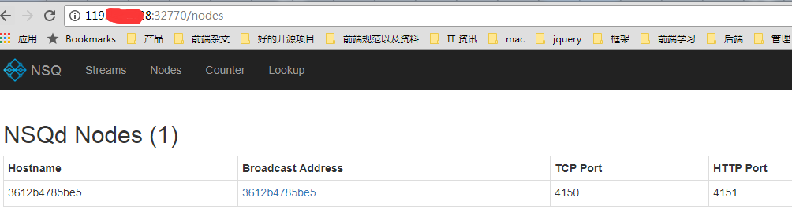
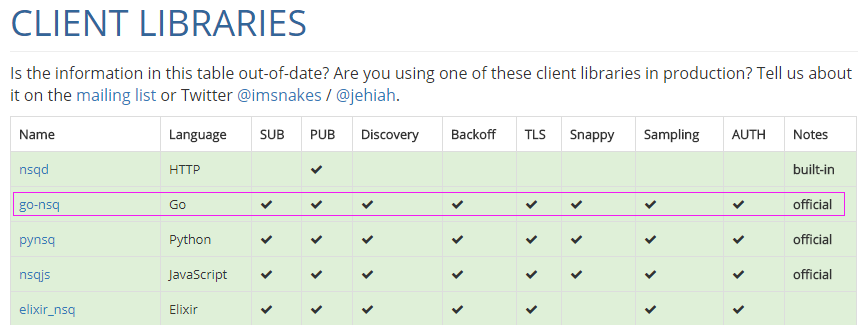
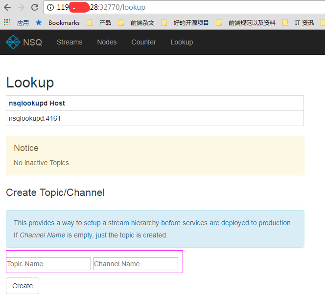
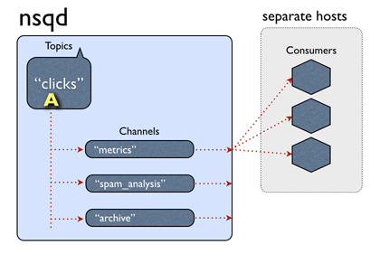
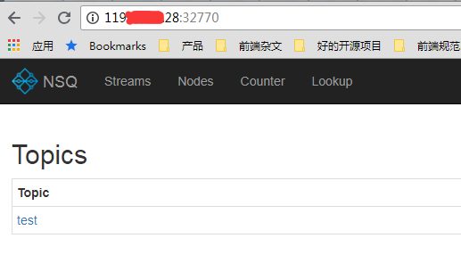
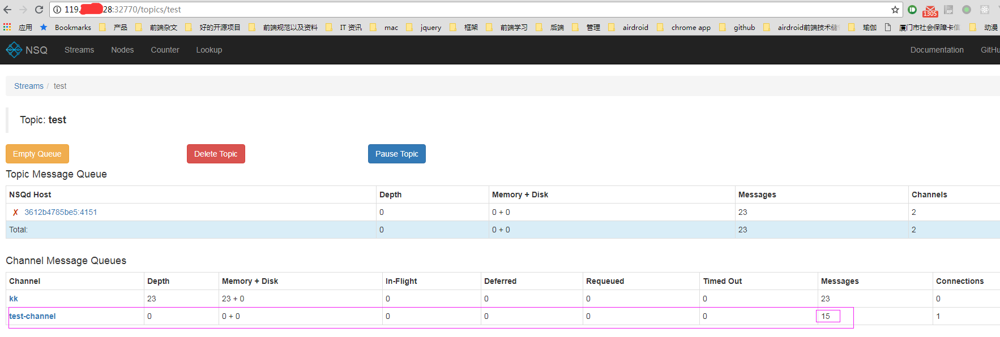

## 前言
最近打算想完善服务端的一些监控机制，并且将其图形化。也一直再找一个高性能，高可用的消息队列做内部服务之间的通讯。其实本身消息队列这种服务在我们的业务层上也用到了一些，比如很多任务队列处理，其实就是用的resque redis的队列的方式来做的： ， 然后我们的 webrtc 服务也用到了 VERNEMQ 这个服务来做 signal 服务通信： , 当初之所以用这个服务也是因为他支持 mqtt 的协议，适合用在移动端设备上， 这次想找的消息队列服务主要是用来做我们内部服务直接的通信，所以可靠性和灵活性非常重要，考虑到我们的大部分服务都是Golang 写的，所以后面就选了 NSQ 来做服务内部之间的通信。
<!--more-->
## NSQ 简介
NSQ是Go语言编写的，开源的分布式消息队列中间件，其设计的目的是用来大规模地处理每天数以十亿计级别的消息。NSQ 具有分布式和去中心化拓扑结构，该结构具有无单点故障、故障容错、高可用性以及能够保证消息的可靠传递的特征，是一个成熟的、已在大规模生成环境下应用的产品。
整个NSQ服务包含三个主要部分:
### nsqlookupd
nsqlookupd是守护进程负责管理拓扑信息。客户端通过查询 nsqlookupd 来发现指定话题（topic）的生产者，并且 nsqd 节点广播话题（topic）和通道（channel）信息。
简单的说nsqlookupd就是中心管理服务，它使用tcp(默认端口4160)管理nsqd服务，使用http(默认端口4161)管理nsqadmin服务。同时为客户端提供查询功能。
主要负责：
- 服务发现 
- 负责nsqd的心跳
- 状态监测
- 给客户端、nsqadmin提供nsqd地址与状态。

总的来说，nsqlookupd具有以下功能或特性：
- 唯一性，在一个Nsq服务中只有一个nsqlookupd服务。当然也可以在集群中部署多个nsqlookupd，但它们之间是没有关联的
- 去中心化，即使nsqlookupd崩溃，也会不影响正在运行的nsqd服务
- 充当nsqd和naqadmin信息交互的中间件
- 提供一个http查询服务，给客户端定时更新nsqd的地址目录 

### nsqadmin
是一套 WEB UI，用来汇集集群的实时统计，并执行不同的管理任务
总的来说，nsqadmin具有以下功能或特性：
- 提供一个对topic和channel统一管理的操作界面以及各种实时监控数据的展示，界面设计的很简洁，操作也很简单
- 展示所有message的数量
- 能够在后台创建topic和channel
- nsqadmin的所有功能都必须依赖于nsqlookupd，nsqadmin只是向nsqlookupd传递用户操作并展示来自nsqlookupd的数据

### nsqd
nsqd 是一个守护进程，负责接收，排队，投递消息给客户端。
简单的说，真正干活的就是这个服务，它主要负责message的收发，队列的维护。nsqd会默认监听一个tcp端口(4150)和一个http端口(4151)以及一个可选的https端口。
总的来说，nsqd 具有以下功能或特性：
- 对订阅了同一个topic，同一个channel的消费者使用负载均衡策略（不是轮询）
- 只要channel存在，即使没有该channel的消费者，也会将生产者的message缓存到队列中（注意消息的过期处理）
- 保证队列中的message至少会被消费一次，即使nsqd退出，也会将队列中的消息暂存磁盘上(结束进程等意外情况除外)
- 限定内存占用，能够配置nsqd中每个channel队列在内存中缓存的message数量，一旦超出，message将被缓存到磁盘中
- topic，channel一旦建立，将会一直存在，要及时在管理台或者用代码清除无效的topic和channel，避免资源的浪费

## NSQ docker 安装
根据官网文档，直接用 docker-compose.yml 来安装：[docker安装文档](http://nsq.io/deployment/docker.html)。
因为 nsq 是基于 golang 开发的，因此装这个之前，要先安装golang环境（1.7+）
接下来开始实作：
首先先建一个 docker-compose.yml 文件，内容如上：
```$xslt
[root@VM_156_200_centos nsq]# cat docker-compose.yml
version: '3'
services:
  nsqlookupd:
    image: nsqio/nsq
    command: /nsqlookupd
    ports:
      - "4160"
      - "4161"
  nsqd:
    image: nsqio/nsq
    command: /nsqd --lookupd-tcp-address=nsqlookupd:4160
    depends_on:
      - nsqlookupd
    ports:
      - "4150"
      - "4151"
  nsqadmin:
    image: nsqio/nsq
    command: /nsqadmin --lookupd-http-address=nsqlookupd:4161
    depends_on:
      - nsqlookupd
    ports:
      - "4171"
[root@VM_156_200_centos nsq]# ls
docker-compose.yml
```
然后在当前所在目录下，执行：**docker-compose up -d**
```$xslt
[root@VM_156_200_centos nsq]# docker-compose up -d
Creating network "nsq_default" with the default driver
Pulling nsqlookupd (nsqio/nsq:latest)...
Trying to pull repository docker.io/nsqio/nsq ...
latest: Pulling from docker.io/nsqio/nsq
709515475419: Pull complete
efd1c5a69d15: Pull complete
fa61d00bb52d: Pull complete
Digest: sha256:fad1937a88fec5b66fb9f4837b72ad3b70012692826aed5c6435f93c5a23b690
Status: Downloaded newer image for docker.io/nsqio/nsq:latest
Creating nsq_nsqlookupd_1 ... done
Creating nsq_nsqadmin_1   ... done
Creating nsq_nsqd_1       ... done
```
这时候就会进行下载镜像，并运行在容器里面了
通过**docker-compose ps** 可以看到当前通过 docker-compose 允许的镜像程序
 ```$xslt
[root@VM_156_200_centos nsq]# docker-compose ps
      Name                    Command               State                                            Ports                                         
----------------------------------------------------------------------------------------------------------------------------------------------------
nsq_nsqadmin_1     /nsqadmin --lookupd-http-a ...   Up      4150/tcp, 4151/tcp, 4160/tcp, 4161/tcp, 4170/tcp, 0.0.0.0:32770->4171/tcp               
nsq_nsqd_1         /nsqd --lookupd-tcp-addres ...   Up      0.0.0.0:32772->4150/tcp, 0.0.0.0:32771->4151/tcp, 4160/tcp, 4161/tcp, 4170/tcp, 4171/tcp
nsq_nsqlookupd_1   /nsqlookupd                      Up      4150/tcp, 4151/tcp, 0.0.0.0:32769->4160/tcp, 0.0.0.0:32768->4161/tcp, 4170/tcp, 4171/tcp
```
然后可以通过 **docker-compose logs** 查看 log:
```$xslt
[root@VM_156_200_centos nsq]# docker-compose logs
Attaching to nsq_nsqadmin_1, nsq_nsqd_1, nsq_nsqlookupd_1
nsqadmin_1    | [nsqadmin] 2018/03/29 03:51:30.947487 nsqadmin v1.0.0-compat (built w/go1.8)
nsqadmin_1    | [nsqadmin] 2018/03/29 03:51:30.947634 HTTP: listening on [::]:4171
nsqlookupd_1  | [nsqlookupd] 2018/03/29 03:51:30.077293 nsqlookupd v1.0.0-compat (built w/go1.8)
nsqlookupd_1  | [nsqlookupd] 2018/03/29 03:51:30.077538 TCP: listening on [::]:4160
nsqlookupd_1  | [nsqlookupd] 2018/03/29 03:51:30.077568 HTTP: listening on [::]:4161
nsqlookupd_1  | [nsqlookupd] 2018/03/29 03:51:31.127668 TCP: new client(172.18.0.4:44088)
nsqlookupd_1  | [nsqlookupd] 2018/03/29 03:51:31.127688 CLIENT(172.18.0.4:44088): desired protocol magic '  V1'
nsqlookupd_1  | [nsqlookupd] 2018/03/29 03:51:31.127812 CLIENT(172.18.0.4:44088): IDENTIFY Address:3612b4785be5 TCP:4150 HTTP:4151 Version:1.0.0-compat
nsqlookupd_1  | [nsqlookupd] 2018/03/29 03:51:31.127823 DB: client(172.18.0.4:44088) REGISTER category:client key: subkey:
nsqlookupd_1  | [nsqlookupd] 2018/03/29 03:51:46.125929 CLIENT(172.18.0.4:44088): pinged (last ping 14.998109614s)
nsqlookupd_1  | [nsqlookupd] 2018/03/29 03:52:01.125927 CLIENT(172.18.0.4:44088): pinged (last ping 15.000001549s)
nsqlookupd_1  | [nsqlookupd] 2018/03/29 03:52:16.125918 CLIENT(172.18.0.4:44088): pinged (last ping 14.999990902s)
nsqd_1        | [nsqd] 2018/03/29 03:51:31.113651 nsqd v1.0.0-compat (built w/go1.8)
nsqd_1        | [nsqd] 2018/03/29 03:51:31.113690 ID: 814
nsqd_1        | [nsqd] 2018/03/29 03:51:31.113721 NSQ: persisting topic/channel metadata to nsqd.dat
nsqd_1        | [nsqd] 2018/03/29 03:51:31.125458 TCP: listening on [::]:4150
nsqd_1        | [nsqd] 2018/03/29 03:51:31.125550 HTTP: listening on [::]:4151
nsqd_1        | [nsqd] 2018/03/29 03:51:31.125632 LOOKUP(nsqlookupd:4160): adding peer
nsqd_1        | [nsqd] 2018/03/29 03:51:31.125636 LOOKUP connecting to nsqlookupd:4160
nsqd_1        | [nsqd] 2018/03/29 03:51:31.128004 LOOKUPD(nsqlookupd:4160): peer info {TCPPort:4160 HTTPPort:4161 Version:1.0.0-compat BroadcastAddress:a24d5cc10d29}
nsqd_1        | [nsqd] 2018/03/29 03:51:46.125732 LOOKUPD(nsqlookupd:4160): sending heartbeat
nsqd_1        | [nsqd] 2018/03/29 03:52:01.125733 LOOKUPD(nsqlookupd:4160): sending heartbeat
nsqd_1        | [nsqd] 2018/03/29 03:52:16.125733 LOOKUPD(nsqlookupd:4160): sending heartbeat
```
这样子 nsq 就部署成功了。
因为 docker-compose 部署的，其实也是属于docker的一部分，所以通过 docker ps 和 docker images 都是可以看到的
```$xslt
[root@VM_156_200_centos nsq]# docker ps
CONTAINER ID        IMAGE               COMMAND                  CREATED             STATUS              PORTS                                                                            NAMES
a1228658c74b        nsqio/nsq           "/nsqadmin --looku..."   3 hours ago         Up 3 hours          4150-4151/tcp, 4160-4161/tcp, 4170/tcp, 0.0.0.0:32770->4171/tcp                  nsq_nsqadmin_1
3612b4785be5        nsqio/nsq           "/nsqd --lookupd-t..."   3 hours ago         Up 3 hours          4160-4161/tcp, 4170-4171/tcp, 0.0.0.0:32772->4150/tcp, 0.0.0.0:32771->4151/tcp   nsq_nsqd_1
a24d5cc10d29        nsqio/nsq           "/nsqlookupd"            3 hours ago         Up 3 hours          4150-4151/tcp, 4170-4171/tcp, 0.0.0.0:32769->4160/tcp, 0.0.0.0:32768->4161/tcp   nsq_nsqlookupd_1
a9ee06d55082        nginx:v3            "nginx -g 'daemon ..."   18 hours ago        Up 18 hours         0.0.0.0:80->80/tcp                                                               webserver3
89e76cdbfe98        nginx               "nginx -g 'daemon ..."   18 hours ago        Up 18 hours         0.0.0.0:8080->80/tcp                                                             webserver
[root@VM_156_200_centos nsq]# docker images
REPOSITORY              TAG                 IMAGE ID            CREATED             SIZE
nginx                   v3                  4ea14de329c4        18 hours ago        109 MB
docker.io/nginx         latest              7f70b30f2cc6        7 days ago          109 MB
docker.io/hello-world   latest              f2a91732366c        4 months ago        1.85 kB
docker.io/nsqio/nsq     latest              2714222e1b39        12 months ago       55.8 MB
```
既然部署成功了，那么就可以通过查看 nsqadmin 来进行管理了
可以看到 端口是 32770,通过访问 http://119.xx.xx.28:32770/nodes 可以看到 nodes


## pub/sub
接下来用golang实现一下 pub 和 sub： 这边用官网推荐的golang 的库来实作：[地址](https://nsq.io/clients/client_libraries.html)

**send.go**:
```$xslt
//Nsq发送测试
package main

import (
	"bufio"
	"fmt"
	"github.com/nsqio/go-nsq"
	"os"
)

var producer *nsq.Producer

// 主函数
func main() {
	strIP1 := "119.xx.xx.28:32772"
	strIP2 := "119.xx.xx.28:32771"
	InitProducer(strIP1)

	running := true

	//读取控制台输入
	reader := bufio.NewReader(os.Stdin)
	for running {
		data, _, _ := reader.ReadLine()
		command := string(data)
		if command == "stop" {
			running = false
		}

		for err := Publish("test", command); err != nil; err = Publish("test", command) {
			//切换IP重连
			strIP1, strIP2 = strIP2, strIP1
			InitProducer(strIP1)
		}
	}
	//关闭
	producer.Stop()
}

// 初始化生产者
func InitProducer(str string) {
	var err error
	fmt.Println("address: ", str)
	producer, err = nsq.NewProducer(str, nsq.NewConfig())
	if err != nil {
		panic(err)
	}
}

//发布消息
func Publish(topic string, message string) error {
	var err error
	if producer != nil {
		if message == "" { //不能发布空串，否则会导致error
			return nil
		}
		err = producer.Publish(topic, []byte(message)) // 发布消息
		return err
	}
	return fmt.Errorf("producer is nil", err)
}
```

**receive.go**:
```$xslt
//Nsq接收测试
package main

import (
	"fmt"
	"time"

	"github.com/nsqio/go-nsq"
)

// 消费者
type ConsumerT struct{}

// 主函数
func main() {
	InitConsumer("test", "test-channel", "119.xx.xx.28:32768")
	for {
		time.Sleep(time.Second * 10)
	}
}

//处理消息
func (*ConsumerT) HandleMessage(msg *nsq.Message) error {
	fmt.Println("receive", msg.NSQDAddress, "message:", string(msg.Body))
	return nil
}

//初始化消费者
func InitConsumer(topic string, channel string, address string) {
	cfg := nsq.NewConfig()
	cfg.LookupdPollInterval = time.Second          //设置重连时间
	c, err := nsq.NewConsumer(topic, channel, cfg) // 新建一个消费者
	if err != nil {
		panic(err)
	}
	c.SetLogger(nil, 0)        //屏蔽系统日志
	c.AddHandler(&ConsumerT{}) // 添加消费者接口

	//建立NSQLookupd连接
	if err := c.ConnectToNSQLookupd(address); err != nil {
		panic(err)
	}

	//建立多个nsqd连接
	// if err := c.ConnectToNSQDs([]string{"127.0.0.1:4150", "127.0.0.1:4152"}); err != nil {
	//  panic(err)
	// }

	// 建立一个nsqd连接
	 if err := c.ConnectToNSQD("119.xx.xx.28:32772"); err != nil {
	  panic(err)
	 }
}
```
这时候现在后台先建一个 topic： **test**， 并创建了两个channel： **kk** 和 **test-channel**

刚创建的时候，是没有激活的， **send.go** 跑起来：
```$xslt
address:  119.xx.xx.28:32772
hello
2018/08/16 15:43:59 INF    1 (119.xx.xx.28:32772) connecting to nsqd
999999
88888888888
9595959
111111111111111111
stop
2018/08/16 18:24:25 INF    1 stopping
2018/08/16 18:24:25 INF    1 exiting router

Process finished with exit code 0
```
每一行都是一次的message的 publish，最后输入 stop 的话，表示输入停止，结束程序。
**receive.go**:
```$xslt
receive 119.xx.xx.28:32772 message: 999999
receive 119.xx.xx.28:32772 message: 88888888888
receive 119.xx.xx.28:32772 message: 9595959
receive 119.xx.xx.28:32772 message: 111111111111111111
receive 119.xx.xx.28:32772 message: stop
```
这时候就可以收到 pub 程序 publish 过来的 message了。这时候查看admin后台，注意，在pub的时候，是不能指定channel的，只能指定topic(sub 才可以指定 topic 和 channel)，所以这些pub的消息，就会往**test**这个topic下的所有channel都传一份，如果这个channel当下没有消费者，那么就会缓存在队列里面，直到消费者出现

所以看到 test-channel 这个 channel 因为有消费者，所以message 都传过去了， 而 kk 这个channel中的所有消息全部都被缓存着。



## 总结
这个只是试用了一下，后面要结合到项目中去实践。

---

参考：
[nsq 优秀的消息队列](https://segmentfault.com/a/1190000012882466)
[golang使用Nsq](https://segmentfault.com/a/1190000009194607)


