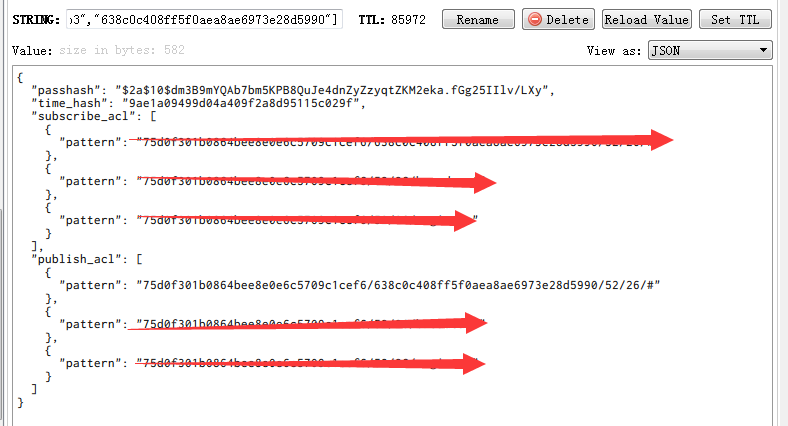

今天在测试webrtc的时候，有出现一个mqtt的情况，就是客户端端在接入VerneMQ的时候。报了一个这个错误：

2018-07-03 10:10:16.060 [error] <0.685.0>@vmq_mqtt_fsm:auth_on_publish:713 can't auth publish [<<"638c0c408ff5f0aea8ae6973e28d5990">>,{[],<<"ea0838b70f13405bc7d8355b13b4c1b3">>},1,[<<"75d0f301b0864bee8e0e6c5709c1cef6">>,<<"52">>,<<"26">>,<<"register">>],<<"{\"method\":\"register.addClient\",\"jsonrpc\":\"2.0\",\"id\":1,\"params\":[\"638c0c408ff5f0aea8ae6973e28d5990\"]}">>,false] due to error
<!--more-->
但是我看了一下， redis 上的权限校验， 发现是对的，是有权限 pub 的

那么为啥会这样呢？？？我用自己的测试程序试了一下：

var mqtt = require('mqtt');
var clientId = 'ea0838b70f13405bc7d8355b13b4c1b3';
var username = '638c0c408ff5f0aea8ae6973e28d5990';
var pwd = 'xxx';
var client  = mqtt.connect('tcp://xxx-signal.xxx.com:1883',{
    clientId: clientId,
    username: username,
    password: pwd
});

client.on('connect', function () {
    console.log("connected");
    client.subscribe("75d0f301b0864bee8e0e6c5709c1cef6/638c0c408ff5f0aea8ae6973e28d5990/52/26/" + 'say');
    setTimeout(function(){
        client.publish("75d0f301b0864bee8e0e6c5709c1cef6/638c0c408ff5f0aea8ae6973e28d5990/52/26/" + 'say', 'hello')
    },10);
});

client.on('message', function (topic, message) {
    // message is Buffer
    console.log(topic);
    console.log(message.toString());
    // client.end()
});

console.log("start");

发现如果我连上去之后，也是会出现这种情况。
后面查了一下。原来是同时有两个同样 clientId 一样的客户端都在连，然后因为 VerneMQ 有重连机制。 导致一直在互踢。
因为从配置上来说的话，allow_multiple_sessions = off  是不允许同一个clientId 的多条连接同时连上的， 后一条会把前一条踢出。 
注意，这里的踢出，并不会马上断开连接。而是变成没有 pub 的权限。 导致后面那一条的连接又重连，又把前面的连接踢出。 这样两方一直互踢。
以上面的代码为例，我开了两个node 进程。其中第一个先连上：

F:\airdroid_code\nodejs\mqtt>node app.js
start
connected
75d0f301b0864bee8e0e6c5709c1cef6/638c0c408ff5f0aea8ae6973e28d5990/52/26/say
hello

这时候连上来，并且正常pub 了一次，然后就一直等待，因为我连接没有断开，这时候，我第二个 node 进程也执行（同样的代码）：

F:\airdroid_code\nodejs\mqtt>node app.js
start
connected
connected
connected
connected

可以看到第二个进程一直处于重连中，而且根本就不能pub，错误是：

2018-07-03 09:22:24.699 [error] <0.24336.0>@vmq_mqtt_fsm:auth_on_publish:713 can't auth publish [<<"638c0c408ff5f0aea8ae6973e28d5990">>,{[],<<"ea0838b70f13405bc7d8355b13b4c1b3">>},0,[<<"75d0f301b0864bee8e0e6c5709c1cef6">>,<<"638c0c408ff5f0aea8ae6973e28d5990">>,<<"52">>,<<"26">>,<<"say">>],<<"hello">>,false] due to error

然后这时候看第一个进程的log，就发现一直在重连，然后一直pub。 一直重复这个过程。

connected
75d0f301b0864bee8e0e6c5709c1cef6/638c0c408ff5f0aea8ae6973e28d5990/52/26/say
hello
connected
75d0f301b0864bee8e0e6c5709c1cef6/638c0c408ff5f0aea8ae6973e28d5990/52/26/say
hello
connected
75d0f301b0864bee8e0e6c5709c1cef6/638c0c408ff5f0aea8ae6973e28d5990/52/26/say
hello
connected
75d0f301b0864bee8e0e6c5709c1cef6/638c0c408ff5f0aea8ae6973e28d5990/52/26/say
hello

所以归根究底，就是前后两个同 clientId 的连接在互抢， 尤其是后一个连接，基本上就一直在重连，连pub都不行。
所以对于客户端来说，一定不能让同一个clientId的多条连接同时连接上。

