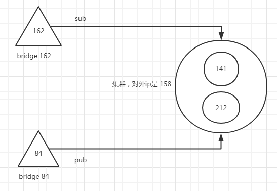

## 前言
通过 我们已经对VerneMQ建立了集群了， 实现了分布式扩展。 但是后面又发现了另一种比较好的分布式扩展方式，那就是Bridge，也就是桥接的方式。
- 所谓的集群，其实是每一个点，都有集群中的其他点的信息，相当于复制了一份主题树和路由表到其他的节点。
- 桥接其实只按照桥接规则转发，本身是不存储其他节点的信息的。

所以后面参考的架构就是，每个区都有一两个节点作为桥接点，然后统一连接到集群上。

             -------------             -----------------
Sensor ----> |    node   | --Bridge--> |               |
             -------------             |    VerneMQ    |
             -------------             |    Cluster    |
Sensor ----> |    node   | --Bridge--> |               |
             -------------             -----------------

<!--more-->
## 简单测试Bridge情况
首先简单测试一下Bridge，就是两个节点， 其中 162 是桥接节点， 84 这一台是vernemq集群节点(虽然只有一个点)
162 这一台根据[官方文档配置](https://vernemq.com/docs/configuration/bridge.html):

plugins.vmq_bridge = on
#84 这一台的内网ip
vmq_bridge.tcp.br0 = 172.16.16.14:1883
vmq_bridge.tcp.br0.client_id = 1528361231
vmq_bridge.tcp.br0.username = 101
vmq_bridge.tcp.br0.password = xxx
vmq_bridge.tcp.br0.cleansession = off
vmq_bridge.tcp.br0.topic.1 = *

注意，桥接节点，也要有权限校验的，所以权限校验规则，也要符合之前配的redis的校验规则，不然会报权限错误。

[debug] <0.361.0> Supervisor vmq_bridge_sup started vmq_bridge:start_link("172.16.16.14", 1883, {vmq_reg,direct_plugin_exports,[vmq_bridge]}) at pid <0.437.0>
[info] <0.31.0> Application vmq_server started on node 'VerneMQ@172.16.16.16'
[error] <0.440.0>@vmq_bridge:on_connect_error:70 connection failed due to not_authorized

但是当我配完了之后，还看到了其他报错：
162 的log：

[error] <0.440.0>@vmq_bridge:on_connect_error:70 connection failed due to wrong_protocol_version

看起来好像是协议错误？？？
看了一下 84 这一台也有报错：

[warning] <0.581.0>@vmq_mqtt_fsm:check_client_id:530 invalid protocol version for {[],<<"1528361231">>} 131

后面去网上查了一下，好像有一个配置没有配对， [issues传送门](https://github.com/erlio/vernemq/issues/663)
**vmq_bridge.tcp.br0.try_private = off**
当我这样配之后，就可以了，正常的log就是这样：

[debug] <0.450.0>@vmq_bridge:handle_info:170 connected to: 172.16.16.14:1883

可以看到已经连接上，只要改162这一台的配置就行了，因为他是作为桥接的那个点。
接下来就是测试了，这两个节点是没有集群的关系的：
- 162：

[kbz@VM_16_16_centos vernemq]$ sudo vmq-admin cluster show
+--------------------+-------+
|        Node        |Running|
+--------------------+-------+
|VerneMQ@172.16.16.16| true  |
+--------------------+-------+

- 84：

[kbz@VM_16_14_centos ~]$ sudo vmq-admin cluster show
+--------------------+-------+
|        Node        |Running|
+--------------------+-------+
|VerneMQ@172.16.16.14| true  |
+--------------------+-------+


都是单台，没有集群，用 mosquitto 来做测试：
- 首先在 84 这一台做 **sub**：

[root@VM_156_200_centos ~]# mosquitto_sub -h 193.112.xxx.84  -i 1528361747 -u 102 -P xxx -p 1883 -t say  -v

- 然后再 162 这一台做 **pub**：

[root@VM_156_200_centos ~]# mosquitto_pub -h 193.112.xxx.162 -i 1528366636 -u 100 -P xxx -p 1883 -t say -m "hi,bridge" -d
Client 1528366636 sending CONNECT
Client 1528366636 received CONNACK
Client 1528366636 sending PUBLISH (d0, q0, r0, m1, 'say', ... (9 bytes))
Client 1528366636 sending DISCONNECT

- 这时候 84 这一台的pub 就收到了：

[root@VM_156_200_centos ~]# mosquitto_sub -h 193.112.xxx.84  -i 1528361747 -u 102 -P xxx -p 1883 -t say  -v
say hi,bridge


这样就通了。说明单台桥接点，用来pub的话，是没有问题。
## 完整的桥接+集群的分布式方式测试
刚才测试通过了，但是只能证明在桥接点pub，然后集群点sub，是可以的。但是我们理想中的，应该是pub和sub都是在桥接点，集群点只做主题和路由表转发。
所以我们现在要进行另一个实验，就是变成有两个桥接点， 一个是 162， 一个是 84. 他们连同一个集群（141，212）， 然后通过负载均衡，有一个公用的入口 IP:  139.199.xxx.158， 局域网是：172.16.0.10 . 效果图如下：

理想结果就是： 162 进行 sub， 另一个 bridge 84 进行 pub的时候， 162 可以收到消息。
接下来就是具体的配置了：
- 84：

plugins.vmq_bridge = on
vmq_bridge.tcp.br0 = 172.16.0.10:1883
vmq_bridge.tcp.br0.client_id = 1528366639
vmq_bridge.tcp.br0.username = 105
vmq_bridge.tcp.br0.password = xxx
vmq_bridge.tcp.br0.cleansession = off
vmq_bridge.tcp.br0.try_private = off
vmq_bridge.tcp.br0.topic.1 = *

- 162：

plugins.vmq_bridge = on
vmq_bridge.tcp.br0 = 172.16.0.10:1883
vmq_bridge.tcp.br0.client_id = 1528361231
vmq_bridge.tcp.br0.username = 101
vmq_bridge.tcp.br0.password = 38b3eff8baf56627478ec76a704e9b52
vmq_bridge.tcp.br0.cleansession = off
vmq_bridge.tcp.br0.try_private = off
vmq_bridge.tcp.br0.topic.1 = *


然后我在测试的时候， 首先是在 162 进行 sub：

[root@VM_156_200_centos ~]# mosquitto_sub -h 193.112.xxx.162  -i 1528361747 -u 102 -P xxx -p 1883 -t say  -v

然后 在 84 进行 pub：

[root@VM_156_200_centos ~]# mosquitto_pub -h 193.112.xxx.84 -i 1528366636 -u 100 -P xxx -p 1883 -t say -m "hi,bridge" -d
Client 1528366636 sending CONNECT
Client 1528366636 received CONNACK
Client 1528366636 sending PUBLISH (d0, q0, r0, m1, 'say', ... (9 bytes))
Client 1528366636 sending DISCONNECT

但是这边发生了一个现象，就是 pub 成功了， 但是162就是没有收到了 pub 过来的消息？？？
刚开始以为是topic设置的问题，是因为topic是可以设置 in，out，both，分别表示是 pub，sub，both。

topic defines a topic pattern that is shared between the two brokers. Any topics matching the pattern (which may include wildcards) are shared. The second parameter defines the direction that the messages will be shared in, so it is possible to import messages from a remote broker using in, export messages to a remote broker using out or share messages in both directions. If this parameter is not defined, VerneMQ defaults to out. The QoS level defines the publish/subscribe QoS level used for this topic and defaults to 0. (Source: mosquitto.conf)

也就是没有设置的话，就是默认 out，也就是只能从 broker 送出消息，只能sub监听。从上面的例子来看，应该是作为 pub 端的 84 是将消息送进去broker 的， 也就是 in， 作为sub 端的 162是 等待broker 推送消息过来的，所以就是 out。因此我们修改上面的配置项：
**84：  vmq_bridge.tcp.br0.topic.1 = * in**
**162： vmq_bridge.tcp.br0.topic.1 = * out**
然后重启再试一下： 发现还是收不到。
但是我如果换成，在同一台上，比如 162 同时作为订阅和发布的点，那么就可以：

[root@VM_156_200_centos ~]# mosquitto_pub -h 193.112.xxx.162 -i 1528366636 -u 100 -P xxx -p 1883 -t say -m "hi,bridge" -d
Client 1528366636 sending CONNECT
Client 1528366636 received CONNACK
Client 1528366636 sending PUBLISH (d0, q0, r0, m1, 'say', ... (9 bytes))
Client 1528366636 sending DISCONNECT


[root@VM_156_200_centos ~]# mosquitto_sub -h 193.112.xxx.162  -i 1528361747 -u 102 -P xxx -p 1883 -t say  -v
say hi,bridge

然后一样换成全部都是 84的，也是一样可以收到。

[root@VM_156_200_centos ~]# mosquitto_pub -h 193.112.xxx.84 -i 1528366636 -u 100 -P xxx -p 1883 -t say -m "hi,bridge" -d
Client 1528366636 sending CONNECT
Client 1528366636 received CONNACK
Client 1528366636 sending PUBLISH (d0, q0, r0, m1, 'say', ... (9 bytes))
Client 1528366636 sending DISCONNECT


[root@VM_156_200_centos ~]# mosquitto_sub -h 193.112.xxx.84  -i 1528361747 -u 102 -P xxx -p 1883 -t say  -v
say hi,bridge

**但是就是不能一个桥接 pub， 另一个桥接 sub？？？**
接下来试下，全部改为 both 的情况，就是即允许 import 消息，又允许 export 消息。
** 162/84 vmq_bridge.tcp.br0.topic.1 = * both**
然后再试一下，还是 84 pub， 162 sub：

[root@VM_156_200_centos ~]# mosquitto_pub -h 193.112.xxx.84 -i 1528366636 -u 100 -P xxx -p 1883 -t say -m "hi,bridge" -d
Client 1528366636 sending CONNECT
Client 1528366636 received CONNACK
Client 1528366636 sending PUBLISH (d0, q0, r0, m1, 'say', ... (9 bytes))
Client 1528366636 sending DISCONNECT


[root@VM_156_200_centos ~]# mosquitto_sub -h 193.112.xxx.162  -i 1528361747 -u 102 -P xxx -p 1883 -t say  -v
say hi,bridge
say hi,bridge
-----------这边省略无数个  say hi,bridge
say hi,bridge
say hi,bridge

神奇的情况出现了，就是一直收到消息，不会停。这时候就会有环路问题了，应该是两个来回一直推。
后面查了一下官方的issues，
关于 设置为 both 的时候，所出现的 环路问题的情况， 发现确实有存在一个未解决的 issue：

vmq_bridge.tcp.br0.try_private = off
vmq_bridge.tcp.br0.topic.1 = s/a both 1

1.vmq_bridge seems like as a mqtt client subscribe topic s/a from remote broker and automatic echo what received from that topic.
Hence rabbitmq queues which bind topic s.a increase infinitely.

2.And seems like when set vmq_bridge.tcp.br0.topic.1 = s/a out 1 (not "both"), then no automatic echo, but the vmq_bridge still subscribe topic from remote broke, is this behavior normal?


而且看了一下， 配置文件，也有提示这个问题：

## If try_private is enabled, the bridge will attempt to indicate to the
## remote broker that it is a bridge not an ordinary client.
## Note that loop detection for bridges is not yet implemented.
##
## Default: on
##
## Acceptable values:
##   - on or off
## vmq_bridge.tcp.br0.try_private = on

而且他现在的这个版本，其实是还没有 实现这个东西的环路检测 

## 结论
所以结论就是： 在 vernemq 没有修复这个bug之前， bridge 的方式是有问题。 只能等他修复了，才能用。真是巨坑！！！
要么就是跟上面的简单测试的一样，就是桥接点只能当pub来用， 集群点来做sub。 或者是同一个桥接点，同一个主题，既可以做pub，也可以做sub。
但是就是不能两个桥接点，相同的主题下，一个当pub，一个当sub。这样消息会收不到。 而我们的情况，就是会有同一个主题下，一个节点pub，另一个节点sub的情况。所以还是继续用集群，舍弃bridge了。

