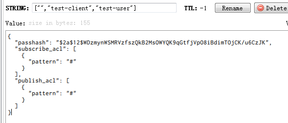
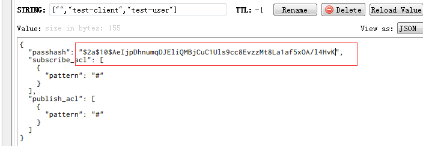
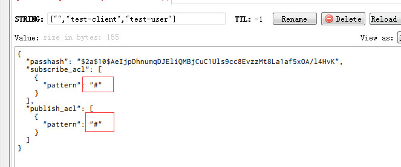

通过  我们已经安装了VerneMQ 服务，接下来就是设置校验了。vernemq 有三种权限校验的方式： 我们接下来一个一个用：
https://vernemq.com/docs/configuration/file-auth.html
### 1 密码文件校验的方式：
要开启密码校验的方式，就要修改 vernemq.conf 的配置文件， 将以下的配置改成：

allow_anonymous = off
plugins.vmq_passwd = on
vmq_passwd.password_file = /etc/vernemq/vmq.passwd
vmq_passwd.password_reload_interval = 10
plugins.vmq_acl = on

ps： 注意 plugins.vmq_acl = on 这个也要开启，不然会处于一直连接中的状态,这个是因为 密码文件校验只能校验 auth，也就是能不能连接上。而 acl 校验是校验用户连上之后是否能sub 或者 pub, 所以这个也要开。其实就是关闭连接无校验方式，然后开启密码文件连接校验方式，同时将 密码校验的间隔设置为 10s,接下来我们就通过这个自带的 密码文件管理的 工具来生成一个密码校验
<!--more-->

vmq-passwd [-c | -D] passwordfile username
vmq-passwd -U passwordfile

具体的操作log如下：

[root@VM_156_200_centos vernemq]# vmq-passwd -c vmq.passwd zach
Password:
Reenter password:
[root@VM_156_200_centos vernemq]# ll
total 72
-rw-r--r-- 1 root root 30851 May  9 13:51 vernemq.conf
-rw-r--r-- 1 root root 29837 May  9 11:41 vernemq.conf.test
-rw-r--r-- 1 root root     8 Mar 21 00:06 vmq.acl
-rw-r--r-- 1 root root   114 May  9 13:53 vmq.passwd
[root@VM_156_200_centos vernemq]# cat vmq.passwd
zach:$6$46DU/VjFrIykytcz$awMWQb7TT4m+SQ34ipXaDIjoTUTTeTLeFUCd7233MpTqE+633L7k8Xm3c52VhOJxaUtheFoZRBhZQlu9AG+/7g==

从上面可以看到，我们往 vmq.passwd （这个就是上面配置项所指定的密码文件，第一次创建，如果不存在，执行会自动创建），然后指定用户名，本例就是zach，接下来就会让你输入密码，而且要确认一遍。然后就成功（本例的密码就是 123456）。
打开 vmq.passwd 来看，可以看到 zach 后面跟了一堆的密码串（这个就是刚才输入的密码的加密串）,然后重启了一下 vernemq：

[root@VM_156_200_centos vernemq]# vernemq restart
ok

接下来我们用测试程序跑下：

var mqtt = require('mqtt');
var client  = mqtt.connect('ws://kebingzao.com:1889/mqtt');

client.on('connect', function () {
    console.log("connected");
    client.subscribe('presence');
    setTimeout(function(){
        client.publish('presence', 'Hello mqtt')
    },10)
});

client.on('message', function (topic, message) {
    // message is Buffer
    console.log(topic);
    console.log(message.toString());
    client.end()
});

console.log("start");


本来如果是直接开启无校验模式的话， 是可以跑成功的：

F:\airdroid_code\nodejs\mqtt>node app.js
start
connected
presence
Hello mqtt

一旦开启密码文件校验方式的话，那么就会报错了：

F:\airdroid_code\nodejs\mqtt>node app.js
start
events.js:141
      throw er; // Unhandled 'error' event
      ^

Error: Connection refused: Not authorized
    at MqttClient._handleConnack (F:\airdroid_code\nodejs\mqtt\node_modules\mqtt\lib\client.js:893:15)
    at MqttClient._handlePacket (F:\airdroid_code\nodejs\mqtt\node_modules\mqtt\lib\client.js:329:12)
    at work (F:\airdroid_code\nodejs\mqtt\node_modules\mqtt\lib\client.js:271:12)
    at Writable.writable._write (F:\airdroid_code\nodejs\mqtt\node_modules\mqtt\lib\client.js:281:5)
    at doWrite (F:\airdroid_code\nodejs\mqtt\node_modules\readable-stream\lib\_stream_writable.js:428:64)
    at writeOrBuffer (F:\airdroid_code\nodejs\mqtt\node_modules\readable-stream\lib\_stream_writable.js:417:5)
    at Writable.write (F:\airdroid_code\nodejs\mqtt\node_modules\readable-stream\lib\_stream_writable.js:334:11)
    at ondata (F:\airdroid_code\nodejs\mqtt\node_modules\readable-stream\lib\_stream_readable.js:619:20)
    at emitOne (events.js:77:13)
    at emit (events.js:169:7)

报了一个没有权限的错误,如果加上用户名和密码的话：

var client  = mqtt.connect('ws://kebingzao.com:1889/mqtt',{
    username: 'zach',
    password: "123456"
});

那么就可以连接上 

F:\airdroid_code\nodejs\mqtt>node app.js
start
connected
presence
Hello mqtt

当然如果是密码错误，或者用户名错误的话，也都会报错：

var client  = mqtt.connect('ws://kebingzao.com:1889/mqtt',{
    username: 'zach',
    password: "1234567"
});

执行结果如下：

F:\airdroid_code\nodejs\mqtt>node app.js
start
events.js:141
      throw er; // Unhandled 'error' event
      ^

Error: Connection refused: Bad username or password
    at MqttClient._handleConnack (F:\airdroid_code\nodejs\mqtt\node_modules\mqtt\lib\client.js:893:15)
    at MqttClient._handlePacket (F:\airdroid_code\nodejs\mqtt\node_modules\mqtt\lib\client.js:329:12)
    at work (F:\airdroid_code\nodejs\mqtt\node_modules\mqtt\lib\client.js:271:12)
    at Writable.writable._write (F:\airdroid_code\nodejs\mqtt\node_modules\mqtt\lib\client.js:281:5)
    at doWrite (F:\airdroid_code\nodejs\mqtt\node_modules\readable-stream\lib\_stream_writable.js:428:64)
    at writeOrBuffer (F:\airdroid_code\nodejs\mqtt\node_modules\readable-stream\lib\_stream_writable.js:417:5)
    at Writable.write (F:\airdroid_code\nodejs\mqtt\node_modules\readable-stream\lib\_stream_writable.js:334:11)
    at ondata (F:\airdroid_code\nodejs\mqtt\node_modules\readable-stream\lib\_stream_readable.js:619:20)
    at emitOne (events.js:77:13)
    at emit (events.js:169:7)

如果是用户名错的话：

var client  = mqtt.connect('ws://kebingzao.com:1889/mqtt',{
    username: 'zach1',
    password: "123456"
});


F:\airdroid_code\nodejs\mqtt>node app.js
start
events.js:141
      throw er; // Unhandled 'error' event
      ^

Error: Connection refused: Not authorized
    at MqttClient._handleConnack (F:\airdroid_code\nodejs\mqtt\node_modules\mqtt\lib\client.js:893:15)
    at MqttClient._handlePacket (F:\airdroid_code\nodejs\mqtt\node_modules\mqtt\lib\client.js:329:12)
    at work (F:\airdroid_code\nodejs\mqtt\node_modules\mqtt\lib\client.js:271:12)
    at Writable.writable._write (F:\airdroid_code\nodejs\mqtt\node_modules\mqtt\lib\client.js:281:5)
    at doWrite (F:\airdroid_code\nodejs\mqtt\node_modules\readable-stream\lib\_stream_writable.js:428:64)
    at writeOrBuffer (F:\airdroid_code\nodejs\mqtt\node_modules\readable-stream\lib\_stream_writable.js:417:5)
    at Writable.write (F:\airdroid_code\nodejs\mqtt\node_modules\readable-stream\lib\_stream_writable.js:334:11)
    at ondata (F:\airdroid_code\nodejs\mqtt\node_modules\readable-stream\lib\_stream_readable.js:619:20)
    at emitOne (events.js:77:13)
    at emit (events.js:169:7)

所以密码文件校验，就是这样了。
当然也可以创建多个用户，就是不用-c， 那么就会添加在后面

[root@VM_156_200_centos vernemq]# cat vmq.passwd
kbz:$6$sbh/s6diN2ZGA6kI$zWKPObfeLEu0L8EYveoEnC5GkfkgB1B73E/t1j7Uciz/evcGvyWgwoNoX36tHQOX6psOC3wga6LekQVFbQhMVA==
[root@VM_156_200_centos vernemq]# vmq-passwd vmq.passwd zach
Password: 
Reenter password: 
[root@VM_156_200_centos vernemq]# cat vmq.passwd 
kbz:$6$sbh/s6diN2ZGA6kI$zWKPObfeLEu0L8EYveoEnC5GkfkgB1B73E/t1j7Uciz/evcGvyWgwoNoX36tHQOX6psOC3wga6LekQVFbQhMVA==
zach:$6$kxThdGLFMCLh7BuH$/DUv2QRvGXfy31V0k3JDNkOdd4kj9Z56+LY0KN++9B6UDDBDpXX7/KoXo6OfhhYP+lbkoXbYnOfxQypFJM8cmQ==

这样就有两个用户了

---

### 2 acl 文件校验的方式：
一样修改原来的几个配置

allow_anonymous = off
plugins.vmq_acl = on
vmq_acl.acl_file = /etc/vernemq/vmq.acl
vmq_acl.acl_reload_interval = 10

plugins.vmq_passwd = off
#vmq_passwd.password_file = /etc/vernemq/vmq.passwd

安装 vernemq 的时候，默认也有一个 vmq_acl.conf 不过打开是topic #，即默认所有主题，我们要自己配，但是我试着配置了一下 这个文件，但是好像还是连接不上：

[root@VM_156_200_centos vernemq]# cat vmq.acl
user kkk
topic presence

修改之前的测试代码：

var client  = mqtt.connect('ws://kebingzao.com:1889/mqtt',{
    username: 'kkk'
});

运行结果：

F:\airdroid_code\nodejs\mqtt>node app.js
start
events.js:141
      throw er; // Unhandled 'error' event
      ^

Error: Connection refused: Not authorized
    at MqttClient._handleConnack (F:\airdroid_code\nodejs\mqtt\node_modules\mqtt\lib\client.js:893:15)
    at MqttClient._handlePacket (F:\airdroid_code\nodejs\mqtt\node_modules\mqtt\lib\client.js:329:12)
    at work (F:\airdroid_code\nodejs\mqtt\node_modules\mqtt\lib\client.js:271:12)
    at Writable.writable._write (F:\airdroid_code\nodejs\mqtt\node_modules\mqtt\lib\client.js:281:5)
    at doWrite (F:\airdroid_code\nodejs\mqtt\node_modules\readable-stream\lib\_stream_writable.js:428:64)
    at writeOrBuffer (F:\airdroid_code\nodejs\mqtt\node_modules\readable-stream\lib\_stream_writable.js:417:5)
    at Writable.write (F:\airdroid_code\nodejs\mqtt\node_modules\readable-stream\lib\_stream_writable.js:334:11)
    at ondata (F:\airdroid_code\nodejs\mqtt\node_modules\readable-stream\lib\_stream_readable.js:619:20)
    at emitOne (events.js:77:13)
    at emit (events.js:169:7)

这个就蛋疼了，也不知道问题出现在哪里？？？
后面终于找到原因了，原来 allow_anonymous = on  一定要设置为 on， 因为这个要允许用户连上来才行，接下来才能进行权限的判断
对于本例来说，当用户连接上来，再进行 pub 和 sub 权限的判断
如果这样写的话：

var client  = mqtt.connect('ws://kebingzao.com:1889/mqtt',{
    username: 'kkk'
});

client.on('connect', function () {
    console.log("connected");
    client.subscribe('presence');
    setTimeout(function(){
        client.publish('presence', 'Hello mqtt')
    },10)
});

那么 username 和 topic presenc 都在 acl 文件里面，所以可以成功。

F:\airdroid_code\nodejs\mqtt>node app.js
start
connected
presence
Hello mqtt

但是如果用户名错的话，就会出现权限问题，表现就在能连接上，但是没有权限 pub

var client  = mqtt.connect('ws://kebingzao.com:1889/mqtt',{
    username: 'kkk1'
});

执行结果如下：

F:\airdroid_code\nodejs\mqtt>node app.js
start
connected
connected
connected
connected

查看服务器的log如下：

2018-05-10 20:33:53.404 [warning] <0.657.0>@vmq_websocket:handle_fsm_return:131 ws session stopped abnormally due to 'publish_not_authorized_3_1_1'
2018-05-10 20:33:54.470 [debug] <0.664.0>@vmq_queue:state_change:948 transition from offline --> online because of add_session

如果是用户名对，但是 topic 不对的话， 也是一样：

var client  = mqtt.connect('ws://kebingzao.com:1889/mqtt',{
    username: 'kkk'
});

client.on('connect', function () {
    console.log("connected");
    client.subscribe('presence1');
    setTimeout(function(){
        client.publish('presence1', 'Hello mqtt')
    },10)
});


F:\airdroid_code\nodejs\mqtt>node app.js
start
connected
connected
connected

2018-05-10 20:34:51.901 [error] <0.694.0>@vmq_mqtt_fsm:auth_on_publish:662 can't auth publish [<<"kkk">>,{[],<<"mqttjs_d4fab9a3">>},0,[<<"presence1">>],<<"Hello mqtt">>,false] due to chain_exhausted
2018-05-10 20:34:51.901 [warning] <0.694.0>@vmq_websocket:handle_fsm_return:131 ws session stopped abnormally due to 'publish_not_authorized_3_1_1'

当然，这个 acl 文件还可以设置为 允许哪个topic 可以被订阅和被pub
ps： 注意，如果把 #vmq_acl.acl_file = /etc/vernemq/vmq.acl 注释掉，那么就会取/etc/vernemq/vmq.acl 这个默认地址的文件，而如果里面的内容是 topic #
那么就是所有的主题都可以被sub 和 pub了，这样就相当于打开空门了， 所以要谨慎。
而且这边有个很蛋疼的问题，如果要恢复原来的没有任何的校验的情况的话，那么就要设置为：

allow_anonymous = on
plugins.vmq_acl = on
plugins.vmq_passwd = off
(plugins.vmq-passwd 这个配置可以开，也可以关，然后对应的权限校验文件，也注释掉)
#vmq_acl.acl_file = /etc/vernemq/vmq.acl
#vmq_passwd.password_file = /etc/vernemq/vmq.passwd

其实这种情况，不是没有任何校验，还是属于acl校验的方式，只不过默认的 vmq.acl 的内容的 topic #， 即允许所有的主题都可以被pub和sub。
所以仅仅只是开启 allow_anonymous = on 还不行， vmq_acl 也要开着，不然会出现可以连得上，但是却没有权限 publish 的情况，不然服务端会报以下错误：

2018-05-10 13:49:27.096 [error] <0.433.0>@vmq_mqtt_fsm:auth_on_publish:662 can't auth publish [undefined,{[],<<"mqttjs_76284544">>},0,[<<"presence">>],<<"Hello mqtt">>,false] due to no_matching_hook_found
2018-05-10 13:49:27.096 [warning] <0.433.0>@vmq_websocket:handle_fsm_return:131 ws session stopped abnormally due to 'publish_not_authorized_3_1_1'


---

### 3 数据库校验的方式：
有好几种，我们主要是使用 redis 来校验，同样要改几个配置：

allow_anonymous =off
plugins.vmq_diversity = on
plugins.vmq_passwd = off
plugins.vmq_acl = off

vmq_diversity.auth_redis.enabled = on
vmq_diversity.redis.host = 127.0.0.1
vmq_diversity.redis.port = 6379
vmq_diversity.redis.password = xxxx
vmq_diversity.redis.database = 0

注意： allow_anonymous 这个设置要设置为 off，不然所有的用户都会被连接上
那么接下来往这个redis 插入一条

SET "[\"\",\"test-client\",\"test-user\"]" "{\"passhash\":\"$2a$12$WDzmynWSMRVzfszQkB2MsOWYQK9qGtfjVpO8iBdimTOjCK/u6CzJK\",\"subscribe_acl\":[{\"pattern\":\"#\"}]}, \"publish_acl\":[{\"pattern\":\"#\"}]} "


这样就有一条记录了 （subscribe_acl 和 publish_acl 都设置为 #， 那么就说明不限制 pub 和 sub 的权限）
从文档来看，这个 passhash 应该就是 123 加密过后的
最后我们的代码是：

var mqtt = require('mqtt');
// var client  = mqtt.connect('mqtt://test.mosquitto.org');
var client  = mqtt.connect('ws://kebingzao.com:1889/mqtt',{
    clientId: 'test-client',
    username: 'test-user',
    password: '123'
});

client.on('connect', function () {
    console.log("connected");
    client.subscribe('presence');
    setTimeout(function(){
        client.publish('presence', 'Hello mqtt')
    },10)
});

client.on('message', function (topic, message) {
    // message is Buffer
    console.log(topic);
    console.log(message.toString());
    client.end()
});

console.log("start");

结果发现报错了？？

F:\airdroid_code\nodejs\mqtt>node app.js
start
events.js:141
      throw er; // Unhandled 'error' event
      ^

Error: Connection refused: Not authorized
    at MqttClient._handleConnack (F:\airdroid_code\nodejs\mqtt\node_modules\mqtt\lib\client.js:893:15)
    at MqttClient._handlePacket (F:\airdroid_code\nodejs\mqtt\node_modules\mqtt\lib\client.js:329:12)
    at work (F:\airdroid_code\nodejs\mqtt\node_modules\mqtt\lib\client.js:271:12)
    at Writable.writable._write (F:\airdroid_code\nodejs\mqtt\node_modules\mqtt\lib\client.js:281:5)
    at doWrite (F:\airdroid_code\nodejs\mqtt\node_modules\readable-stream\lib\_stream_writable.js:428:64)
    at writeOrBuffer (F:\airdroid_code\nodejs\mqtt\node_modules\readable-stream\lib\_stream_writable.js:417:5)
    at Writable.write (F:\airdroid_code\nodejs\mqtt\node_modules\readable-stream\lib\_stream_writable.js:334:11)
    at ondata (F:\airdroid_code\nodejs\mqtt\node_modules\readable-stream\lib\_stream_readable.js:619:20)
    at emitOne (events.js:77:13)
    at emit (events.js:169:7)

权限校验失败， 那么问题来了， 这权限跑判断校验的逻辑从哪里来的。
查看 console.log 是这样：

2018-05-11 14:05:56.877 [warning] <0.466.0>@vmq_mqtt_fsm:check_user:548 can't authenticate client {[],<<"test-client">>} due to error

后面查了一下，发现每次开始运行的时候，都会加载这个脚本 /usr/share/vernemq/lua/auth/redis.lua

2018-05-11 14:05:50.043 [debug] <0.346.0> Supervisor vmq_diversity_script_sup started vmq_diversity_script_sup_sup:start_link("/usr/share/vernemq/lua/auth/redis.lua") at pid <0.354.0>

后面看了一下，原来关于数据库权限校验的在在这个 redis.lua 脚本里面的， 看了一下这个脚本的信息：

[root@VM_156_200_centos auth]# cat redis.lua
require "auth/auth_commons"
function auth_on_register(reg)
    if reg.username ~= nil and reg.password ~= nil then
        key = json.encode({reg.mountpoint, reg.client_id, reg.username})
        res = redis.cmd(pool, "get " .. key)
        if res then
            res = json.decode(res)
            if res.passhash == bcrypt.hashpw(reg.password, res.passhash) then
                cache_insert(
                    reg.mountpoint,
                    reg.client_id,
                    reg.username,
                    res.publish_acl,
                    res.subscribe_acl
                    )
                return true
            end
        end
    end
    return false
end

pool = "auth_redis"
config = {
    pool_id = pool
}

redis.ensure_pool(config)
hooks = {
    auth_on_register = auth_on_register,
    auth_on_publish = auth_on_publish,
    auth_on_subscribe = auth_on_subscribe,
    on_unsubscribe = on_unsubscribe,
    on_client_gone = on_client_gone,
    on_client_offline = on_client_offline
}

虽然 lua 脚本看不太懂，但是大概的意思应该就是，如果auth_on_register 这个方法返回 false，那么应该就是校验失败了。为了校验，那么我们就粗暴的校验一下，直接返回 true 看看,改成这样子：

function auth_on_register(reg)
    return true
end

然后重新启动一下服务： vernemq restart
然后重新运行一下测试程序：

F:\airdroid_code\nodejs\mqtt>node app.js
start
connected
connected
connected

发现可以连接上了，但是没有publish的权限？？？

2018-05-11 14:13:45.543 [error] <0.476.0>@vmq_mqtt_fsm:auth_on_publish:662 can't auth publish [<<"test-user">>,{[],<<"test-client">>},0,[<<"presence">>],<<"Hello mqtt">>,false] due to error
2018-05-11 14:13:45.543 [warning] <0.476.0>@vmq_websocket:handle_fsm_return:131 ws session stopped abnormally due to 'publish_not_authorized_3_1_1'

对比了 redis.lua 里面的webhook，那么是不是需要我们自己去实现 auth_on_publish 和 auth_on_subscribe 这两个方法吗？ 
那我们就自己实现这两个方法看看，也是直接返回 true

function auth_on_register(reg)
    return true
end

function auth_on_publish(reg)
    return true
end

function auth_on_subscribe(reg)
    return true
end

重启一下服务， 然后再试下

F:\airdroid_code\nodejs\mqtt>node app.js
start
connected
presence
Hello mqtt

终于又可以连接上，又可以 pub 和 sub了,但是这样子跟没有开启校验，根本没有什么差别，大家都可以连接。所以接下来还是 修改 auth_on_register  方法， 看看为什么会返回 false,这时候就涉及到调试了，如果我们能在这个lua文件进行调试，并且可以打印出来，那么就可以很快调试了。
举个例子比如我们修改成这样：

function auth_on_register(reg)
   if reg.username ~= nil and reg.password ~= nil then
        key = json.encode({reg.mountpoint, reg.client_id, reg.username})
        print("arg :" .. "m: " .. reg.mountpoint .. ",c:" .. reg.client_id .. ",u:" .. reg.username .. ",p:" .. reg.password)
        print("key:" .. key)
   end
   return true
end

看能不能把参数打出来， 执行一下 node 程序，发现在 console.log 里面都没有打出来？？？到底是会打在哪里呢？？？

[root@VM_156_200_centos lua_demo]# cd /var/log/vernemq/
[root@VM_156_200_centos vernemq]# ll
total 8308
-rw-rw-r-- 1 vernemq vernemq 2150431 May 11 14:21 console.log
-rw-rw-r-- 1 vernemq vernemq 3799473 May 10 23:59 console.log.0
-rw-rw-r-- 1 vernemq vernemq 1178267 May  9 23:59 console.log.1
-rw-rw-r-- 1 vernemq vernemq    1668 May  8 08:16 console.log.2
-rw-rw-r-- 1 vernemq vernemq   19809 May  7 21:25 console.log.3
-rw-rw-r-- 1 vernemq vernemq       0 May 11 11:09 crash.log
-rw-rw-r-- 1 vernemq vernemq       0 May 10 10:17 crash.log.0
-rw-rw-r-- 1 vernemq vernemq   47799 May  9 23:28 crash.log.1
-rw-rw-r-- 1 vernemq vernemq    6426 May  8 08:16 crash.log.2
-rw-rw-r-- 1 vernemq vernemq       0 May  7 21:25 crash.log.3
-rw-rw-r-- 1 vernemq vernemq   99908 May 11 11:11 erlang.log.1
-rw-rw-r-- 1 vernemq vernemq   47134 May 11 14:21 erlang.log.2
-rw-r----- 1 vernemq vernemq  938339 May  9 14:55 erl_crash.dump
-rw-rw-r-- 1 vernemq vernemq   10798 May 11 14:13 error.log
-rw-rw-r-- 1 vernemq vernemq  117772 May 10 21:19 error.log.0
-rw-rw-r-- 1 vernemq vernemq   30641 May  9 23:28 error.log.1
-rw-rw-r-- 1 vernemq vernemq    1668 May  8 08:16 error.log.2
-rw-rw-r-- 1 vernemq vernemq       0 May  7 21:25 error.log.3
-rw-rw-r-- 1 vernemq vernemq     258 May 11 14:20 run_erl.log

在这个log文件里面，有看到这个 erlang.log.2 的更新时间都很快，应该会打一些运行的信息，所以就打开一看，果然发现我们print 的信息，这样就好办了

=INFO REPORT==== 11-May-2018::14:20:50 ===
    alarm_handler: {set,{system_memory_high_watermark,[]}}
 __      ____  __  ____         _____ _______      ________ _____   _____ _____ _________     __
 \ \    / /  \/  |/ __ \       |  __ \_   _\ \    / /  ____|  __ \ / ____|_   _|__   __\ \   / /
  \ \  / /| \  / | |  | |______| |  | || |  \ \  / /| |__  | |__) | (___   | |    | |   \ \_/ / 
   \ \/ / | |\/| | |  | |______| |  | || |   \ \/ / |  __| |  _  / \___ \  | |    | |    \   /   
    \  /  | |  | | |__| |      | |__| || |_   \  /  | |____| | \ \ ____) |_| |_   | |     | |   
     \/   |_|  |_|\___\_\      |_____/_____|   \/   |______|_|  \_\_____/|_____|  |_|     |_|   

Eshell V8.3.5.3  (abort with ^G)
(VerneMQ@127.0.0.1)1> arg :m: ,c:test-client,u:test-user,p:123
key:["","test-client","test-user"]

既然是可以打印了，那么我看下，为什么默认自带的那个 redis.lua 会授权失败， 所以就再修改下

function auth_on_register(reg)
    if reg.username ~= nil and reg.password ~= nil then
        key = json.encode({reg.mountpoint, reg.client_id, reg.username})
        print("arg :" .. "m: " .. reg.mountpoint .. ",c:" .. reg.client_id .. ",u:" .. reg.username .. ",p:" .. reg.password)
        print("key:" .. key)
        res = redis.cmd(pool, "get " .. key)
        if res then
            print("res:" .. res)
            res = json.decode(res)
            print("passhash:" .. res.passhash)
            str = bcrypt.hashpw(reg.password, res.passhash)
            print("has:" .. str)
            if res.passhash == bcrypt.hashpw(reg.password, res.passhash) then
                cache_insert(
                    reg.mountpoint,
                    reg.client_id,
                    reg.username,
                    res.publish_acl,
                    res.subscribe_acl
                    )
                return true
            end
        end
    end
    return false
end

其实就是加一些log，逻辑都不变的，主要就是判断 有没有从redis 里面取到数据，以及密码的hash匹配正不正确，主要是两个逻辑.然后重启一下服务，然后再执行一下测试程序：

F:\airdroid_code\nodejs\mqtt>node app.js
start
events.js:141
      throw er; // Unhandled 'error' event
      ^

Error: Connection refused: Not authorized
    at MqttClient._handleConnack (F:\airdroid_code\nodejs\mqtt\node_modules\mqtt\lib\client.js:893:15)
    at MqttClient._handlePacket (F:\airdroid_code\nodejs\mqtt\node_modules\mqtt\lib\client.js:329:12)
    at work (F:\airdroid_code\nodejs\mqtt\node_modules\mqtt\lib\client.js:271:12)
    at Writable.writable._write (F:\airdroid_code\nodejs\mqtt\node_modules\mqtt\lib\client.js:281:5)
    at doWrite (F:\airdroid_code\nodejs\mqtt\node_modules\readable-stream\lib\_stream_writable.js:428:64)
    at writeOrBuffer (F:\airdroid_code\nodejs\mqtt\node_modules\readable-stream\lib\_stream_writable.js:417:5)
    at Writable.write (F:\airdroid_code\nodejs\mqtt\node_modules\readable-stream\lib\_stream_writable.js:334:11)
    at ondata (F:\airdroid_code\nodejs\mqtt\node_modules\readable-stream\lib\_stream_readable.js:619:20)
    at emitOne (events.js:77:13)
    at emit (events.js:169:7)

报错了，然后看下log

(VerneMQ@127.0.0.1)1> arg :m: ,c:test-client,u:test-user,p:123
key:["","test-client","test-user"]
res:{"passhash":"$2a$12$WDzmynWSMRVzfszQkB2MsOWYQK9qGtfjVpO8iBdimTOjCK/u6CzJK","subscribe_acl":[{"pattern":"#"}],"publish_acl":[{"pattern":"#"}]}
passhash:$2a$12$WDzmynWSMRVzfszQkB2MsOWYQK9qGtfjVpO8iBdimTOjCK/u6CzJK
has:$2a$12$WDzmynWSMRVzfszQkB2MsOcPkeckkI3JxqNuNrPe58v67eIRI8yua

发现可以从 redis 中取到数据了，但是密码的hash计算校验却不匹配。这个说明我们输入的那个hash，根本就不是原密码123的hash值。为了得到123的hash加密之后，正确的hash值是多少，我这边就用go写了一个版本来计算：

package main

import (
   "golang.org/x/crypto/bcrypt"
   "fmt"
)

func main() {
   password := []byte("123")

   // Hashing the password with the default cost of 10
   hashedPassword, err := bcrypt.GenerateFromPassword(password, bcrypt.DefaultCost)
   if err != nil {
      panic(err)
   }
   fmt.Println(string(hashedPassword))

   // Comparing the password with the hash
   err = bcrypt.CompareHashAndPassword(hashedPassword, password)
   fmt.Println(err) // nil means it is a match
}

执行得到的结果是：

$2a$10$AeIjpDhnumqDJEliQMBjCuC1Uls9cc8EvzzMt8La1af5xOA/l4HvK

因此就将redis 里面的这个改成：

然后再执行一下，测试程序看看，能不能匹配上：

F:\airdroid_code\nodejs\mqtt>node app.js
start
connected
presence
Hello mqtt

发现可以了，我们看看打出来log对不对:

arg :m: ,c:test-client,u:test-user,p:123
key:["","test-client","test-user"]
res:{"passhash":"$2a$10$AeIjpDhnumqDJEliQMBjCuC1Uls9cc8EvzzMt8La1af5xOA/l4HvK","subscribe_acl":[{"pattern":"#"}],"publish_acl":[{"pattern":"#"}]}
passhash:$2a$10$AeIjpDhnumqDJEliQMBjCuC1Uls9cc8EvzzMt8La1af5xOA/l4HvK
has:$2a$10$AeIjpDhnumqDJEliQMBjCuC1Uls9cc8EvzzMt8La1af5xOA/l4HvK

结果一模一样，所以匹配上了，所以就 auth 校验通过了。所以默认的 redis.lua 其实是没有问题。当然我们这边可以加点print log，会比较好。所以最后改成

[root@VM_156_200_centos auth]# cat redis.lua
require "auth/auth_commons"

function auth_on_register(reg)
    if reg.username ~= nil and reg.password ~= nil then
        key = json.encode({reg.mountpoint, reg.client_id, reg.username})
        print("arg :" .. "m: " .. reg.mountpoint .. ",c:" .. reg.client_id .. ",u:" .. reg.username .. ",p:" .. reg.password)
        res = redis.cmd(pool, "get " .. key)
        if res then
            print("res:" .. res)
            res = json.decode(res)
            truehash = bcrypt.hashpw(reg.password, res.passhash)
            print("ture hash:" .. truehash)
            print("redis hash:" .. res.passhash)
            if res.passhash == truehash then
                cache_insert(
                    reg.mountpoint,
                    reg.client_id,
                    reg.username,
                    res.publish_acl,
                    res.subscribe_acl
                    )
                return true
            else
               print("pass hash not match")
            end
        else
           print("redis not found:" .. key)
        end
    else
        print("param error, cannot find username or password")
    end
    return false
end

function auth_on_publish(reg)
    return true
end

function auth_on_subscribe(reg)
    return true
end

pool = "auth_redis"
config = {
    pool_id = pool
}

redis.ensure_pool(config)
hooks = {
    auth_on_register = auth_on_register,
    auth_on_publish = auth_on_publish,
    auth_on_subscribe = auth_on_subscribe,
    on_unsubscribe = on_unsubscribe,
    on_client_gone = on_client_gone,
    on_client_offline = on_client_offline
}

接下来就尝试几种情况的log：
#### 1 首先是正常情况：

var client  = mqtt.connect('ws://kebingzao.com:1889/mqtt',{
    clientId: 'test-client',
    username: 'test-user',
    password: '123'
});


F:\airdroid_code\nodejs\mqtt>node app.js
start
connected
presence
Hello mqtt

log：

(VerneMQ@127.0.0.1)1> arg :m: ,c:test-client,u:test-user,p:123
res:{"passhash":"$2a$10$AeIjpDhnumqDJEliQMBjCuC1Uls9cc8EvzzMt8La1af5xOA/l4HvK","subscribe_acl":[{"pattern":"#"}],"publish_acl":[{"pattern":"#"}]}
ture hash:$2a$10$AeIjpDhnumqDJEliQMBjCuC1Uls9cc8EvzzMt8La1af5xOA/l4HvK
redis hash:$2a$10$AeIjpDhnumqDJEliQMBjCuC1Uls9cc8EvzzMt8La1af5xOA/l4HvK

#### 2 少参数的情况，比如少了 username 或者 password的情况：

var client  = mqtt.connect('ws://kebingzao.com:1889/mqtt',{
    clientId: 'test-client',
    username: 'test-user'
});

果然报错：

F:\airdroid_code\nodejs\mqtt>node app.js
start
events.js:141
      throw er; // Unhandled 'error' event
      ^

Error: Connection refused: Not authorized
    at MqttClient._handleConnack (F:\airdroid_code\nodejs\mqtt\node_modules\mqtt\lib\client.js:893:15)
    at MqttClient._handlePacket (F:\airdroid_code\nodejs\mqtt\node_modules\mqtt\lib\client.js:329:12)


log：

param error, cannot find username or password

#### 3 参数对，但是配起来找不到 redis 的情况：

var client  = mqtt.connect('ws://kebingzao.com:1889/mqtt',{
    clientId: 'test-client',
    username: 'test-user1',
    password: '123'
});


F:\airdroid_code\nodejs\mqtt>node app.js
start
events.js:141
      throw er; // Unhandled 'error' event
      ^

Error: Connection refused: Not authorized
    at MqttClient._handleConnack (F:\airdroid_code\nodejs\mqtt\node_modules\mqtt\lib\client.js:893:15)
    at MqttClient._handlePacket (F:\airdroid_code\nodejs\mqtt\node_modules\mqtt\lib\client.js:329:12)

log：

arg :m: ,c:test-client,u:test-user1,p:123
redis not found:["","test-client","test-user1"]

#### 4 redis 找到记录了，但是 passhash 匹配不上 的情况：

var client  = mqtt.connect('ws://kebingzao.com:1889/mqtt',{
    clientId: 'test-client',
    username: 'test-user',
    password: '1234'
});


F:\airdroid_code\nodejs\mqtt>node app.js
start
events.js:141
      throw er; // Unhandled 'error' event
      ^

Error: Connection refused: Not authorized
    at MqttClient._handleConnack (F:\airdroid_code\nodejs\mqtt\node_modules\mqtt\lib\client.js:893:15)

log：

arg :m: ,c:test-client,u:test-user,p:1234
res:{"passhash":"$2a$10$AeIjpDhnumqDJEliQMBjCuC1Uls9cc8EvzzMt8La1af5xOA/l4HvK","subscribe_acl":[{"pattern":"#"}],"publish_acl":[{"pattern":"#"}]}
ture hash:$2a$10$AeIjpDhnumqDJEliQMBjCuaWll1mz888NoncepSReHHoilJfMDasW
redis hash:$2a$10$AeIjpDhnumqDJEliQMBjCuC1Uls9cc8EvzzMt8La1af5xOA/l4HvK
pass hash not match

#### 5 还有最后一种情况，就是redis 找到了，并且校验成功了，但是在最后的 cache_insert 会失败,因为cache_insert 方法会对 redis 存放的格式进行校验的， 具体代码如下：

function cache_insert(mountpoint, client_id, username, publish_acl, subscribe_acl)
    type_assert(mountpoint, "string", "mountpoint")
    type_assert(client_id, "string", "client_id")
    type_assert(username, "string", "username")
    type_assert(publish_acl, {"table", "nil"}, "publish_acl")
    type_assert(subscribe_acl, {"table", "nil"}, "subscribe_acl")
    validate_acls(publish_acl)
    validate_acls(subscribe_acl)
    auth_cache.insert(mountpoint, client_id, username, publish_acl, subscribe_acl)
end

举个例子，比如校验 publish_acl 和 subscribe_acl 如果不是 数组格式的话，就会出错。
假设我们把 redis 存放发 publish_acl 变成一个 字符串：

{
      "passhash": "$2a$10$AeIjpDhnumqDJEliQMBjCuC1Uls9cc8EvzzMt8La1af5xOA/l4HvK",
      "subscribe_acl": [
       {
            "pattern": "#"
       }
       ],
       "publish_acl": ""
}

那么在执行测试程序的时候，就会报错：

F:\airdroid_code\nodejs\mqtt>node app.js
start
events.js:141
      throw er; // Unhandled 'error' event
      ^

Error: Connection refused: Not authorized
    at MqttClient._handleConnack (F:\airdroid_code\nodejs\mqtt\node_modules\mqtt\lib\client.js:893:15)
    at MqttClient._handlePacket (F:\airdroid_code\nodejs\mqtt\node_modules\mqtt\lib\client.js:329:12)

这时候 console.log 就会报这个 格式的错误：

2018-05-11 15:44:54.969 [error] <0.382.0>@vmq_diversity_script_state:handle_info:171 can't call function auth_on_register with args [{addr,<<"125.77.202.250">>},{port,56262},{mountpoint,<<>>},{client_id,<<"test-client">>},{username,<<"test-user">>},{password,<<"123">>},{clean_session,true}] in "/usr/share/vernemq/lua/auth/redis.lua" due to {assert_error,<<"publish_aclexpects one of ( table nil ), but was a string">>}
2018-05-11 15:44:54.969 [warning] <0.522.0>@vmq_mqtt_fsm:check_user:548 can't authenticate client {[],<<"test-client">>} due to error

总共就以上5种情况。

---

虽然我们解决了redis auth 的问题。 但是 关于 sub 和 pub 的权限校验，我们其实还是大开空门的。

function auth_on_publish(reg)
    return true
end

function auth_on_subscribe(reg)
    return true
end

是直接返回true的。如果我们后面要对 sub 和 pub 主题进行权限控制的话，肯定不能这样做的,后面试着看能不能打印这个参数，所以打印这个：

function auth_on_publish(reg)
    print("1111111111111111111")
    return true
end

但是发现其实并没有触发到， 难道这两个函数没有用， 后面我就试着去掉了一下：我擦，还真的可以去掉，也就是，我redis.lua 改成这样就可以了

[root@VM_156_200_centos auth]# cat redis.lua
require "auth/auth_commons"

function auth_on_register(reg)
    if reg.username ~= nil and reg.password ~= nil then
        key = json.encode({reg.mountpoint, reg.client_id, reg.username})
        print("arg :" .. "m: " .. reg.mountpoint .. ",c:" .. reg.client_id .. ",u:" .. reg.username .. ",p:" .. reg.password)
    res = redis.cmd(pool, "get " .. key)
        if res then
            print("res:" .. res)
            res = json.decode(res)
            truehash = bcrypt.hashpw(reg.password, res.passhash)
            print("ture hash:" .. truehash)
            print("redis hash:" .. res.passhash)
            if res.passhash == truehash then
                cache_insert(
                    reg.mountpoint,
                    reg.client_id,
                    reg.username,
                    res.publish_acl,
                    res.subscribe_acl
                    )
                return true
            else
               print("pass hash not match")
            end
        else
           print("redis not found:" .. key)
        end
    else
        print("param error, cannot find username or password")
    end
    return false
end

pool = "auth_redis"
config = {
    pool_id = pool
}

redis.ensure_pool(config)
hooks = {
    auth_on_register = auth_on_register,
    auth_on_publish = auth_on_publish,
    auth_on_subscribe = auth_on_subscribe,
    on_unsubscribe = on_unsubscribe,
    on_client_gone = on_client_gone,
    on_client_offline = on_client_offline
}

只要修改 auth_on_register 就可以了， 其他5个webhook 都不需要重新写。那么权限是怎么设置的呢？其实上例之所以可以，是因为我们把 subscribe_acl 和 publish_acl 都设置为 #， 这个就意味着所有主题都可以被 sub 和 pub,所以才不会出现权限的问题。

假设我们只指定 presence 主题可以被sub 和 pub。那么对于本例来说，也是可以的

{
    "passhash": "$2a$10$AeIjpDhnumqDJEliQMBjCuC1Uls9cc8EvzzMt8La1af5xOA/l4HvK",
    "subscribe_acl": [
        {
            "pattern": "presence"
        }
    ],
    "publish_acl": [
        {
            "pattern": "presence"
        }
    ]
}


F:\airdroid_code\nodejs\mqtt>node app.js
start
connected
presence
Hello mqtt

但是如果我如果换成另外一个主题，比如 say

client.on('connect', function () {
    console.log("connected");
    client.subscribe('say');
    setTimeout(function(){
        client.publish('say', 'Hello mqtt')
    },10)
});

那么就会出问题，就会报权限问题

2018-05-11 18:01:29.686 [error] <0.1434.0>@vmq_mqtt_fsm:auth_on_publish:662 can't auth publish [<<"test-user">>,{[],<<"test-client">>},0,[<<"say">>],<<"Hello mqtt">>,false] due to error

当然，他这个 pattern 其实有好几个变量的：

The pattern is a MQTT topic string that can contain MQTT wildcards, but also the template variables %m (mountpoint), %u (username), and %c (client id) which are automatically substituted with the auth data provided.

比如如果是 %u 就代表用户，那么就是：

{
    "passhash": "$2a$10$AeIjpDhnumqDJEliQMBjCuC1Uls9cc8EvzzMt8La1af5xOA/l4HvK",
    "subscribe_acl": [
        {
            "pattern": "%u/presence"
        }
    ],
    "publish_acl": [
        {
            "pattern": "%u/presence"
        }
    ]
}

那么就要这样写：

client.on('connect', function () {
    console.log("connected");
    client.subscribe('test-user/presence');
    setTimeout(function(){
        client.publish('test-user/presence', 'Hello mqtt')
    },10)
});

这样就可以了

F:\airdroid_code\nodejs\mqtt>node app.js
start
connected
test-user/presence
Hello mqtt

如果用户名错误的话，那么就会报权限错误

client.on('connect', function () {
    console.log("connected");
    client.subscribe('test-user1/presence');
    setTimeout(function(){
        client.publish('test-user1/presence', 'Hello mqtt')
    },10)
});

所以如果要允许开放所有的 sub 和 pub 权限的话，并且又是只能这个 clientid 的 这个用户才能用，那么就要设置成这个：

key： ["","test-client","test-user"]
value： 
{
"passhash": "$2a$10$AeIjpDhnumqDJEliQMBjCuC1Uls9cc8EvzzMt8La1af5xOA/l4HvK",
"subscribe_acl": [
     {
         "pattern": "%c/%u/presence"
     }
],
"publish_acl": [
    {
        "pattern": "%c/%u/presence"
    }
]
}

当然程序就要这样写：

var client  = mqtt.connect('ws://kebingzao.com:1889/mqtt',{
    clientId: 'test-client',
    username: 'test-user',
    password: '123'
});

client.on('connect', function () {
    console.log("connected");
    client.subscribe('test-client/test-user/presence');
    setTimeout(function(){
        client.publish('test-client/test-user/presence', 'Hello mqtt')
    },10)
});

也就是说，只要你不告诉 别人你的 clientid 和 username，那么别人即使知道你的 主题， 他也不能 sub 和 pub,所以最后如果要完成 redis 校验的话，就要改两个地方：
一个是 vernemq.conf: 相较于默认的配置，主要改变这几个配置：

allow_anonymous = off
plugins.vmq_passwd = off
plugins.vmq_acl = off
plugins.vmq_diversity = on

#vmq_acl.acl_file = /etc/vernemq/vmq.acl
#vmq_passwd.password_file = /etc/vernemq/vmq.passwd

vmq_diversity.auth_redis.enabled = on              
vmq_diversity.redis.port = 6379                     
vmq_diversity.redis.password = xxxx             
vmq_diversity.redis.database = 0   

log.console.level = debug

还有就是 redis.lua 文件：

[root@VM_156_200_centos auth]# cat redis.lua
require "auth/auth_commons"

function auth_on_register(reg)
    if reg.username ~= nil and reg.password ~= nil then
        key = json.encode({reg.mountpoint, reg.client_id, reg.username})
        print("arg :" .. "m: " .. reg.mountpoint .. ",c:" .. reg.client_id .. ",u:" .. reg.username .. ",p:" .. reg.password)
    res = redis.cmd(pool, "get " .. key)
        if res then
            print("res:" .. res)
            res = json.decode(res)
            truehash = bcrypt.hashpw(reg.password, res.passhash)
            print("ture hash:" .. truehash)
            print("redis hash:" .. res.passhash)
            if res.passhash == truehash then
                cache_insert(
                    reg.mountpoint,
                    reg.client_id,
                    reg.username,
                    res.publish_acl,
                    res.subscribe_acl
                    )
                return true
            else
               print("pass hash not match")
            end
        else
           print("redis not found:" .. key)
        end
    else
        print("param error, cannot find username or password")
    end
    return false
end

pool = "auth_redis"
config = {
    pool_id = pool
}

redis.ensure_pool(config)
hooks = {
    auth_on_register = auth_on_register,
    auth_on_publish = auth_on_publish,
    auth_on_subscribe = auth_on_subscribe,
    on_unsubscribe = on_unsubscribe,
    on_client_gone = on_client_gone,
    on_client_offline = on_client_offline
}


最后就是记录以下 redis 的插入操作的语法：

SET "[\"\",\"test-client\",\"test-user\"]" "{\"passhash\":\"$2a$12$WDzmynWSMRVzfszQkB2MsOWYQK9qGtfjVpO8iBdimTOjCK/u6CzJK\",\"subscribe_acl\":[{\"pattern\":\"a/+/c\"}]}"


