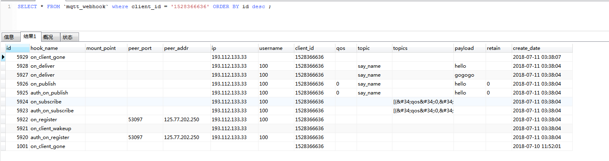
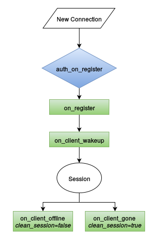
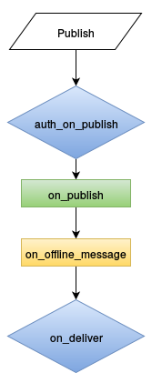
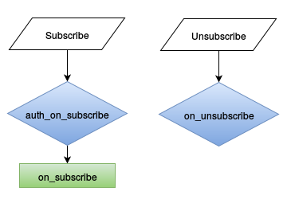
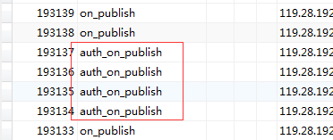
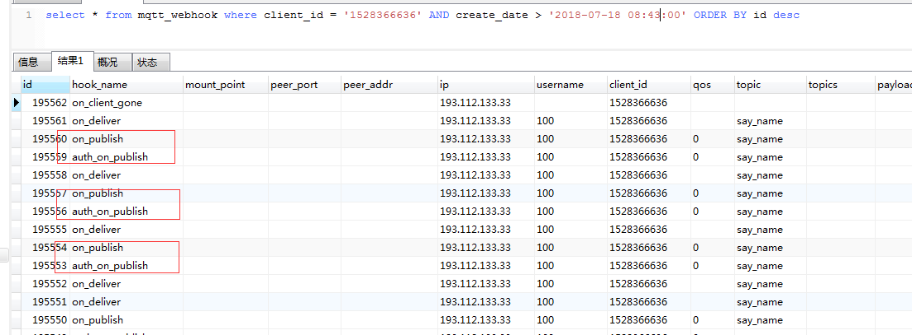

之前在一个 webrtc 的项目中，使用VerneMQ作为signal服务器进行通信的时候，发现每次连接的log都很难去跟进。而且 VerneMQ 的console.log 只能打出运行的一些基本状态，没法打印出每次连接的每一个事件节点的log，比如 pub 和 sub 之类的事件。
后面看来一下官方的文档 [webhookplugins](https://vernemq.com/docs/plugindevelopment/webhookplugins.html) 才发现可以通过设置webhook来得到每一次连接的各个事件节点。
## 操作流程：
首先是将 配置的这个打开：

plugins.vmq_webhooks = on

然后刚开始测试的时候，可以动态添加：

[kbz@VM_16_13_centos ~]$ sudo vmq-admin webhooks register hook=on_deliver  endpoint="http://xxx.airdroid.com/mqtt/webhook"
Done

注意，这样添加的好处，就是进程不需要重启，就可以生效。但是缺点就是 如果进程重启了，那么这些设置就都没有了。
如果要想持久化，就要添加到 vernemq.conf 这个文件里面。因为我们只是测试，所以先不需要添加到 vernemq.conf 文件中。
<!--more-->
就这样，我们直接添加了所有能够添加的 webhook， 查看目前所支持的 [webhook 事件](https://github.com/erlio/vernemq/blob/320192be1cde04d7656f42a12a4f63b0880437cb/apps/vmq_webhooks/src/vmq_webhooks_plugin.erl#L333)
这时候就查看：

[kbz@VM_16_13_centos ~]$ sudo vmq-admin webhooks show
+------------------+------------------------------------------------+-------------+
|       hook       |                    endpoint                    |base64payload|
+------------------+------------------------------------------------+-------------+
|  on_unsubscribe  |http://xxx.airdroid.com/mqtt/webhook|    true     |
|   on_subscribe   |http://xxx.airdroid.com/mqtt/webhook|    true     |
|   on_register    |http://xxx.airdroid.com/mqtt/webhook|    true     |
|    on_publish    |http://xxx.airdroid.com/mqtt/webhook|    true     |
|on_offline_message|http://xxx.airdroid.com/mqtt/webhook|    true     |
|    on_deliver    |http://xxx.airdroid.com/mqtt/webhook|    true     |
| on_client_wakeup |http://xxx.airdroid.com/mqtt/webhook|    true     |
|on_client_offline |http://xxx.airdroid.com/mqtt/webhook|    true     |
|  on_client_gone  |http://xxx.airdroid.com/mqtt/webhook|    true     |
|auth_on_subscribe |http://xxx.airdroid.com/mqtt/webhook|    true     |
| auth_on_register |http://xxx.airdroid.com/mqtt/webhook|    true     |
| auth_on_publish  |http://xxx.airdroid.com/mqtt/webhook|    true     |
+------------------+------------------------------------------------+-------------+

如果是要注销掉这个webhook的话，那么就是：

$ vmq-admin webhooks deregister hook=auth_on_register endpoint="http://xxx.airdroid.com/mqtt/webhook"

接下来就是 写对应的接口了。 go 代码如下：

// 获取webhook
func (c *Mqtt) Webhook() revel.Result {
   res := WebHookRes{}
   res.Result = "ok"
   // 获取头部
   hookName := c.Request.Header.Get("vernemq-hook")
   //log.Info("vernemq hook:", hookName)
   // 获取数据
   params, err := utils.GetJsonParam(c.Request)
   if err != nil {
      log.Error("vernemq hook: json err", err)
      return utils.EchoResult(c.Controller, res)
   }

   utils.SetNotExist(params, "mountpoint", "")
   utils.SetNotExist(params, "clientId", "")
   utils.SetNotExist(params, "username", "")
   utils.SetNotExist(params, "peerAddr", "")
   utils.SetNotExist(params, "peerPort", "")
   utils.SetNotExist(params, "qos", "")
   utils.SetNotExist(params, "topic", "")
   utils.SetNotExist(params, "topics", "")
   utils.SetNotExist(params, "payload", "")
   utils.SetNotExist(params, "retain", "")
   utils.SetNotExist(params, "password", "")
   utils.SetNotExist(params, "cleanSession", "")

   if params["payload"] != "" {
      params["payload"], err = crypto.Base64DecodeToStr(params["payload"])
      if err != nil {
         params["payload"] = ""
         log.Error("payload decode err", err)
      }
      // 接下来判断是否是一个json 格式的
      tmp := make(map[string]interface{})
      err := json.Unmarshal([]byte(params["payload"]), &tmp)
      if err != nil {
         params["payload"] = ""
         log.Error("payload no json string", err)
      }
      if len(params["payload"]) > 100 {
         params["payload"] = params["payload"][:100]
      }
   }

   if params["topic"] != "" {
      if len(params["topic"]) > 100 {
         params["topic"] = params["topic"][:100]
      }
   }

   if params["topics"] != "" {
      if len(params["topics"]) > 100 {
         params["topics"] = params["topics"][:100]
      }
   }

   data := models.MqttWebHookData{
      HookName:     hookName,
      CreateDate:   utils.GetNowDatetime(),
      MountPoint:   params["mountpoint"],
      ClientId:     params["clientId"],
      Username:     params["username"],
      PeerAddr:     params["peerAddr"],
      PeerPort:     params["peerPort"],
      Qos:          params["qos"],
      CleanSession: params["cleanSession"],
      Topic:        params["topic"],
      Topics:       params["topics"],
      Payload:      params["payload"],
      Retain:       params["retain"],
      Ip:           util.ClientIp(c.Request.Request),
   }
   log.Infof("vernemq hook(%v): info:%v", hookName, params)
   //log.Infof("vernemq hook(%v): data:%v", hookName, data)
   // 插入log
   models.MqttWebHookModel.InsertMqttWebHookLogs(data)
   return utils.EchoResult(c.Controller, res)
}

全部返回 **ok**, 数据很简单就是取出来， 然后入库。
测试程序如下：

var mqtt = require('mqtt');
// var client  = mqtt.connect('mqtt://test.mosquitto.org');
var clientId = '1528366636';
var username = '100';
var pwd = 'xxx';
var client  = mqtt.connect('tcp://test-xxx.airdroid.com:1883',{
    clientId: clientId,
    username: username,
    password: pwd
});

client.on('connect', function () {
    console.log("connected");
    client.subscribe('say_name');
    setTimeout(function(){
        client.publish('say_name', 'hello')
    },10);
});

client.on('message', function (topic, message) {
    // message is Buffer
    console.log(topic);
    console.log(message.toString());
    // client.end()
});

console.log("start");

而且通过看 log， 也可以看到：

[Info] [2018-07-11 03:38:04] [vernemq hook(auth_on_register): info:map[username:100 qos: topics: peerPort:53097 clientId:1528366636 password:xxx cleanSession:1 peerAddr:125.77.202.250 topic: payload: retain: mountpoint:]]
[Info] [2018-07-11 03:38:04] [vernemq hook(on_client_wakeup): info:map[topics: payload: mountpoint: qos: peerAddr: peerPort: topic: retain: clientId:1528366636 username:]]
[Info] [2018-07-11 03:38:04] [vernemq hook(on_register): info:map[topic: topics: payload: retain: clientId:1528366636 peerPort:53097 mountpoint: username:100 peerAddr:125.77.202.250 qos:]]
[Info] [2018-07-11 03:38:04] [vernemq hook(auth_on_subscribe): info:map[peerAddr: qos: topic: payload: retain: clientId:1528366636 topics:[{&#34;qos&#34;:0,&#34;topic&#34;:&#34;say_name&#34;}] mountpoint: username:100 peerPort:]]
[Info] [2018-07-11 03:38:04] [vernemq hook(on_subscribe): info:map[username:100 peerAddr: qos: retain: topics:[{&#34;qos&#34;:0,&#34;topic&#34;:&#34;say_name&#34;}] clientId:1528366636 peerPort: topic: payload: mountpoint:]]
[Info] [2018-07-11 03:38:04] [vernemq hook(auth_on_publish): info:map[qos:0 topics: payload:hello retain:0 username:100 mountpoint: clientId:1528366636 topic:say_name peerAddr: peerPort:]]
[Info] [2018-07-11 03:38:04] [vernemq hook(on_publish): info:map[topics: clientId:1528366636 qos:0 payload:hello retain:0 peerPort: username:100 mountpoint: topic:say_name peerAddr:]]
[Info] [2018-07-11 03:38:04] [vernemq hook(on_deliver): info:map[mountpoint: peerAddr: peerPort: retain: payload:gogogo username:100 clientId:1528366636 topic:say_name qos: topics:]]
[Info] [2018-07-11 03:38:04] [vernemq hook(on_deliver): info:map[topic:say_name payload:hello username:100 clientId:1528366636 qos: topics: retain: mountpoint: peerAddr: peerPort:]]
[Info] [2018-07-11 03:38:07] [vernemq hook(on_client_gone): info:map[username: peerAddr: peerPort: qos: topics: mountpoint: clientId:1528366636 topic: payload: retain:]]

而且入库也是可以查到：

这时候就可以从库里面查到某一个client连接的所有的触发的事件节点顺序。
## 添加到配置文件的话

plugins.vmq_webhooks = on
vmq_webhooks.mywebhook1.hook = on_unsubscribe
vmq_webhooks.mywebhook1.endpoint = http://xxx.airdroid.com/mqtt/webhook
vmq_webhooks.mywebhook2.hook = on_subscribe
vmq_webhooks.mywebhook2.endpoint = http://xxx.airdroid.com/mqtt/webhook
vmq_webhooks.mywebhook3.hook = on_register
vmq_webhooks.mywebhook3.endpoint = http://xxx.airdroid.com/mqtt/webhook
vmq_webhooks.mywebhook4.hook = on_publish
vmq_webhooks.mywebhook4.endpoint = http://xxx.airdroid.com/mqtt/webhook
vmq_webhooks.mywebhook5.hook = on_offline_message
vmq_webhooks.mywebhook5.endpoint = http://xxx.airdroid.com/mqtt/webhook
vmq_webhooks.mywebhook6.hook = on_deliver
vmq_webhooks.mywebhook6.endpoint = http://xxx.airdroid.com/mqtt/webhook
vmq_webhooks.mywebhook7.hook = on_client_wakeup
vmq_webhooks.mywebhook7.endpoint = http://xxx.airdroid.com/mqtt/webhook
vmq_webhooks.mywebhook8.hook = on_client_offline
vmq_webhooks.mywebhook8.endpoint = http://xxx.airdroid.com/mqtt/webhook
vmq_webhooks.mywebhook9.hook = on_client_gone
vmq_webhooks.mywebhook9.endpoint = http://xxx.airdroid.com/mqtt/webhook
vmq_webhooks.mywebhook10.hook = auth_on_subscribe
vmq_webhooks.mywebhook10.endpoint = http://xxx.airdroid.com/mqtt/webhook
vmq_webhooks.mywebhook11.hook = auth_on_register
vmq_webhooks.mywebhook11.endpoint = http://xxx.airdroid.com/mqtt/webhook
vmq_webhooks.mywebhook12.hook = auth_on_publish
vmq_webhooks.mywebhook12.endpoint = http://xxx.airdroid.com/mqtt/webhook

然后重启一下即可：

[kbz@VM_0_6_centos ~]$ sudo service vernemq restart
Restarting vernemq (via systemctl):                        [  OK  ]

## 事件节点的含义
这些事件节点，主要涉及到三个事件，register， publish， subscribe
### [session 的生命周期](https://vernemq.com/docs/plugindevelopment/sessionlifecycle.html)

### [publish 事件流](https://vernemq.com/docs/plugindevelopment/publishflow.html)

### [subscribe 事件流](https://vernemq.com/docs/plugindevelopment/subscribeflow.html)

## 使用webhook cache的问题
从上面可以看到，每一个 on_register 都要伴随一个校验的 auth_on_register，同理， 每一次 on_publish 都要伴随一个校验的 auth_on_publish，每一次的 on_subscribe 都要伴随一个校验的 auth_on_subscribe，而且如果 publish 很多的时候，就会出现大量的 auth_on_publish。

其实从debug角度来说，这些 auth 的webhook，其实是没啥必要的。所以 VerneMQ 提供针对这三个 auth 事件的缓存: [传送门](https://vernemq.com/docs/plugindevelopment/webhookplugins.html),原理也很简单，就是返回的时候， 加上这个头部 cache-control: max-age=AgeInSeconds  就行了。这样下次有auth的webhook的时候， VerneMQ 就会去查看 webhook cache 有没有这个缓存。如果有的话，就不抛送了。所以接口的代码要改下，返回的时候，加上：

AUTH_ON_SUBSCRIBE = "auth_on_subscribe"
AUTH_ON_REGISTER = "auth_on_register"
AUTH_ON_PUBLISH = "auth_on_publish"

// 插入log
models.MqttWebHookModel.InsertMqttWebHookLogs(data)
// 如果是这三种校验的webhook，那么就设置缓存，先设置为 300s
if hookName == AUTH_ON_REGISTER || hookName == AUTH_ON_PUBLISH || hookName == AUTH_ON_SUBSCRIBE {
   c.Response.Out.Header().Add("Cache-Control", "max-age:300")
}
return utils.EchoResult(c.Controller, res)

还是那个测试程序， 可以看到 这边已经有缓存了:

[kbz@VM_16_13_centos ~]$ sudo vmq-admin webhooks cache show
+------+------------------------------------------------+-----------------+-----+
| stat |                    endpoint                    |      hook       |value|
+------+------------------------------------------------+-----------------+-----+
|misses|http://xxx.airdroid.com/mqtt/webhook|auth_on_subscribe|6235 |
|misses|http://xxx.airdroid.com/mqtt/webhook|auth_on_register |5470 |
|misses|http://xxx.airdroid.com/mqtt/webhook| auth_on_publish |56279|
+------+------------------------------------------------+-----------------+-----+

然后我又换了一个新的测试程序测了一下：

var mqtt = require('mqtt');
var clientId = '1528366636';
var username = '100';
var pwd = 'xxxxx';
var client  = mqtt.connect('tcp://xxx-signal.xxx.com:1883',{
    clientId: clientId,
    username: username,
    password: pwd
});

client.on('connect', function () {
    console.log("connected");
    client.subscribe('say_name');
    setTimeout(function(){
        client.publish('say_name', 'hello');
        setTimeout(function(){
            client.publish('say_name', 'hello2');
            setTimeout(function(){
                client.publish('say_name', 'hello3');
                setTimeout(function(){
                    client.publish('say_name', 'hello4')
                },1000);
            },1000);
        },1000);
    },10);
});

client.on('message', function (topic, message) {
    // message is Buffer
    console.log(topic);
    console.log(message.toString());
});

console.log("start");

发现后面的每一次的pub，还是会有 auth， 跟我想象中有点差别？？？

那就奇怪了，不是说 auth 会缓存起来吗？？？ 怎么还是发过来了？？？？ 如果是这样的话，那么代码得改一下了， 就是如果是这三个auth的话，那么就不入库了。
而且我看了一下文档，如果缓存如果过期了，还是会继续留在内存里面。不会删掉。 那这样会不会导致内存泄露？？？？？

Note: cache entries are currently not actively disposed after expiry and will remain in memory.

而且用了一段时间，发现竟然还有副作用，那就是在连接mqtt 的时候，发现整个校验全部无效了。redis 的校验全部失效了。 无论是register 的 auth ，还是 publish auth 和 sub auth 全部没有用了。我怀疑就是因为 这三个 auth 被缓存起来了。 所以都没有经过 auth 这一步。重启也没有用， 因为还是缓存在内存里面。

[kbz@VM_16_13_centos ~]$ sudo vmq-admin webhooks cache show
+------+------------------------------------------------+-----------------+-----+
| stat |                    endpoint                    |      hook       |value|
+------+------------------------------------------------+-----------------+-----+
|misses|http://xxx.airdroid.com/mqtt/webhook|auth_on_subscribe|6235 |
|misses|http://xxx.airdroid.com/mqtt/webhook|auth_on_register |5470 |
|misses|http://xxx.airdroid.com/mqtt/webhook| auth_on_publish |56279|
+------+------------------------------------------------+-----------------+-----+

只要这个东西还在，那么就是auth就会失效。
我后面的解决方法就是：先把webhook 的那个接口，返回的 **cache-contol** 的逻辑去掉了。但是发现还是不行，还是会绕过。后面把 webhook 的配置关掉 **plugins.vmq_webhooks = off** 然后重启 vernemq 才搞定。 权限校验才恢复。
总结： 这个功能跟我想象中的不太一样，可能是我理解错了，反正我后面就不用了。
## 订阅webhook的耗时问题
自从订阅了webhook之后，有测试反应最近signal的连接和pub会比之前没有校验的那一台机器来的慢。所以为了重现这种情况，需要把现在用的那一台hk中的 权限校验和 webhook都去掉。 让他们测下 速度上有没有提高上来。所以配置文件是要改的， 首先把权限校验去掉， 然后把webhook去掉。

#关闭插件和redis校验 （原先都是on）
plugins.vmq_diversity = off
vmq_diversity.auth_redis.enabled = off

#开启任意授权连接，并且开放acl 校验 （原先是 off）
allow_anonymous = on
plugins.vmq_acl = on

#最后是关掉webhook 的开关 （原先是 on）
plugins.vmq_webhooks = off

这样改为之后，重启一下vernemq 就行了。 **sudo service vernemq restart**
后面试下了一下，果然差很多。原来连接要 20s的， 现在只要 6s。那么问题出现在哪里呢？
- 一个原因是 redis 校验的时候，很花时间。
- 另一个原因是 webhook 的请求，很花时间。

刚开始先测了一下redis校验的问题，把redis的权限校验开起来：

plugins.vmq_diversity = on
vmq_diversity.auth_redis.enabled = on

allow_anonymous = off
plugins.vmq_acl = off

发现还是挺快的，基本没什么差别。 所以怀疑是webhook的问题。为什么会怀疑是webhook的问题。是因为webhook 是一个同步请求。尤其是  auth_on_register，auth_on_publish，auth_on_subscribe 这三个事件，如果接口那边返回的不是 200 和 ok。 那么是可以拒绝连接和拒绝 pub 和 sub 的。所以肯定是同步请求。至于其他的几个事件是不是也是同步的，这个得测下。首先在权限开启的时候，把 webhook 也开启来 **plugins.vmq_webhooks = on**
开了之后，重启了一下服务，果然发现连接的时长多了4,5s了。所以就是因为webhook的同步请求，导致速度变慢了。
而且后面如果把 auth_on_register，auth_on_publish，auth_on_subscribe 这三个事件注释掉，只监听其他事件的话，会不会时间会短点？？ 数据证明，虽然比没有注释的时候快，但是还是比全部关掉的时候满了2s左右，所以应该也是同步请求。

