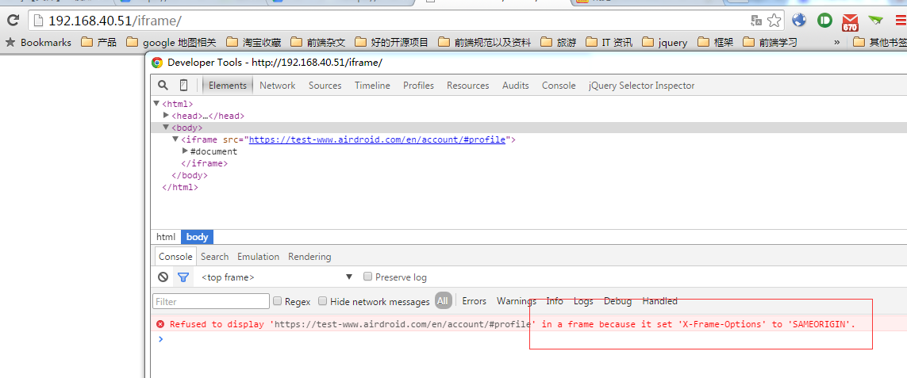
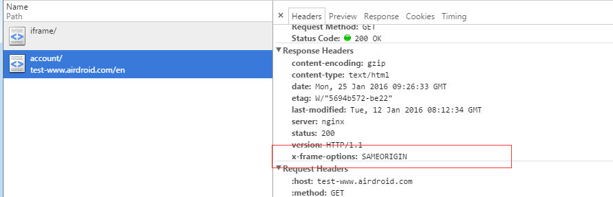

之前我们项目的官网有反馈一个问题，就是用户将我们的官网的页面嵌入到他自己的站点。

通过这种方式，可以用来做点击劫持 Clickjacking

因此我们要防止 页面内嵌

#### 方法1： 通过js来防止：


if (window.location != window.parent.location) {
 window.parent.location = window.location;
}


但是这个容易被破解，只要

// 顶层窗口中放入代码 var location = document.location;
// 或者 var location = "";

<!--more-->
#### 方法2：使用 X-Frame-Options  header

使用X-Frame-Options防止网页被Frame

因为我们用的是nginx，所以只要添加这一栏header 即可


add_header X-Frame-Options SAMEORIGIN;


这个方法才能真正杜绝点击劫持

---

先拿测试的来测。

发现加了之后，果然不能嵌入了

设置是 SAMEORIGIN ，也就是说同源的就可以了

---

#### 使用 X-Frame-Options 有三个可选的值：
* DENY：浏览器拒绝当前页面加载任何Frame页面
* SAMEORIGIN：frame页面的地址只能为同源域名下的页面
* ALLOW-FROM：允许frame加载的页面地址

---

#### 除了X-Frame-Options之外，Firefox的"Content Security Policy"以及Firefox的NoScript扩展也能够有效防御ClickJacking，这些方案为我们提供了更多的选择