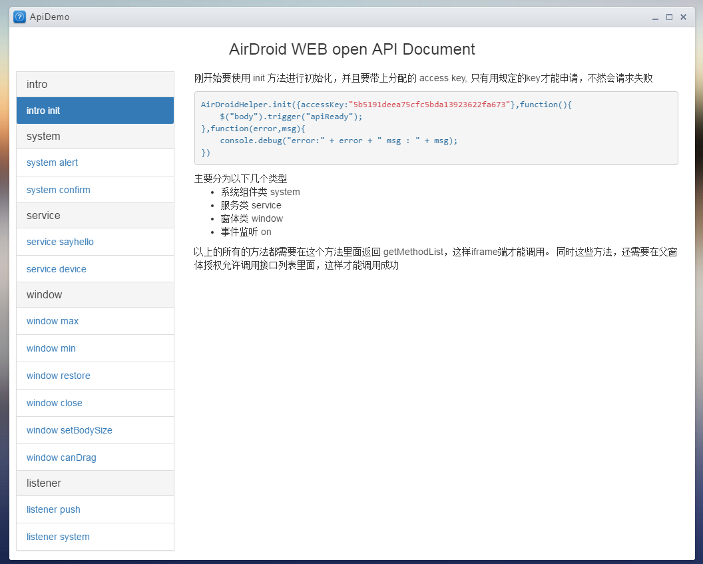

之前在做一个web项目的时候，有做了一个针对该项目开放的第三方平台。 说是第三方平台，其实也不太对，没那么高大尚。 简单的来说，就是开放这个web项目的一些内部API, 并用来给一些内嵌在该web站点的页面调用。让其获取该站点的相关信息和方法, 甚至可以通过这些API来调用所连接手机所提供的一些接口服务，比如打开google play，安装apk等等。
有做的其中一个例子就是有内嵌了一个第三方服务的第三方页面，然后提供他们一个sdk js文件，并提供了一些方法:
<!--more-->

// 服务端增加接口，只需要在列表里添加接口名就行。
SERVER_METHODS : [
    "openPlayStoreOnDeviceThemer",
    "sendIntentBroadCastThemer",
    "isThemerAppInstalled"
],
// 对应系统层面的触发事件,一般是一些公告方法，比如alert之类的
SYSTEM_METHODS : [
    "system.alert",
    "system.confirm"
]

这样他们就可以在他们的页面接入我们的js sdk，并调用我们提供给他们的api方法，包括后面做的在lite模式下，使用iframe内嵌第三方广告，也有用到这一块的东西。
而且后面我也专门写了一个api文档模块，用来描述这个。

其中主要包括了几个部分的api文档:
- 系统组件类
- 服务类
- 窗体类
- 事件监听

后面会一一讲解

---
完整系列：






