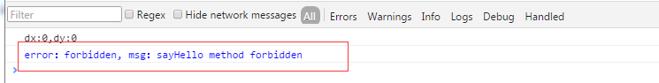

通过  我们知道了iframe和父页面通信的方式。那么接下来就要描述下 具体 web api 要怎么设计。
## 一个Iframe对应一个channel，并且具有唯一性
首先肯定一个iframe要对应一条单独的channel，所以channel通道肯定是要唯一的。针对这一点，那就是在初始化模块的时候，就初始化一个新的channel给新的iframe。
这时候在父web站点的加载iframe的代码如下， **IframeApp.js**:
ps： 下面有一些代码跟父站点有上下文关系，如果没有特意说明，说明无关紧要，可以直接无视
<!--more-->

self.find("iframe").load(function () {
    self.find("iframe").css("visibility","visible");
    self.removeAppLoadMask();
    // 这里添加了 本地API HOOK
    // 启动通讯通道，提供RPC
    var appFrameId = _.uniqueId('i_app_');
    self.find('iframe').attr('id', appFrameId);
    // 数据 api
    var provider = new ApiProvider(appFrameId,self);
    self._refChan = provider.getChannelObj();
});


然后是 **apiprovider.js** 这个文件主要是提供对 iframe 页面的访问和授权支持。

window.ApiProvider = function (iframeId,winObj) {
    var self = this;
    // 允许的token
    self._accessToken = null;
    // 允许开放的方法
    self._accessMothod = ['registerPushHandle'];
    self.chan = Channel.build({
        window: document.getElementById(iframeId).contentWindow,
        origin: "*",
        scope: "AirDroid_Web_OpenAPI",
        onReady: function () {
            self.init();
            // 将通道绑定到具体的窗体对象,使得既可以让子窗体监听父窗体的窗体变化，也可以让子窗体调用父窗体的渲染形式
            winObj && winObj.hookChan(self.chan);
        }
    });
...
}

其中可以看到在初始化通道的时候，会把新建的窗体对象 winObj 也传过去。这个也是为了后面要实现的 window 开发api的方法做的。通过这个winObj，就可以操作这个窗体的一些行为，比如放大，缩小，关闭等等。

接下来就是子页面的初始化通道的代码，这边会提供一个sdk，让子页面来可以引入， **airdroid.js** :

// 初始化通道
self._chan = Channel.build({
    window : window.parent,
    origin : self.origin,
    scope : "AirDroid_Web_OpenAPI",
    onReady : function () {
        console.debug("channel ready!!!!!");
    }
});

上面的 **self.origin** 在初始化的时候，是可以传的，如果没有传的话，就默认为 * 

## 提供权限校验
肯定不能允许所有的子iframe都能连上来，万一是一些有问题的iframe呢，因此要提供一个accessKey的功能。 也就是当iframe通道连上来的时候。还要再进行初始化，把合法的accessKey传上来。然后父对象检查这个accessKey是否合法，如果合法的话，就把对应的accessToken传回去。后面子页面的每一个call都要带上accessToken过来，只有这个accessToken是合法的，父页面才能正常执行。这样就能够防止非法的iframe连上来，即使连上来，也因为没有accessToken，导致没法执行方法。
具体父站点的代码如下， **apiprovider.js** :

// 允许开放的方法
self._accessMothod = ['registerPushHandle'];
// 获取权限初始化，要得到对应的tokenKey
init: function(trans,params){
    trans.delayReturn(true);
    // 获取accessKey
    var accessKey = params.accessKey;
    var mapItem = self.controlMap[accessKey];
    if(mapItem){
        self._accessToken = mapItem.token;
        // 所允许被调用的方法，目前只对服务方法和系统方法做限制，其他先不限制
        self._accessMothod = self._accessMothod.concat(mapItem.openMap.SERVER_METHODS.concat(mapItem.openMap.SYSTEM_METHODS || []));
        trans.complete(self.getAccessToken());
    }else{
        throw {error: "forbidden", message: "Illegal access key"};
    }
},

子iframe会再连接上通道之后，执行init事件，然后把accessKey传过来。然后父页面检查accessKey是否合法。如果不合法就返回错误。如果合法，就返回对应的accessToken，作为后面的通信凭证。
其中controlMap 这个变量存放的是所有的合法accessKey以及所允许调用的api列表，这个可以从服务端去取，比如之前的那个demo的的 controlMap就是：

// demo 接口
"c81e728d9d4c2f636f067f89cc14862c": {
    token: "52e50a7fd932cba519f306c5b6faf246",
    // 所允许的方法
    openMap: {
        // 服务请求
        SERVER_METHODS:[
            "sayHello",
            "getDeviceOpt",
            "reconnectPhone"
        ],
        // 系统方法
        SYSTEM_METHODS: [
            "system.alert",
            "system.confirm"
        ]
    }
}

不过有一个方法比较特殊，registerPushHandle 这个方法是用来注册push推送事件的，默认所有的子页面都有，不需要额外给。
对于父页面来说，针对子页面所有的call请求都要做校验，只有校验通过，才会执行其call请求，主要是以下两层校验：
- 子页面过来的方法，父页面必须存在，并且在这个子iframe所允许调用的api列表里面。
- 子页面过来的accessToken是否是正确的。

具体指向的方法如下， **apiprovider.js** :

provide: function (apis) {
    var self = this;
    apis = apis || [];
    // todo 这边不绑定window系列的方法，window系列的方法会在AppWindow里面绑定，这里只绑定 service 和 system 系列的方法
    _.each(apis, function (apiName) {
        var isSupportedApi = _.has(self.ALL_APIS, apiName);
        if (isSupportedApi) {
            self.chan.bind(apiName, function(tran,params){
                // 除了init方法之后，每一次请求都会带accessToken
                var token = params.accessToken;
                // 如果token是对的，并且是在允许的方法之内，那么就允许
                // 如果是init 和 registerPushHandle 这两个方法，也允许
                if((token && self.getAccessToken() === token && self._accessMothod.indexOf(apiName) > -1)
                    || apiName === "init"){
                    // 是被允许开放的方法
                    return self.ALL_APIS[apiName].apply(this,arguments);
                }else{
                    // 返回禁止信息
                    if(self.getAccessToken() !== token){
                        throw {error: "forbidden", message: 'token error'};
                    }else if(self._accessMothod.indexOf(apiName) < 0){
                        throw {error: "forbidden", message: apiName +' method forbidden'};
                    }
                }
            });
        }
    });
},

之所以特殊判断init方法是因为init是初始化权限校验的方法，所以肯定是不能做限制的。
子页面 sdk **airdroid.js** :

if(methodName === 'init'){
    var oldsuccess = configs.success;
    // 判断是否有传deviceId
    self._deviceId = configs.params.deviceId || "";
    configs.success = function(result){
        self._accessToken = result;
        // 绑定白名单监听
        // 这边要有一个延迟，不然AirDroidHelper还没有初始化
        setTimeout(function(){
            // 注册监听事件
            if(self.PUSH_LISTENS && self.PUSH_LISTENS.length > 0 && self._deviceId){
                // 注册推送监听事件
                self.registerPushHandle({
                    params: {
                        deviceId: self._deviceId,
                        pushArr: self.PUSH_LISTENS
                    },
                    success: function(){
                        console.log("register handle success");
                    }
                });
            }
        },500);
        self.isFunction(oldsuccess) && oldsuccess(result);
    }
}else{
    // 不是的话，全部带上token值
    configs.params.accessToken = self._accessToken;
}
configs.success = configs.success || function(){};
self._chan.call(configs);

子页面在初始化所能调用方法的时候，就要先进行init的初始化，调用父页面的init方法，将accessKey，获取对应的token，然后把token保存起来，接下来的所有的方法调用全部都会加上这个token参数
configs 就是调用通道传过去的配置 option 对象，包括调用的方法名，参数，以及成功回调，和失败回调。
## 限制所能调用的API方法和类型
虽然accessToken校验通过了，但是针对不同的iframe页面，可能web父页面这边要授予不同的权限。有些页面只能调用一些基本的组件，比如alert，蒙层之类的。 而有的子页面却可以调用更深层次的api，比如获取当前连接手机的信息，获取当前登录用户的信息，甚至可以通过子页面的api，直接重连手机。所以对子页面所能调用的api方法也是有限制的。
因为该设计还不够完善。目前子页面的通信功能主要有两种类型：
1. 主动调用（分为三个类型）
     1.1  服务类型 service， 比如获取设备信息，连接设备之类的
     1.2  系统组件类型 system， 比如弹出alert框，出现蒙层之类的
     1.3  窗体类型 window， 比如放大，缩小，关闭之类的

2. 事件监听（分为两个类型）
     2.1 服务推送事件 push 类型，比如设备断开，新增联系人之类的
     2.2 窗体监听事件类型，比如监听窗体的放大，缩小，关闭

以下的子页面 demo 模块所允许的方法列表： **openMethodList.js**
注意： 这些方法肯定要在父页面所开放的所有api方法中，如果不在里面的话，肯定的调不到

AirdroidRuntime.getMethodList = function() {
    return {
        // 服务端增加接口，只需要在列表里添加接口名就行。
        SERVER_METHODS : [
            "sayHello",
            "getDeviceOpt",
            "reconnectPhone"
        ],
        // 对应窗体的触发事件, 注意，因为这一部分只跟窗体有关，所以方法的实现不在apiprovider.js 中，而是在 AppWindow.js 的 hookChan
         WINDOW_METHODS : [
            "window.close",
            "window.max",
            "window.min",
            "window.restore",
            "window.setBodySize",
            "window.setDPosition"
         ],
        // 对应系统层面的触发事件,一般是一些公告方法，比如alert之类的
         SYSTEM_METHODS : [
            "system.alert",
            "system.confirm"
         ],
    //====================上面都是调用事件，下面都是监听事件=======================//
         // 监听push事件
         PUSH_LISTENS : [
            // camera 关闭
             "camera_destroy",
            // 手机端服务挂掉
             "access_offline"
         ],
        // 监听系统和窗体事件
         SYSTEM_LISTENS : [
            // 监听窗体的关闭事件
             "window.close",
            // 监听窗体的最小化
             "window.min",
            // 监听窗体恢复大小
             "window.restore",
            // 监听窗体的最大化
             "window.max",
            // 监听窗体的大小改变
             "window.resize"
         ]
    }
}

虽然有5种类型，但其实调用的方式是有差的。前三种是属于 主动调用，即 call 的方式。后两种是监听，即 bind 方式。
### 先从主动调用说起。
主动调用的三种类型，其中前两种 SERVER_METHODS 和 SYSTEM_METHODS 类型的方法，是需要父页面那边授权的。也就是说，哪怕子页面这边已经在方法里面添加了这些方面，但是如果父页面没有授权该子页面这些方法。实际上是会返回forbidden的。
也就是刚才 demo 模块 controlMap 的 openMap：

// demo 接口
"c81e728d9d4c2f636f067f89cc14862c": {
    token: "52e50a7fd932cba519f306c5b6faf246",
    // 所允许的方法
    openMap: {
        // 服务请求
        SERVER_METHODS:[
            "sayHello",
            "getDeviceOpt",
            "reconnectPhone"
        ],
        // 系统方法
        SYSTEM_METHODS: [
            "system.alert",
            "system.confirm"
        ]
    }
}

也就是说， SERVER_METHODS 和 SYSTEM_METHODS 类型的方法需要父页面在该子页面的openMap里面授权，才能在子页面添加或者使用，如果调用不存在openMap里面的方法，就会返回forbidden。
如果把上面openMap里面的 sayHello 方法去掉，然后让子页面去调用这个方法的话，就会出现以下报错：

具体代码 **apiprovider.js** :

if((token && self.getAccessToken() === token && self._accessMothod.indexOf(apiName) > -1)
    || apiName === "init"){
    // 是被允许开放的方法
    return self.ALL_APIS[apiName].apply(this,arguments);
}else{
    // 返回禁止信息
    if(self.getAccessToken() !== token){
        throw {error: "forbidden", message: 'token error'};
    }else if(self._accessMothod.indexOf(apiName) < 0){
        throw {error: "forbidden", message: apiName +' method forbidden'};
    }
}

当父页面 throw 这个错误的时候，就会触发子页面的configs.error 方法， **airdroid.js**:

configs.error = function(){
    self.isFunction(originError) && originError.apply(null, arguments);
    self.errorHandler.apply(null, arguments);
};
// 默认的错误事件
errorHandler: function (errorType, msg) {
    console.debug("error：" + errorType + ", msg：" + msg);
}

至于第三个主动调用的window系列的方法。并不要求父页面授权，只要父页面有绑定这些事件就行了。因此子页面只要添加在methodList里面就行了。
而且因为window系列的方法都涉及到对该窗体的操作，因此这部分代码是不在父对象的apiprovider.js里面绑定的。而是在window操作方法 AppWindow.js 绑定的。
通过在初始化通道的时候，将通道传到这个第三方页面的窗体事件

// 将通道绑定到具体的窗体对象,使得既可以让子窗体监听父窗体的窗体变化，也可以让子窗体调用父窗体的渲染形式
winObj && winObj.hookChan(self.chan);

可以看到，在初始化IframeApp的时候，会把该app对应的窗体对象传过来。因此就变成在AppWindow.js 绑定对应的window系列的对象， **AppWindow.js**:

hookChan: function (chan) {
    var self = this;
    if (this._isIframeApp) {
        this._chan = chan;
        // 窗体函数hook
        chan.bind("window.close", function (m, param) {
            self._wDom.find(".window_close").trigger('click');
            return true;
        }).bind("window.max", function (m, param) {
            self._wDom.find(".window_max").trigger('click');
        }).bind("window.min", function (m, param) {
            self._wDom.find(".window_min").trigger('click');
        }).bind("window.restore", function (m, param) {
            if (self._wDom.attr("max") == "true" && self._wDom.is(":visible")) {
                self._wDom.find(".window_max").trigger('click');
            } else if (!self._wDom.is("visible") && self._taskItem.is(":visible")) {
                self._taskItem.trigger('click');
            }
        }).bind("window.setTitle", function (m, param) {
            self.updateTitle(param.title);
            return true;
        })
    }
},

所以会发现在 apiprovider.js 里面绑定所有接口的时候，是没有包含window系列的接口的。

self.ALL_APIS = $.extend(true,{}, self.SERVER_APIS, self.SYSTEM_APIS);
// chan 绑定所有的事件
self.provide(_.keys(self.ALL_APIS));

他只有service 系列和system 系列的接口。
当然对于子页面来说，所有的调用系列的接口，都是一样的，只要调用call接口就行了。
### 被动监听接口
既然调用系列的接口分析完了，接下来就是分析监听系列的接口了。
监听系列的接口，都不需要在父页面授权（当然，父页面本身要存在这个事件触发），子页面只要监听就行了。
**openApi.js**:

// 监听窗体和系统的变化，比如窗体的放大缩小等等，可以去 airdroid.js 里面的 SYSTEM_LISTENS 去添加
// 同时也监听推送事件，可以去airdroid.js 里面的 PUSH_LISTENS 去添加
on: function(eventName,callback){
    airdroidApi.on(eventName,function(data){
        console.debug("[API Rev]=>" + eventName);
        console.log(data);
        callback(data);
    });
}

其中 airdroidApi 其实就是 airdroid.js 这个 sdk的对象， openApi.js 是对他的进行再封装，他们两个合起来才是完成的第三方SDK。
其中airdroid.js基本上是不变的，而 openApi.js 是含有一定定制化的，因为不同的第三方，我们要给他们分配的权限和方法是不一样的。
**airdriod.js** 关于事件监听的代码，就是用bind方法：

// 接下来绑定监听的系统和窗体事件和push推送事件
var API_LISTENS = self.SYSTEM_LISTENS.concat(self.PUSH_LISTENS);

self.on = function(eventType,callback){
    if(API_LISTENS.indexOf(eventType) == -1 || !this.isFunction(callback)){
        console.info("[API Error]=>Not support this event type[" + eventType + "] OR callback is not a function!");
    }else{
        // 绑定监听事件，让父窗口来调用
        self._chan.bind(eventType,function(m,d){
            callback(d);
        });
    }
};

但是对于系统监听和窗体监听，这两种的实现还不一样。窗体监听只要上述那种处理就行了，直接通过on方法 bind 事件就行了。在父对象的窗体操作中，如果触发特定的操作，比如放大，关闭等等，就会触发这个事件，然后子页面就可以触发执行对应的方法了。
以下是父对象的窗体最大化事件 **AppWindow.js**：

// iframe程序，往通道激发信息
if (self._isIframeApp && self._chan) {
    self._chan.call({
        method: "window.max",
        params: {},
        success: function () {
            return true;
        },
        error: function () {
            return false;
        }
    });
}

在执行父窗体的最大化事件的时候，会去检测该窗体是否是iframe窗体，并且是否有通道对象。如果都有的话，就触发这个window 事件。这时如果子页面有监听这个窗体事件的话，就可以触发到了。
而系统监听的事件，比如设备断开啊，相机打开，断开了，都跟具体的设备有关系。因此子页面这边除了用on方法bind知会，还需要再进行一层处理，就是去父页面注册（因为父页面用的是listener 观察者模式）。
这时候就需要调用一个子页面必须要调用的方法 registerPushHandle 来绑定具体的 系统监听的事件。
子页面 **airdroid.js**:

// 注册监听事件
if(self.PUSH_LISTENS && self.PUSH_LISTENS.length > 0 && self._deviceId){
    // 注册推送监听事件
    self.registerPushHandle({
        params: {
            deviceId: self._deviceId,
            pushArr: self.PUSH_LISTENS
        },
        success: function(){
            console.log("register handle success");
        }
    });
}

要带上deviceId过去，并且是在init方法里面调用的, 父页面 **apiprovider.js**。

// 注册推送事件(这个事件很重要，是第三方消息推送的基础)
registerPushHandle: function(trans,params){
    var deviceId = params.deviceId;
    var pushArr = params.pushArr;
    // 加入到白名单中
     Airdroid.MessageManage.addWhiteListListener(pushArr);
    // 监听事件
     _.each(pushArr,function(item){
        // 先去掉旧的，再绑定新的事件
        Airdroid.MessageManage.removeListener(item,undefined,"open_api_" + deviceId);
        Airdroid.MessageManage.addListener(item,function(data){
            if(!(data.data && data.data.deviceId)){
                data.data = data.data || {};
                data.data.deviceId = Airdroid.DeviceManage.getCurrentDeviceId();
            }
            if(data.data.deviceId == deviceId){
                // 如果是该设备，就call
                self.chan.call({
                    method: item,
                    params: data.data,
                    success: function () {
                        return true;
                    },
                    error: function () {
                        return false;
                    }
                });
            }
        },"open_api_" + deviceId);
    })
},

这样子，如果出现设备断开等事件的话，就会用fireEvent触发，然后就到这边，最后执行call，到子页面触发执行, 这时候就会触发了。

if (event_type == self.EventTypes.msg_access_offline) {
    self.fireEvent(event_type, {});
}
