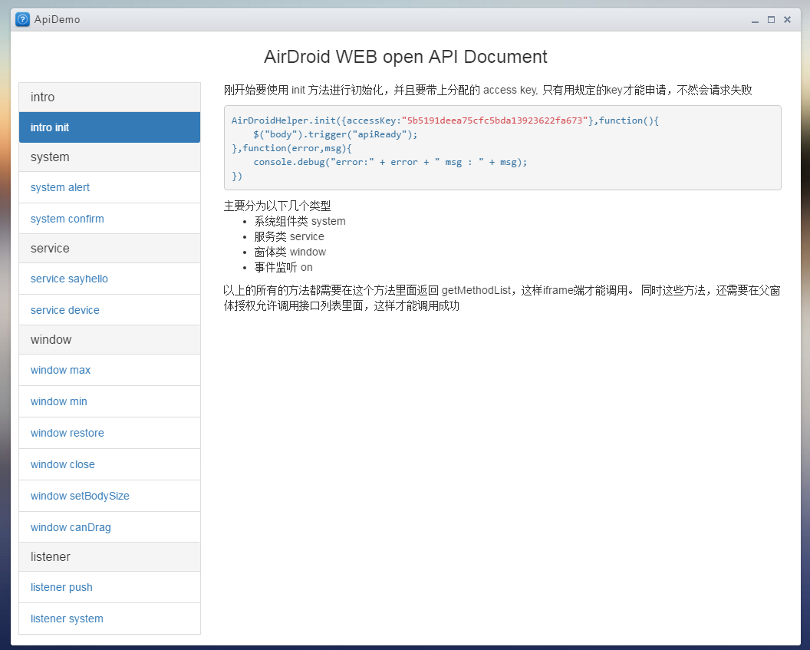
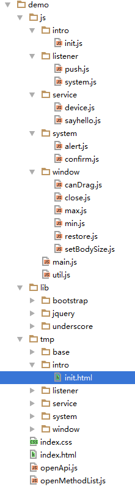
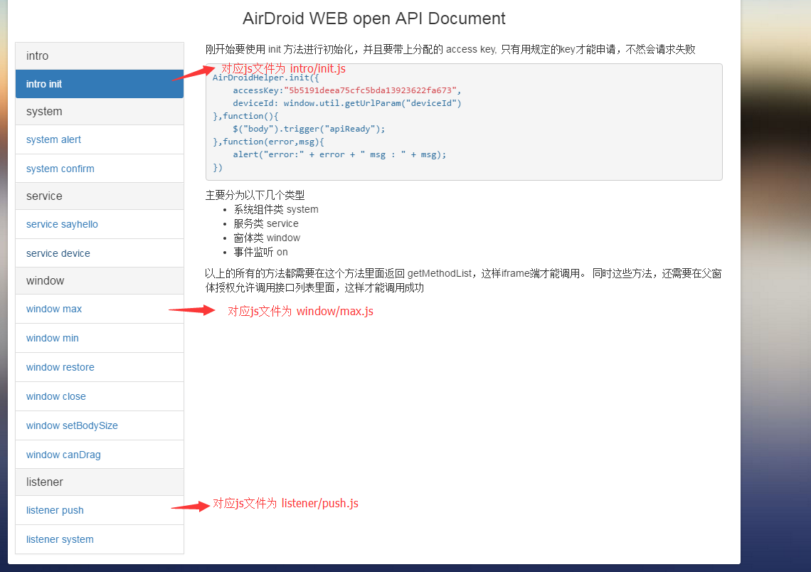
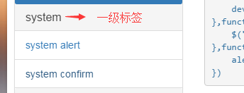
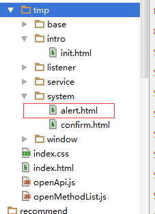

本篇主要是围绕着这个 demo 来做进一步的讲解。 再看一下这个demo的截图：

<!--more-->
创建这个demo的时候，就会去建立通道，并把当前设备的deviceId放到url后面传过去 

self.find("iframe").load(function () {
    self.find("iframe").css("visibility","visible");
    self.removeAppLoadMask();
    // 这里添加了 本地API HOOK
    // 启动通讯通道，提供RPC
    var appFrameId = _.uniqueId('i_app_');
    self.find('iframe').attr('id', appFrameId);
    // 数据 api
    var provider = new ApiProvider(appFrameId,self);
    self._refChan = provider.getChannelObj();
});

demo的目录结构：

分为几个部分，一个是首页和css，一个是lib库，一个是业务的js，最后一个是每一个功能的模板。
接下来看 **index.html**：

<!DOCTYPE html>
<html>
<head>
<meta charset="utf-8"/>
<title>open API Demo</title>
    <link rel="stylesheet" href="./lib/bootstrap/css/bootstrap.min.css">
    <link rel="stylesheet" href="./lib/bootstrap/css/doc.min.css">
    <link rel="stylesheet" href="./index.css">
    
    
    
    
    
    
    
    
</head>
    <body>
    <h3 class="text-center">AirDroid WEB open API Document</h3>
    

        <ul id="tab_list" class="nav nav-pills nav-stacked col-md-3" role="tablist"></ul>
        

    

    </body>
    
    
    
    
    
    
    
    
    
    
    
    
    
    
    
</html>

通过**index.html**可以看到，整个js分为了三部分
- lib 库部分（jQuery， bootstrap，underscore）， 这部分没有什么好说的，就是工具，便于更好的开发
- airdroid js sdk 部分 （jschannel，openMethodList，airdroid，openApi），除了第一个是通道的lib库之外，其他三个都是我们自己写的 js 文件，用来作为第三方接入的sdk文件。
- api文档业务逻辑部分，这部分就是这个demo的业务部分

先从第三部分开始分析：
可以看到，除了util 和 main 这两个文件，其他的js都只是某一个功能的js文件。
而且从文件的名字，也是可以看到是对应的。

也就是从这些js中，如果去掉某一个功能tab，比如 window min 这个功能，那么就要把 wndow/min.js js去掉就行了。
同样的道理，如果要添加一个功能tab，比如 window resize， 那么只要添加一个对应的js，即 window/resize.js 就行了。
那么究竟是怎么实现的呢，包括模板的实现, 那我们找一个js看看, **js/system/alert.js**。

//==== airdroid system alert demo =======
(function(window){
    var id = "system_alert";
    window.util.appendFeatureListItem(id);
    window.util.waitApiReady(function(){
        $("#" + id + "_btn").click(function(){
            window.util.clearLog();
            AirDroidHelper.System.alert("demo-->alert",function(){
                // yes callback
                window.util.log("你点击了确定");
            })
        });
    })
})(window);

可以看到逻辑非常简单，就是声明一个id，然后调用appendFeatureListItem 添加dom。
最后在waitApiReady方面的回调里面执行dom里面的交互逻辑，交互逻辑也很简单，就是点击一个按钮，调用system.alert 方法。
首先看看appendFeatureListItem 这个方面是如何添加对应的dom的, **util.js**

/**
 * 根据templateName获取模版内容
 * @param folder 文件夹
 * @param name 文件名
 * @param [obj] 模版对象
 * @return {*}
 */
getTemplate: function (folder, name, obj) {
    var dom = "";
    var baseUrl = window.baseUri || "./";
    var file_url = baseUrl + 'tmp/' + folder + "/" + name + '.js';
    if (window.isPublish) {
        dom = window["ajst"]['tmp/' + folder + "/" + name + '.html'](obj);
    } else {
        if (!obj) obj = {};
        if (this.cacheTpls[file_url]) {
            var tpl = this.cacheTpls[file_url];
        } else {
            var tpl = this.cacheTpls[file_url] = $.ajax({
                url: baseUrl + 'tmp/' + folder + "/" + name + '.html',
                async: false,
                cache: true
            }).responseText;
        }
        dom = _.template(tpl, obj);
    }
    return dom;
},
// 判断对应的dom是否存在
checkDomExist: function(domSelect){
  return $(domSelect).length > 0;
},
// 添加功能的list con
appendFeatureListCon: function(id) {
    // 如果是第一个，那么要加上active的类
    $("#tab_list").append(this.getTemplate("base","listCon",{
        id: id
    }))
},
// 添加功能的list item
appendFeatureListItem: function(id) {
    var self = this;
    var folder = id.split("_")[0];
    var name = id.split("_")[1];
    var conSelector = "#" + folder + "_con";
    // 接下来判断容器是否存在
    if(!this.checkDomExist(conSelector)){
        // 如果不存在，要先添加
        this.appendFeatureListCon(folder);
    }
    $(conSelector + " .list-group").append(this.getTemplate("base","listItem",{
        id: id,
        isAcive: !self.checkDomExist(".list-group-item")
    }));
    var tabDom = $('

');
    if(!this.checkDomExist("#tab_content .tab-pane")){
        tabDom.addClass("active");
    }
    tabDom.append(this.getTemplate(folder, name,{
        id: id
    }));
    $("#tab_content").append(tabDom);
},

就是把id分为两个，一个是对应的文件夹名，一种是文件夹里面的文件名。
注意： 这边添加dom分别两个方面，一个是左边的list name，一个是右边的tab 内容。
首先他会去判断左边list的一级标签是否存在，所谓的一级标签就是这个:

如果一级标签不存在的话，就调用 appendFeatureListCon 这个方法添加一级标签。
然后再添加所属的二级list标签。
最后再添加右边的tab内容。可以看到他在查看对应模板的时候，是通过文件夹名和文件名去查找的。也就是说tmp模板里面的文件要遵循一定的规律。也就是说 system.alert 的模板一定是在 tmp/system/alert.html 这边

这样就省了另外指定的功夫。
接下来看一下对应模板的内容: **alert.html**:


    
该方法是显示一个AirDroid的alert 组件

    <pre class="nt">
    AirDroidHelper.System.alert("demo-->alert",function(){
        // yes callback
        window.util.log("你点击了确定");
    })
    </pre>
    <button class="btn btn-primary" id="<%=id%>_btn">点我</button>
    


可以看到，是固定由一个 class为 tab-pane的div包起来的。
其实整个左边的架构就是由bootstrap的 collapse 和 tab 组合起来的。
既然dom分析完了。那么就分析 waitApiReady 这个方法。
前面几章都说了，在创建通道的时候，还需要调用init方法, **main.js**:

$(function(){
    $("#con .list-group-item a").click(function(){
        $("#con .list-group-item").removeClass("active");
    });
    // =================================api demo here=======================
    if(AirDroidHelper){
        AirDroidHelper.init({
            accessKey:"c81e728d9d4c2f636f067f89cc14862c",
            deviceId: window.util.getUrlParam("deviceId")
        },function(){
            $("body").trigger("apiReady");
        },function(error,msg){
            alert("error:" + error + " msg : " + msg);
        })
    }
});

deviceId 直接通过url 带过来。
在 init成功之后，会trigger 一个 apiReady 事件： **util.js** :

waitApiReady: function(cb){
    if(this.apiReady){
        cb();
    }else{
        $("body").on("apiReady", function(){
            cb();
        })
    }
}

其实就是为了确认 init 已经成功，这样调用的时候，才能保证调用成功。
也就是说后续如果还要添加api文档的话，就按照这种方式，继续添加js和对应的tpl模板文件就行了。

---
完整系列：








