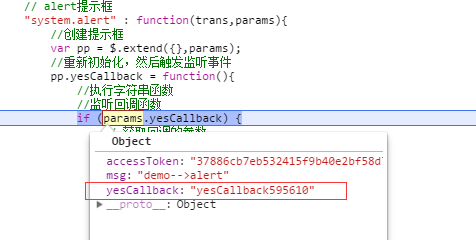

通过  可以知道demo这个模块的基础架构。 那么这次主要讲sdk这部分的内容。其实sdk这部分的逻辑，其实在前面的几次讲解中，都讲的差不多了，不过那些都是一些概念，这次着重分析代码。
首先以下4个文件，就是整个sdk的内容，当然后续给第三方服务的，就是合并起来并压缩的一个js文件，现在为了便于分析，就分成4个js比较好区别：
<!--more-->



除了 jschannel 是一个库之外， 接下来主要讲解其他三个库的作用。
其中 airdroid.js 是基本上不会变的，无论多少个iframe，他都要接一样的这个js。 这个js也是sdk的底层。
但是每一个 iframe，都有一个属于自身的 openApi.js 和 openMethodList.js。 这两个js是定制化的，每次给第三方服务的都不一样，之所以不一样是因为分配的权限和方法是不一样的。
以 demo 这个模块来说，分配的权限都在 **openMethodList.js** 这个文件里面：

(function () {
    window.AirdroidRuntime = {};
    AirdroidRuntime.getMethodList = function() {
        return {
            // 服务端增加接口，只需要在列表里添加接口名就行。
            SERVER_METHODS : [
                "sayHello",
                "getDeviceOpt",
                "reconnectPhone"
            ],
            // 对应窗体的触发事件, 注意，因为这一部分只跟窗体有关，所以方法的实现不在apiprovider.js 中，而是在 AppWindow.js 的 hookChan
            WINDOW_METHODS : [
                "window.close",
                "window.max",
                "window.min",
                "window.restore",
                "window.setBodySize",
                "window.setDPosition"
            ],
            // 对应系统层面的触发事件,一般是一些公告方法，比如alert之类的
            SYSTEM_METHODS : [
                "system.alert",
                "system.confirm"
            ],
            //====================上面都是调用事件，下面都是监听事件=======================//
            // 监听push事件
            PUSH_LISTENS : [
                // camera 关闭
                "camera_destroy",
                // 手机端服务挂掉
                "access_offline"
            ],
            // 监听系统和窗体事件
            SYSTEM_LISTENS : [
                // 监听窗体的关闭事件
                "window.close",
                // 监听窗体的最小化
                "window.min",
                // 监听窗体恢复大小
                "window.restore",
                // 监听窗体的最大化
                "window.max",
                // 监听窗体的大小改变
                "window.resize"
            ]
        }
    }
})();

关于这些事件的类型和应用，前面已经讲过了，这边就不再多说了。而 **openApi.js** 这个js就是对 airdroid 所bind 的方法的再一层封装，使得结构更清晰，调用更清楚。

/**
 * User: zach
 * Date: 14-3-19
 * 第三方开发API, 先给一个统一需求，最后再按各自的需求再增加
 */
(function(window){

    // 初始化 API 对象
    var airdroidApi = new window.AirdroidApi();

    // 这里每增加一个方法，都要去 airdroid.js 的 方法列表里面添加
    // 因为该通信是异步的，因此每次的结果都要回调
    window.AirDroidHelper = {
        isFunction:function(obj){
            return airdroidApi.isFunction(obj);
        },
        // 初始化，传入accesskey 和 deviceId
        init:function(params,successCb,failCb){
            var self = this;
            airdroidApi.init({
                params : params,
                // 设置超时时间，因为连接的超时时间是36秒，因此这边要设的更长
                success: function(result){
                    if(self.isFunction(successCb)){
                        successCb();
                    }
                },
                error: function(errorType,msg){
                    console.debug("error：" + errorType + ",msg：" + msg);
                    if(self.isFunction(failCb)){
                        failCb(errorType,msg);
                    }
                }
            })
        },
        // 服务请求管理接口
        Service: {
            // 在play上打开
            sayHello : function(msg, success){
                return airdroidApi.sayHello({
                    params:{
                        msg: msg
                    },
                    success: success
                });
            }
        },
        // 设备管理接口
        DeviceManage : {
            // 设备id，一般通过读取iframe的url参数来获取
            deviceId: null,
            deviceOpt: null,
            // 是否已经连接
            isConnected: false,
            // 是否是远程
            isRemote: false,
            // 设置设备id
            setDeviceId: function(id){
                this.deviceId = id;
            },
            // 获取设备属性对象
            getDeviceOpt: function(successCb){
                var self = this;
                return self.deviceOpt || airdroidApi.getDeviceOpt({
                        params : {deviceId:self.deviceId},
                        success: function(deviceOpt){
                            console.log("获取设备对象信息");
                            self.deviceOpt = deviceOpt;
                            if($.isFunction(successCb)){
                                successCb(deviceOpt);
                            }
                        },
                        error: function(){
                            alert("没有这个方法");
                        }
                    });
            },
            // 判断设备是否已经连接
            checkIsConnected:function(){
                return this.isConnected;
            },
            // 判断是否远程
            checkIsRemote:function(){
                return this.isRemote;
            },
            // 连接设备
            connectPhone: function(successCb,failCb){
                var self = this;
                return airdroidApi.connectPhone({
                    params : {
                        deviceId: self.deviceId
                    },
                    // 设置超时时间，因为连接的超时时间是36秒，因此这边要设的更长
                    timeout: 40000,
                    success: function(data){
                        if(data.result === 1){
                            self.isConnected = true;
                            self.isRemote = data.isRemote;
                            if($.isFunction(successCb)){
                                successCb();
                            }
                        }else{
                            self.isConnected = false;
                            self.isRemote = data.isRemote;
                            if($.isFunction(failCb)){
                                failCb();
                            }
                        }
                    }
                });
            },
            // 重新连接手机
            reconnectPhone: function(successCb,failCb){
                var self = this;
                return airdroidApi.reconnectPhone({
                    params : {
                        deviceId: self.deviceId
                    },
                    // 设置超时时间，因为连接的超时时间是36秒，因此这边要设的更长
                    timeout: 40000,
                    success: function(data){
                        if(data.result === 1){
                            self.isConnected = true;
                            self.isRemote = data.isRemote;
                            if($.isFunction(successCb)){
                                successCb();
                            }
                        }else{
                            self.isConnected = false;
                            self.isRemote = data.isRemote;
                            if($.isFunction(failCb)){
                                failCb();
                            }
                        }
                    }
                });
            }
        },
        // 对应窗体的触发事件
        Window: {
            // 设置窗体最大化
            max : function(success){
                airdroidApi["window.max"]({
                    success: success
                });
            },
            // 设置窗体最小化
            min : function(success){
                airdroidApi["window.min"]({
                    success: success
                });
            },
            // 设置窗体关闭
            close : function(success){
                airdroidApi["window.close"]({
                    success: success
                });
            },
            // 设置窗体恢复原状
            restore : function(success){
                airdroidApi["window.restore"]({
                    success: success
                });
            },
            // 设置窗体大小
            setBodySize : function(params, success){
                airdroidApi["window.setBodySize"]({
                    params : params,
                    success: success
                });
            },
            // 设置可以拖拽
            setCanDrag: function(cb){
                document.body.setAttribute("class", "SADD");
                var _startX = 0;            // mouse starting positions
                var _startY = 0;
                var _offsetX = 0;           // current element offset
                var _offsetY = 0;
                var _dragElement;           // needs to be passed from OnMouseDown to OnMouseMove
                var _oldZIndex = 0;         // we temporarily increase the z-index during drag
                var InitDragDrop = function() {
                    document.onmousedown = OnMouseDown;
                    document.onmouseup = OnMouseUp;
                };
                var isToppestNodeHasClassName = function (obj,cn){
                    if(obj.className == cn){
                        return true;
                    }else{
                        if(obj.nodeName.toUpperCase() != "BODY") {
                            return  isToppestNodeHasClassName(obj.parentNode,cn);
                        }else{
                            return false;
                        }
                    }
                };
                var OnMouseDown = function(e) {
                    var target = e.target != null ? e.target : e.srcElement;
                    if (target.nodeName.toUpperCase() == 'INPUT') {
                        return;
                    }
                    // IE is retarded and doesn't pass the event object
                    if (e == null) {
                        e = window.event;
                    }
                    // IE uses srcElement, others use target
                    target = e.target != null ? e.target : e.srcElement;

                    // for IE, left click == 1
                    // for Firefox, left click == 0
                    if ((e.button == 1 && window.event != null ||
                        e.button == 0) &&
                            //target.className == 'SADD')
                        isToppestNodeHasClassName(target,'SADD')) {
                        // grab the mouse position
                        _startX = e.screenX;
                        _startY = e.screenY;

                        // grab the clicked element's position
                        _offsetX = ExtractNumber(target.style.left);
                        _offsetY = ExtractNumber(target.style.top);

                        // bring the clicked element to the front while it is being dragged
                        _oldZIndex = target.style.zIndex;
                        target.style.zIndex = 10000;

                        // we need to access the element in OnMouseMove
                        _dragElement = target;

                        // tell our code to start moving the element with the mouse
                        document.onmousemove = OnMouseMove;

                        // cancel out any text selections
                        document.body.focus();

                        // prevent text selection in IE
                        document.onselectstart = function () { return false; };
                        // prevent IE from trying to drag an image
                        target.ondragstart = function() { return false; };
                        // prevent text selection (except IE)
                        return false;
                    }
                };
                var OnMouseMove = function(e) {
                    var target = e.target != null ? e.target : e.srcElement;
                    if (target.nodeName.toUpperCase() == 'INPUT') {
                        return;
                    }

                    if (e == null) {
                        e = window.event;
                    }
                    // this is the actual "drag code"

                    var xx = _offsetX + e.screenX - _startX;
                    var yy = _offsetY + e.screenY - _startY;

                    try{
                        airdroidApi["window.setDPosition"]({
                            params : {dx: xx ,dy:yy},
                            success: function(){
                                cb && cb(xx,yy);
                            }
                        });
                    }catch(ex){

                    }
                    _startX = e.screenX;
                    _startY = e.screenY;
                };
                var OnMouseUp = function(e) {
                    var target = e.target != null ? e.target : e.srcElement;
                    if (target.nodeName.toUpperCase() == 'INPUT') {
                        return;
                    }

                    if (_dragElement != null) {
                        _dragElement.style.zIndex = _oldZIndex;

                        // we're done with these events until the next OnMouseDown
                        document.onmousemove = null;
                        document.onselectstart = null;
                        _dragElement.ondragstart = null;
                        _dragElement = null;
                    }
                };
                var ExtractNumber = function(value) {
                    var n = parseInt(value);
                    return n == null || isNaN(n) ? 0 : n;
                };
                InitDragDrop();
            }
        },
        // 调用父窗体的系统事件
        System: {
            // alert 提示框
            alert : function(msg,callback){
                airdroidApi["system.alert"]({
                    params:{
                        msg: msg,
                        yesCallback: callback
                    },
                    success:function(){
                        console.debug("set alert");
                    }
                });
            },
            // confirm 确认框
            confirm : function(msg,yesCallback,cancelCallback){
                airdroidApi["system.confirm"]({
                    params:{
                        msg: msg,
                        yesCallback: yesCallback,
                        cancelCallback: cancelCallback
                    },
                    success:function(){
                        console.debug("set confirm");
                    }
                });
            }
        },
        // 监听窗体和系统的变化，比如窗体的放大缩小等等，可以去 airdroid.js 里面的 SYSTEM_LISTENS 去添加
        // 同时也监听推送事件，可以去airdroid.js 里面的 PUSH_LISTENS 去添加
        on: function(eventName,callback){
            airdroidApi.on(eventName,function(data){
                console.debug("[API Rev]=>" + eventName);
                console.log(data);
                callback(data);
            });
        }
    };
})(window);
console.debug('Airdroid Open Api  ready !!!');

可以看到， 他重新用 一个对象 AirDroidHelper  对 airdroidApi 这个对象的方法进行了再封装。其实方法，参数还是不变，只是让其结构更清晰。
假设我要调用一个alert，那么我只要 这样写：

AirDroidHelper.System.alert("demo-->alert",function(){
    // yes callback
    window.util.log("你点击了确定");
})

虽然我这样写，也可以实现：

var airdroidApi = new window.AirdroidApi();
airdroidApi["system.alert"]({
    params:{
        msg: msg,
        yesCallback: callback
    },
    success:function(){
        console.debug("set alert");
    }
});

但是很明显，上面那种更好。而且可以分层次，比如关于设备的所有操作，都放在DeviceManage对象里面，关于window的都放在window里面。
比如重连设备:

AirDroidHelper.DeviceManage.reconnectPhone(function(){
    window.util.log("设备连接成功")
},function(){
    window.util.log("设备连接失败")
});

窗口最大化:

AirDroidHelper.Window.max(function(){
    window.util.log("该窗口已放大");
});

监听设备连接断开

AirDroidHelper.on("access_offline",function(data){
    window.util.log("设备连接断开了");
});


接下来重头戏来了，就是核心的 **airdroid.js** :

(function () {
    var consoleMothods = ["debug", "error", "info", "log", "warn", "dir", "dirxml", "table", "trace", "assert",
        "count", "markTimeline", "profile", "profileEnd", "time", "timeEnd", "timeStamp",
        "timeline", "timelineEnd", "group", "groupCollapsed", "groupEnd", "clear"];
    for(var i in consoleMothods){
        console[consoleMothods[i]] = console[consoleMothods[i]] ||  console.log;
    }
})();
(function () {
    // 定义airdroid的API对象
    window.AirdroidApi = function (origin) {
        var self = this;
        if (window.parent === window) {
            return;
        }
        self.origin = origin || "*";
        self.initialize();
        return self;
    };
    AirdroidApi.prototype = {
        // 初始化事件
        initialize: function(){
            var self = this;
            // 每次请求都会带过去的token
            self._accessToken = "";
            // 设备id 不同的API 接口，不一定会传这个
            self._deviceId = "";
            // 必须要调用的接口
            self.NEED_METHODS = [
                "init",
                "registerPushHandle"
            ];
            // 获取开放的方法
            var open_methods = window.AirdroidRuntime.getMethodList() || {};
            // 服务端增加接口，只需要在列表里添加接口名就行。
            self.SERVER_METHODS = open_methods.SERVER_METHODS || [];
            // 对应窗体的触发事件, 注意，因为这一部分只跟窗体有关，所以方法的实现不在apiprovider.js 中，而是在 AppWindow.js 的 hookChan
            self.WINDOW_METHODS = open_methods.WINDOW_METHODS || [];
            // 对应系统层面的触发事件,一般是一些公告方法，比如alert之类的
            self.SYSTEM_METHODS = open_methods.SYSTEM_METHODS || [];
            //====================上面都是调用事件，下面都是监听事件=======================//
            // 监听push事件
            self.PUSH_LISTENS = open_methods.PUSH_LISTENS || [];
            // 监听系统和窗体事件
            self.SYSTEM_LISTENS = open_methods.SYSTEM_LISTENS || [];
            // 初始化通道
            self._chan = Channel.build({
                window     : window.parent,
                origin     : self.origin,
                scope      : "AirDroid_Web_OpenAPI",
                onReady    : function () {
                    console.debug("channel ready!!!!!");
                }
            });
            // 开始运行
            self.startRunning();
        },
        // 开始执行
        startRunning:function(){
            var self = this;
            // 初始化调用方法
            var API_METHODS = self.SERVER_METHODS.concat(self.NEED_METHODS,self.WINDOW_METHODS,self.SYSTEM_METHODS);
            for (var i in API_METHODS) {
                (function (methodName) {
                    self[methodName] = function (configs) {
                        configs = configs || {};
                        // 默认30秒超时
                        configs.timeout = configs.timeout || 30000;
                        var originError = configs.error;
                        configs.error = function(){
                            self.isFunction(originError) && originError.apply(null, arguments);
                            self.errorHandler.apply(null, arguments);
                        };
                        configs.method = methodName;
                        // 这边success方法没有定义，因此调用的时候，要自己定义, 也可以覆盖定义
                        // 接下来处理参数中的回调函数，如果是function的话，就动态监听
                        //这时候如果有回调函数的话，要进行处理，监听
                        var regFunction = function (obj) {
                            if (typeof obj === 'object') {
                                for (var k in obj) {
                                    if (typeof obj[k] === 'function') {
                                        var curId = Math.floor(Math.random()*1000001);
                                        //添加唯一值使之成为唯一的监听函数名
                                        var cbName = k + curId.toString();
                                        var cbFun = obj[k];
                                        obj[k] = cbName;     //监听的回调函数名取代回调函数体
                                        //监听回调函数
                                        self.cbListener(cbName,cbFun);
                                    } else if (typeof obj[k] === 'object') {
                                        regFunction(obj[k]);
                                    }
                                }
                            }
                        };
                        regFunction(configs.params);
                        // 如果是init函数的话，要做一下区分
                        configs.params = configs.params || {};
                        if(methodName === 'init'){
                            var oldsuccess = configs.success;
                            // 判断是否有传deviceId
                            self._deviceId = configs.params.deviceId || "";
                            configs.success = function(result){
                                self._accessToken = result;
                                // 绑定白名单监听
                                // 这边要有一个延迟，不然AirDroidHelper还没有初始化
                                setTimeout(function(){
                                    // 注册监听事件
                                    if(self.PUSH_LISTENS && self.PUSH_LISTENS.length > 0 && self._deviceId){
                                        // 注册推送监听事件
                                        self.registerPushHandle({
                                            params: {
                                                deviceId: self._deviceId,
                                                pushArr: self.PUSH_LISTENS
                                            },
                                            success: function(){
                                                console.log("register handle success");
                                            }
                                        });
                                    }
                                },500);
                                self.isFunction(oldsuccess) && oldsuccess(result);
                            }
                        }else{
                            // 不是的话，全部带上token值
                            configs.params.accessToken = self._accessToken;
                        }
                        configs.success = configs.success || function(){};
                        self._chan.call(configs);
                    }
                }(API_METHODS[i]));
            }
            //始终保持监听注销事件
            self._chan.bind("removecbListen",function(m,d){
                self.removecbListener(d);
            });
            //  接下来绑定监听的系统和窗体事件和push推送事件
            var API_LISTENS = self.SYSTEM_LISTENS.concat(self.PUSH_LISTENS);
            self.on = function(eventType,callback){
                if(API_LISTENS.indexOf(eventType) == -1 || !this.isFunction(callback)){
                    console.info("[API Error]=>Not support this event type[" + eventType + "] OR callback is not a function!");
                }else{
                    // 绑定监听事件，让父窗口来调用
                    self._chan.bind(eventType,function(m,d){
                        callback(d);
                    });
                }
            };
            // 用于动态监听回调函数，原有的jschannel的回调有很大的限制，因此要用动态监听回调
            self.cbListener = function(eventType,callback){
                if(!self.isFunction(callback)){
                    console.info("[API Error]=>Not support this event type[" + eventType + "] OR callback is not a function!");
                }else{
                    self._chan.bind(eventType,function(trans,params){
                        trans.delayReturn(true);
                        trans.complete(callback(params));
                    });
                }
            };
            //用于动态释放监听函数
            self.removecbListener = function(eventType){
                self._chan.unbind(eventType);
            };
        },
        // 判断是否是函数
        isFunction: function(obj){
            return Object.prototype.toString.call(obj) == '[object Function]';
        },
        // 默认的错误事件
        errorHandler: function (errorType, msg) {
            console.debug("error：" + errorType + ", msg：" + msg);
        }
    };
})();

但是在这之前，就会先初始化airdroid 对象了。即 运行 initialize

var airdroidApi = new window.AirdroidApi();

这次的初始化就是绑定 window.AirdroidRuntime.getMethodList() 里面的方法。
里面的方法分为两种，一种是主动调用的，一种是监听的。
监听的还比较好处理，直接 用 **bind** 就可以了。

self.on = function(eventType,callback){
    if(API_LISTENS.indexOf(eventType) == -1 || !this.isFunction(callback)){
        console.info("[API Error]=>Not support this event type[" + eventType + "] OR callback is not a function!");
    }else{
        // 绑定监听事件，让父窗口来调用
        self._chan.bind(eventType,function(m,d){
            callback(d);
        });
    }
};

而对于后面要主动调用的，就不能用简单的call了，因为一旦call，那相当于就是直接执行了。所以又给这些方法又包了一层，封装成一股方法，后面直接调用。

self[methodName] = function (configs) {
    configs = configs || {};
    // 默认30秒超时
    configs.timeout = configs.timeout || 30000;
    var originError = configs.error;
    configs.error = function(){
        self.isFunction(originError) && originError.apply(null, arguments);
        self.errorHandler.apply(null, arguments);
    };
    configs.method = methodName;
    // 这边success方法没有定义，因此调用的时候，要自己定义, 也可以覆盖定义
    // 接下来处理参数中的回调函数，如果是function的话，就动态监听
    //这时候如果有回调函数的话，要进行处理，监听
    var regFunction = function (obj) {
        if (typeof obj === 'object') {
            for (var k in obj) {
                if (typeof obj[k] === 'function') {
                    var curId = Math.floor(Math.random()*1000001);
                    //添加唯一值使之成为唯一的监听函数名
                    var cbName = k + curId.toString();
                    var cbFun = obj[k];
                    obj[k] = cbName;     //监听的回调函数名取代回调函数体
                    //监听回调函数
                    self.cbListener(cbName,cbFun);
                } else if (typeof obj[k] === 'object') {
                    regFunction(obj[k]);
                }
            }
        }
    };
    regFunction(configs.params);
    // 如果是init函数的话，要做一下区分
    configs.params = configs.params || {};
    if(methodName === 'init'){
        var oldsuccess = configs.success;
        // 判断是否有传deviceId
        self._deviceId = configs.params.deviceId || "";
        configs.success = function(result){
            self._accessToken = result;
            // 绑定白名单监听
            // 这边要有一个延迟，不然AirDroidHelper还没有初始化
            setTimeout(function(){
                // 注册监听事件
                if(self.PUSH_LISTENS && self.PUSH_LISTENS.length > 0 && self._deviceId){
                    // 注册推送监听事件
                    self.registerPushHandle({
                        params: {
                            deviceId: self._deviceId,
                            pushArr: self.PUSH_LISTENS
                        },
                        success: function(){
                            console.log("register handle success");
                        }
                    });
                }
            },500);
            self.isFunction(oldsuccess) && oldsuccess(result);
        }
    }else{
        // 不是的话，全部带上token值
        configs.params.accessToken = self._accessToken;
    }
    configs.success = configs.success || function(){};
    self._chan.call(configs);
}

这样不仅后面调用的时候，会在里面执行 call 来调用。
而且里面还区分 **init** 方法和其他方法。也就是说，如果当前是init的话，就会进行accessKey权限校验，并得到accessToken，保存起来。
然后其他的方法调用的时候，就会在原有的params参数上再加上accessToken的值。同时也会在init方法里面调用 registerPushHandle去父页面注册绑定一些系统的推送事件。
因此这两个方法，是必须会调用的方法，不用父页面去授权

// 必须要调用的接口
self.NEED_METHODS = [
    "init",
    "registerPushHandle"
];

接下来还发现重写的方法里面，有一个非常重要的方法， regFunction， 那么这个是用来干什么的呢？
这个是用来注册方法回调的。
举个例子，我们在调用 alert 方法的时候，

AirDroidHelper.System.alert("demo-->alert",function(){
    // yes callback
    window.util.log("你点击了确定");
})

具体在openApi的方法是：

alert : function(msg,callback){
    airdroidApi["system.alert"]({
        params:{
            msg: msg,
            yesCallback: callback
        },
        success:function(){
            console.debug("set alert");
        }
    });
},

第二个参数不是有一个回调方法，就是当用户点击alert的确定键的时候的回调。
需要知道一点的是，jschannel 本身是没有回调的，或者说它的回调有很大的限制。
他可以通过 trans 参数来延迟返回，返回的时候，可以返回不同的参数。
举个例子： reconnectPhone 就是通过这种方式来进行回调的： **openApi.js**:

reconnectPhone: function(successCb,failCb){
    var self = this;
    return airdroidApi.reconnectPhone({
        params : {
            deviceId: self.deviceId
        },
        // 设置超时时间，因为连接的超时时间是36秒，因此这边要设的更长
        timeout: 40000,
        success: function(data){
            if(data.result === 1){
                self.isConnected = true;
                self.isRemote = data.isRemote;
                if($.isFunction(successCb)){
                    successCb();
                }
            }else{
                self.isConnected = false;
                self.isRemote = data.isRemote;
                if($.isFunction(failCb)){
                    failCb();
                }
            }
        }
    });
}

而在父站点的处理逻辑， **apiprovider.js**;

reconnectPhone: function(trans,params){
    trans.delayReturn(true);
    var deviceId = params.deviceId;
    var deviceObj = Airdroid.DeviceManage.getDeviceObjById(deviceId);
    // 获取返回结果
    var getResultData = function(isConnect){
        return {
            result: isConnect ? 1 : 0,
            isRemote : deviceObj.isRemote()
        }
    };
    Airdroid.CenterManage.reconnectPhone(deviceObj,function(){
        // 设备连接成功
        trans.complete(getResultData(true));
    },function(){
        // 设备连接失败
        trans.complete(getResultData(false));
    });
},

可以看到 通过 trans.delayReturn(true); 来延迟返回，然后最后通过  trans.complete() 设置不一样的返回值来作为成功和失败的回调。然后在子页面的success 方法里面会根据 返回值来确定是成功还是失败。
这样子按道理上是可以实现回调的效果，但是会有以下限制：
- 这个意味着很多方法需要在 openApi.js 的封装方法的success方法进行回调再判断，跟 reconectPhone 方法一样。
- 该方法只能适应那种一次性流程的，比如连接设备，要么成功要么失败，因此可以在结果出来之后，就返回。但是有时候就会有那种阶段性回调，比如我操作一个东西，要回调，然后再操作一个东西，然后再回调，举个例子，比如有一个这么一个方法“system.prompt”，这个方法有三个回调，一个是按ok，一个按cancel，一个是参数校验回调validateCallback，所以流程是输入一个非法的字符，触发validateCallback，然后换成一个合法字符，点击ok，触发yesCallback。 对于这种情况trans.delayReturn就不能用了，因为当你第一次触发validateCallback的时候，流程就已经complete结束了，下面就没法再进行了。

为了解决上述的情况，才有 **regFunction** 这个东西，这个函数的原理其实就是把参数里面的回调函数（比如alert方法参数的yesCallback就是一个函数）换成一个随机值的一个字符串（比如变成yesCallback123456），然后使用 self.cbListener(cbName,cbFun); 监听这个事件。
然后父页面接收到这个事件之后，如果他触发这个回调的话，会去判断原有的参数是否有yesCallback这个参数，如果有的话，就触发这个参数值的事件，这样最终的回调就跑到子页面所绑定的这个回调了, 最后再把这个回调的监听事件给注销掉（父对象执行这个回调成功之后，就会马上注销掉）。
所以 **airdroid.js**:

// 用于动态监听回调函数，原有的jschannel的回调有很大的限制，因此要用动态监听回调
self.cbListener = function(eventType,callback){
    if(!self.isFunction(callback)){
        console.info("[API Error]=>Not support this event type[" + eventType + "] OR callback is not a function!");
    }else{
        self._chan.bind(eventType,function(trans,params){
            trans.delayReturn(true);
            trans.complete(callback(params));
        });
    }
};

//用于动态释放监听函数
self.removecbListener = function(eventType){
    self._chan.unbind(eventType);
};

这时候在子页面的调用方式就是 **openApi.js**:

alert : function(msg,callback){
    airdroidApi["system.alert"]({
        params:{
            msg: msg,
            yesCallback: callback
        },
        success:function(){
            console.debug("set alert");
        }
    });
},

这时候你会发现传的success还是一个函数，这个是因为在执行的时候，就会被转化了 **airdroid.js**:

for (var i in API_METHODS) {
    (function (methodName) {
        self[methodName] = function (configs) {
            configs = configs || {};
            // 默认30秒超时
            configs.timeout = configs.timeout || 30000;
            var originError = configs.error;
            configs.error = function(){
                self.isFunction(originError) && originError.apply(null, arguments);
                self.errorHandler.apply(null, arguments);
            };
            configs.method = methodName;
            // 这边success方法没有定义，因此调用的时候，要自己定义, 也可以覆盖定义
            // 接下来处理参数中的回调函数，如果是function的话，就动态监听
            //这时候如果有回调函数的话，要进行处理，监听
            var regFunction = function (obj) {
                if (typeof obj === 'object') {
                    for (var k in obj) {
                        if (typeof obj[k] === 'function') {
                            var curId = Math.floor(Math.random()*1000001);
                            //添加唯一值使之成为唯一的监听函数名
                            var cbName = k + curId.toString();
                            var cbFun = obj[k];
                            obj[k] = cbName;     //监听的回调函数名取代回调函数体
                            //监听回调函数
                            self.cbListener(cbName,cbFun);
                        } else if (typeof obj[k] === 'object') {
                            regFunction(obj[k]);
                        }
                    }
                }
            };
            regFunction(configs.params);
            // 如果是init函数的话，要做一下区分
            configs.params = configs.params || {};
            if(methodName === 'init'){
                var oldsuccess = configs.success;
                // 判断是否有传deviceId
                self._deviceId = configs.params.deviceId || "";
                configs.success = function(result){
                    self._accessToken = result;
                    // 绑定白名单监听
                    // 这边要有一个延迟，不然AirDroidHelper还没有初始化
                    setTimeout(function(){
                        // 注册监听事件
                        if(self.PUSH_LISTENS && self.PUSH_LISTENS.length > 0 && self._deviceId){
                            // 注册推送监听事件
                            self.registerPushHandle({
                                params: {
                                    deviceId: self._deviceId,
                                    pushArr: self.PUSH_LISTENS
                                },
                                success: function(){
                                    console.log("register handle success");
                                }
                            });
                        }
                    },500);
                    self.isFunction(oldsuccess) && oldsuccess(result);
                }
            }else{
                // 不是的话，全部带上token值
                configs.params.accessToken = self._accessToken;
            }
            configs.success = configs.success || function(){};
            self._chan.call(configs);
        }
    }(API_METHODS[i]));
}

执行的方法里面，会去判断这个config参数有没有是函数回调类型的，如果有的话，就通过**regFunction**转化为唯一值的字符串，然后在子页面监听这个字符串 **self.cbListener(cbName,cbFun);**， 这时候当父页面执行到原来callback的时候，就会去获取callback参数的唯一字符串，然后直接**call** 来触发子页面的绑定事件，触发完之后，再调用**removecbListen**把这个监听注销掉。这就是一个一次性事件。
所以在父站点的这个方法是这样写的， **apiprovider.js**:

"system.alert" : function(trans,params){
    //创建提示框
    var pp = $.extend({},params);
    //重新初始化，然后触发监听事件
    pp.yesCallback = function(){
        //执行字符串函数
        //监听回调函数
        if (params.yesCallback) {
            // 获取回调的参数
            if(_.isObject(params.param)){
                var newParam = params.param;
            }else{
                var newParam = {};
            }
            //触发回调函数
            self.chan.call({
                method:params.yesCallback,
                params:newParam,
                success:function () {
                    //alert只执行一次，执行完之后应该要注销掉该监听方法
                    self.chan.call({
                        method:"removecbListen",
                        params:params.yesCallback,
                        success:function () {
                            return true;
                        },
                        error:function () {
                            return false;
                        }
                    });
                    return true;
                },
                error:function () {
                    return false;
                }
            });
        }
    };
    AirUtil.alert(pp.msg,pp.yesCallback);
    return true;
},

未转化之前的参数是：

转换之后为:

到父页面就是：

这样就是一个完整的回调循环了，这种情况，就非常灵活。
比如这个更复杂，有三个callback回调， 父页面是这样定义的， **apiprovider.js**:

// prompt 填充框
"system.prompt" : function(trans,params){
    var pp = $.extend({},params);
    //重新初始化，然后触发监听事件
    if(_.isObject(params.param)){
        var newParams = params.param;
    }else{
        var newParams = {};
    }
    // 按 ok的回调
    pp.yesCallback = function(){
        //执行字符串函数
        //获取输入值
        var filedValue = arguments[0];
        if (params.yesCallback) {
            //触发回调函数
            self.chan.call({
                method:params.yesCallback,
                params:{data:filedValue},
                success:function () {
                    self.chan.call({
                        method:"removecbListen",
                        params:params.yesCallback,
                        success:function () {
                            return true;
                        },
                        error:function () {
                            return false;
                        }
                    });
                    return true;
                },
                error:function () {
                    return false;
                }
            });
        }
    };
    // 按 cancel的回调
    pp.cancelCallback = function(){
        //执行字符串函数
        //监听回调函数
        if (params.cancelCallback) {
            //触发回调函数
            self.chan.call({
                method:params.cancelCallback,
                params:newParams,
                success:function () {
                    self.chan.call({
                        method:"removecbListen",
                        params:params.cancelCallback,
                        success:function () {
                            return true;
                        },
                        error:function () {
                            return false;
                        }
                    });
                    return true;
                },
                error:function () {
                    return false;
                }
            });
        }
    };
    // 验证参数回调
    pp.validateCallback = function(value,callback){
        //执行字符串函数
        //监听回调函数
        if (params.validateCallback) {
            //触发回调函数
            self.chan.call({
                method:params.validateCallback,
                // 将输入的值传过去
                params:{data:value},
                success:function (result) {
                    //把返回值通过callback执行
                    if(callback(result)){
                        // 如果返回true，就释放该事件
                        self.chan.call({
                            method:"removecbListen",
                            params:params.validateCallback,
                            success:function () {
                                return true;
                            },
                            error:function () {
                                return false;
                            }
                        });
                    }
                    return true;
                },
                error:function () {
                    return false;
                }
            });
        }
    };
    AirUtil.prompt(pp.type,pp.title,pp.fieldName,pp.defaultValue,pp.yesCallback,pp.cancelCallback,pp.validateCallback);
    return true;
},

子页面就是这样调用 **openApi.js**:

// 询问填充框 prompt
prompt : function(title,fieldName,defaultValue,yesCallback,cancelCallback,validateCallback,type){
    airdroidApi["system.prompt"]({
        params:{
            type: type || "",
            title: title || "",
            fieldName: fieldName || "",
            defaultValue: defaultValue || "",
            yesCallback: yesCallback,
            cancelCallback: cancelCallback,
            validateCallback: validateCallback || null
        },
        success:function(){
            console.debug("set prompt");
        }
    });
},

不管你这个流程有几个回调，只要没有注销，那么就会一直存在。所以每次我们用完就要把它注销掉。

---
完整系列：








