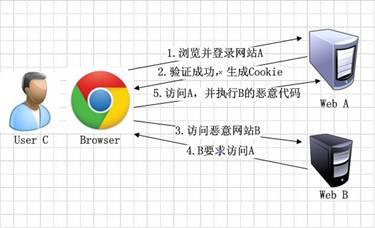

前段时间公司有进行了一次关于web安全的分享会，因此也打算写一个关于web安全的系列。
本篇作为总纲先列一下，后面有空的话，会根据不同的攻击方式来单独写文章。
web安全作为一个系列，后面也会去一直的迭代和更新。

# web安全攻击以及防护

## 1. 跨网站脚本（Cross-site scripting，通常简称为XSS或跨站脚本或跨站脚本攻击）
### 描述
跨网站脚本(Cross-site scripting，通常简称为XSS或跨站脚本或跨站脚本攻击)是一种网站应用程序的安全漏洞攻击，是代码注入的一种。它允许恶意用户将代码注入到网页上，其他用户在观看网页时就会受到影响。这类攻击通常包含了HTML以及用户端脚本语言。
XSS攻击通常指的是通过利用网页开发时留下的漏洞，通过巧妙的方法注入恶意指令代码到网页，使用户加载并执行攻击者恶意制造的网页程序。这些恶意网页程序通常是JavaScript，但实际上也可以包括Java， VBScript， ActiveX， Flash 或者甚至是普通的HTML。攻击成功后，攻击者可能得到更高的权限（如执行一些操作）、私密网页内容、会话和cookie等各种内容。
### 防护
对于任何的参数请求以及页面中涉及到的用户信息全部都要进行特殊字符的过滤，进行 html转义，防止触发恶意脚本

## 2. 跨站请求伪造（Cross-SiteRequest Forgery，CSRF）
### 描述
CSRF(Cross-Site Request Forgery，跨站点伪造请求)是一种网络攻击方式，该攻击可以在受害者毫不知情的情况下以受害者名义伪造请求发送给受攻击站点，从而在未授权的情况下执行在权限保护之下的操作，具有很大的危害性。具体来讲，可以这样理解CSRF攻击：攻击者盗用了你的身份，以你的名义发送恶意请求，对服务器来说这个请求是完全合法的，但是却完成了攻击者所期望的一个操作，比如以你的名义发送邮件、发消息，盗取你的账号，添加系统管理员，甚至于购买商品、虚拟货币转账等。
大致流程如下：

### 防护
1. token机制。在HTTP请求中进行token验证，如果请求中没有token或者token内容不正确，则认为CSRF攻击而拒绝该请求。
2. 验证码。通常情况下，验证码能够很好的遏制CSRF攻击，但是很多情况下，出于用户体验考虑，验证码只能作为一种辅助手段，而不是最主要的解决方案。
3. referer识别。在HTTP Header中有一个字段Referer，它记录了HTTP请求的来源地址。如果Referer是其他网站，就有可能是CSRF攻击，则拒绝该请求。但是，服务器并非都能取到Referer。很多用户出于隐私保护的考虑，限制了Referer的发送。在某些情况下，浏览器也不会发送Referer，例如HTTPS跳转到HTTP。

## 3. SQL注入攻击
### 描述
攻击者在HTTP请求中注入恶意的SQL代码，服务器使用参数构建数据库SQL命令时，恶意SQL被一起构造，并在数据库中执行。
用户登录，输入用户名 zach，密码 ‘ or ‘1’=’1 ，如果此时使用参数构造的方式，就会出现

select * from user where name = 'zach' and password = '' or '1'='1'

不管用户名和密码是什么内容，使查询出来的用户列表不为空。
### 防护
一般我们会从两个方面同时入手。
#### Web端
1. 有效性检验。
2. 限制字符串输入的长度。

#### 服务端
1. 不用拼接SQL字符串。
2. 使用预编译的PrepareStatement。
3. 有效性检验。(为什么服务端还要做有效性检验？第一准则，外部都是不可信的，防止攻击者绕过Web端请求)
4. 过滤SQL需要的参数中的特殊字符。比如单引号、双引号。

## 4. 文件上传漏洞
### 描述
文件上传漏洞，指的是用户上传一个可执行的脚本文件，并通过此脚本文件获得了执行服务端命令的能力。
许多第三方框架、服务，都曾经被爆出文件上传漏洞，比如很早之前的Struts2，以及富文本编辑器等等，可能被一旦被攻击者上传恶意代码，有可能服务端就被人黑了。
### 防护
1. 文件上传的目录设置为不可执行。
2. 判断文件类型。在判断文件类型的时候，可以结合使用MIME Type，后缀检查等方式。因为对于上传文件，不能简单地通过后缀名称来判断文件的类型，因为攻击者可以将可执行文件的后缀名称改为图片或其他后缀类型，诱导用户执行。
3. 对上传的文件类型进行白名单校验，只允许上传可靠类型。
4. 上传的文件需要进行重新命名，使攻击者无法猜想上传文件的访问路径，将极大地增加攻击成本，同时向shell.php.rar.ara这种文件，因为重命名而无法成功实施攻击。
5. 限制上传文件的大小。
6. 单独设置文件服务器的域名。

## 5. 点击劫持(clickjacking)
### 描述
点击劫持(ClickJacking)是一种视觉上的欺骗手段。大概有两种方式，一是攻击者使用一个透明的iframe，覆盖在一个网页上，然后诱使用户在该页面上进行操作，此时用户将在不知情的情况下点击透明的iframe页面；二是攻击者使用一张图片覆盖在网页，遮挡网页原有位置的含义
### 防护
对网站设置X-Frame-Options的http头可以阻止一个网站被加载到<frame>标签
具体为设置值为：
* DENY时，禁止在任何的网页中加载此页面
* SAMEORIGIN时，只允许在同一域名页面的 <frame>中展示
* ALLOW-FROM uri时，允许制定Uri的页面的<frame>中展示

请参照之前写的文章: 

## 6. 非安全的CrossDomain.XML文件
### 描述
为解决Flash/Flex系统中的跨域问题，提出了crossdomain.xml跨域策略文件。虽然可以解决跨域问题，但是也带来了恶意攻击的风险，如果该策略文件里允许访问任何域，就可能允许发起对网络服务器的跨站点请求伪造和跨站点脚本攻击。比如，不安全Flash应用程序可能会访问本地数据和用户保存的网页记录，甚至传播病毒和恶意代码。
### 防护
只对提供安全资源的可信域开放允许，不要将 allow-access-from 实体设置为星号