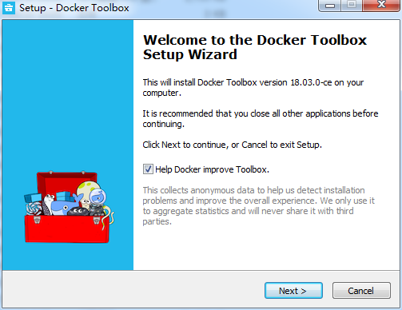

## 前言
通过  我们已经可以在服务器上通过 Docker 来实现多个 golang 版本的并存。 但是我的平时开发环境有一台是 windows7，这台机器有时候也会需要跑 go 程序，所以在这台 windows7 上也会有安装多个 golang 版本的需求。
我的 windows7 本来就有安装 golang 版本了，不过是比较旧的版本，1.7.4：
```html
admin@admin-PC MINGW64 /f/airdroid_code/go/src
$ go version
go version go1.7.4 windows/amd64
```
所以我打算也通过 Docker 也安装一个容器来装载一个比较新的 golang 版本，比如 1.10 或者更新。有些比较细的，之前就有在  讲过了，这边就不细讲了，这边只讲差异点。
<!--more-->
## 安装 Docker Toolbox
直接去官网下载：[docker desktop windows](https://hub.docker.com/editions/community/docker-ce-desktop-windows?tab=description)
其实 Docker 是有支持 windows 的，但是是需要 windows 10 的 64 位的专业版或者企业版才行。 windows 7 肯定不满足。

如果是 windows 7 的话，那么就要安装 **Docker Toolbox** 才行, 下载地址：[Docker Toolbox]( https://docs.docker.com/toolbox/overview/)
下载 exe 之后，就双击安装：


一路 next 过去

装完了，就会出现三个图标：

其中 **Oracle VM VirtualBox** 是用来设置虚拟的共享目录的。 **Kitematic** 可以用来管理你的Docker 镜像，而 **Docker QuickStart Terminal** 就是 Docker 的控制终端，所有的 Docker 操作都要在这个终端里面来进行操作。
接下来点击 **Docker Quickstart Terminal** 图标，从而打开一个 **Docker Toolbox terminal** (这边最好用管理员权限来打开)， 打开Terminal后，Terminal会自动进行一些设置，这个过程中会安装 boot2docker，这部分需要点时间，全部完成之后，会出现如下的结果：

接下来就可以在这个终端里面用 docker 的命令了。
## 生成 golang 高版本的镜像
这个是一样的操作，就不细说了，本质上这个 Toolbox terminal 就可以当做 linux 的 terminal 来用，常用的指令都有：


## 挂载目录并生成容器
接下来跟在 linux 一样的操作，就是挂载一个本地目录到容器的 gopath 的 src 目录：

但是这边有出现一个很奇怪的问题，就是我挂载成功了，而且 docker inspect 的 Mounts 指向也没有问题， 但是就是不会同步？？

我在容器的 /go/src/ 做的一些文件操作，比如添加文件啊，都不会同步到宿主机所对应的共享目录， 反之我在宿主机的共享目录做的一些文件操作，也不会同步到容器的 /go/src/ ??
后面查了一下文档：[optional add shared directories](https://docs.docker.com/toolbox/toolbox_install_windows/#optional-add-shared-directories)。

原来正常情况下，Toolbox只支持挂载 **C:\Users** 目录， 那我们就试一下，看会不会跟 windows 的文件系统权限有关系：
先在 **C:\Users** 目录下建一个目录叫 **go-src**：
接下来就挂载到这个目录下：

然后随便建了一个 123.txt 的文件，看会不会同步到宿主机。

发现可以了，而且在这个宿主机的对应目录下操作，也可以同步到这个容器对应的共享目录。
### 添加 virtualbox 共享目录
虽然将宿主机目录设置在 C:\Users 目录下可以实现共享目录的功能，但是我们很多时候代码不想放 c 盘，而是要自定义路径，那怎么办了？？
这时候就要用到之前安装的 Oracle VM VirtualBox 这个工具的，它就是用来设置自定义的虚拟共享目录的。双击这个图标，然后打开这个管理器，默认有个 default 配置，然后点击共享文件夹

这时候可以看到已经有一个固定分配了，那就是 c:/Users 这个目录，难怪这个目录可以，原来是默认设置的。所以我们接下来就是点击添加按钮，将我们的自定义配置加上去：

添加好了之后，还需要使用 **docker-machine restart default** 进行重启来生效：

接下来挂载一下，发现已经成功共享了（我在宿主机的对应目录添加了一个 456.txt 有成功共享了）：

## 执行 go 程序代码
接下来就把一些 go 程序拷贝到这个宿主机的共享目录来，然后就可以执行 go get 和 go run 了， 但是要注意，在进行 go get 加载依赖包的时候，因为也是在 docker 容器里面进行的，所以也会有代理的问题：

我这边的处理方式就是将宿主机的全局 vpn 代理打开，然后重试一下，这时候容器也可以使用代理了（注意，这边我并没有使用 --net host 指令，而是我宿主机开代理vpn之后，docker 容器也直接就使用了，我猜测应该出口是同一个，所以直接就生效了）。

至于调试运行的话，可以直接在容器里面直接进行，也可以到容器外用 docker 指令运行，但是一定要在 toolbox 这个终端才行。


## 总结
虽然 windows7 也可以安装 docker，并且可以实现挂载多个 go 版本，但是毕竟没有 linux 好用，为了日常有时候的开发需求，还是凑合可以使用的。
