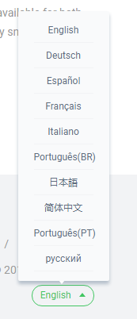
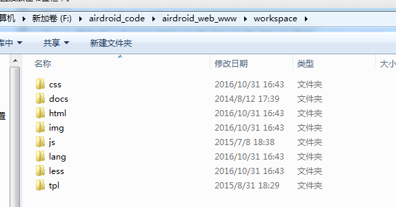
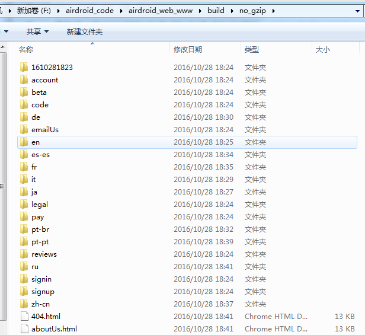
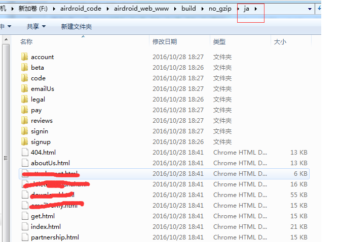
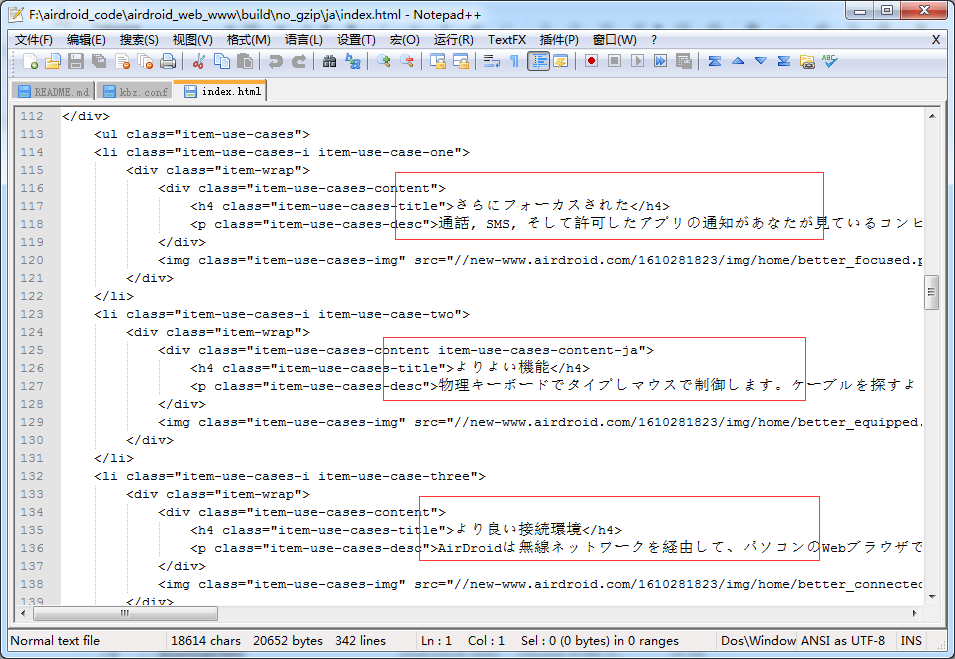

## 写在前面的话
说在前头，现在是2018-09， 但是接下来我写的这个一系列的文章，都是从我的Evernote 笔记里面抄过来的。我的Evernote里面，技术笔记不少，有几千篇，都是这几年的技术积累。但是真正能够直接放到网上跟大家共享的，其实也不多。
这个系列是其中之一，这个系列的笔记，就是我在做这个项目官网的一些技术思路，这个官网最早可以追溯到 2015-2016 年，也是我一手搭起来。所以接下来看的时候，不要说我很low，里面用的很多技术都是很旧的，甚至连三大框架都没有，还在用jquery库。其实在 2015-2016 的时候，我在做这个项目的时候，用的东西已经是那时候最新的，甚至有些东西网上根本找不到，只能自己造车轮(比如后续的 gulp-staticly插件)。
<!--more-->
当然本系列主要还是讲官网的构建优化流程，当然还会有一些逻辑细节，不过大部分都是围绕构建优化来的。 当然现在这个官网还在很好的work中，[传送门](https://www.airdroid.com/)。因为基本上这个系列的文章大部分都是在2016年写的，后面几篇是在前不久补上去的，比较新。所以我在做代码的搬运工的时候，也会适当调整一下(就是加一下OS,耶!!)，免得太有历史感。
简单来说，构建优化，主要是几部分：
- 从 grunt 到 gulp
- 从自己shell脚本传到服务到Jenkins 结合 gitlab 的webhook 实现自动化构建部署
- 那时候怎么做静态页面预编译，从而做SEO优化
- 作为一个全球性的站点，怎么实现国内和国外的加载速度优化

这些都会在下面的文章中一一说道，好了，接下来前方高能了。

## 简介
官网的架构没有用到那时候流行的一些框架，比如 backbone 之类的。主要是考虑到官网是偏页面碎片化的一个站点，没有所谓的整体。考虑到当时的便捷性和开发方便，所以就以 **jquery + underscore** 这两个工具库来做。
构建的话，就以 **npm + bower + grunt** 方式来做。
因为官网具有多种语言(有10种语言):

为了考虑SEO，为了考虑SEO， 为了考虑SEO(不要跟我说现在SPA也可以做SEO，我当然知道现在可以,问题是当时2016年，你给我做做看! o(*≧▽≦)ツ┏━┓), 所以考虑到这一点，其中有一个需求是在打包的时候，将代码转换为具有多个语言的静态文件。
效果如下：
即原来的代码结构是：

打完包之后，就是：

每一个语言路径里面都有对应的该语言的文件。

随便打开一个html文件：

可以看到文本都变成对应的语言了。
那么怎么实现这个效果呢。其实就在打包的逻辑里面。下一节主要讲打包的逻辑。

