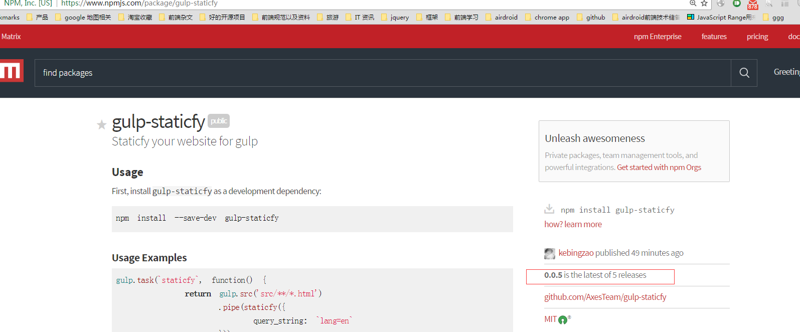

## 写在前面的话
说在前头，现在是2018-09，下面的文章是我在2016-10月的时候，记录在Evernote的，那时候 [phantomjs-node](https://github.com/amir20/phantomjs-node) 这个issue，确实没有解决，后面我们团队有提交了一个pr上去，而且这个作者也成功修复了，并更新了新版本，从而修复了这个bug。
但是在那个时候，时间是比较赶的，你没办法去赌这个作者，马上去采取你的pr并更新版本，才有了下面的解决。
反正我觉得整个过程挺有意思的，有记录并分享的价值。<(￣︶￣)>
<!--more-->
## 前因
在使用gulp-staticfy组件对官网项目进行多语言预编译的时候。出现了一个很奇葩的情况，就是会随机出现乱码。而且非英文的其他语言都有可能会出现这种情况。
比如我们的日语的某个页面，就会出现这种情况：

乱码的正则匹配值是 '\ufffd'， 通过这个匹配这个值，就可以判断当前页面是否有包含乱码：

## 寻找解决方案
### 定位问题
刚开始是怀疑是 gulp-staticfy 在设置phantom 抓取的时候，没有设置编码为 utf8 ，然后后面改了一下：
在 phantom.create 的时候，加上 output-encoding
```javascript
return phantom.create(['--output-encoding=utf8']).then(_ph => {
    ph = _ph;
    return ph.createPage();
}).catch(e => {
    console.log(e);
})
```
然后在 后面 ph_page 在 open url 的时候，也加上 encoding 为 utf8 的配置：
```javascript
createPhPage().then(page => {
    ph_page = page;
    return ph_page.open(url, {encoding: 'utf8'});
}).then(status => {
    //console.log(status);
    return ph_page.property('content')
}).then(content => {
    console.log(gutil.colors.blue(baseName) + gutil.colors.green(" load success"));
    ph_page.close();
    doFinish();
    file.contents = new Buffer(content);
    callback(null, file);
}).catch(e => {
    ph_page && ph_page.close();
    doFinish();
    console.log(e)
});
```
事实证明，这个设置也没有什么用。而且phantom 本身默认就是输出utf8 编码的。
那么到底是什么问题导致这种情况呢？ 后面看到这篇文章: [Node.js 爬虫程序汉字乱码的原因：buffer 的拼接问题！](http://www.imooc.com/article/9053)。

也就是如果爬取的数据的中文数据量比较小，一般显示是正常的。但当爬取的数据量较大时，很有可能出现部分汉字会乱码现象。
产生原因：
在默认的情况下 trunk 是一个 Buffer 对象，而 data += trunk 的实质上隐藏了 toString 的变换的：
data = data.toString() + trunk.toString();
由于汉字不是用一个字节来存储的，如果某一块 buffer 传输的恰好不完整，将会导致有被截破的汉字的存在，于是出现乱码。

所以有可能是这个原因，即在进行读取的时候，如果把当前的chunk块之间转换为string，就有可能会包含乱码了。那么原因可能就在用的那个库上了，即 [phantomjs-node](https://github.com/amir20/phantomjs-node), 查了一下这个库的issues，看看有没有人提这个问题，果然看到了一个未解决的提问:

可以看到 在抓取这个页面的时候， http://varlamov.ru/1960870.html， 每一次都会跑出乱码出来，不过很明显，这个作者还没有解决。

既然这个作者还没有解决，那么我们就自己找找解决方案了， 就从 这个库开始找。 首先先找到这个库读取chunk的那一部分代码。
后面定位到这个代码: **phantom/lib/phantom.js** 片段：
```javascript
this.process.stdout.pipe(new _linerstream2.default()).on('data', data => {
    const message = data.toString('utf8');
    if (message[0] === '>') {
        // Server end has finished NOOP, lets allow NOOP again..
        if (message === '>' + NOOP) {
            this.isNoOpInProgress = false;
            return;
        }
```
而且在输出的时候，还用了 **new _linerstream2.default()** 这个组件再封装一次。这个 **linerstream** 又是另一个引入的库，  
```javascript
var _linerstream = require('linerstream');
```
所以接下来再找到 **linerstream** 库， 发现这个库的作用其实很简单，就是把文件一行一行的读出来，然后推送给**phantom**, 而且看了一下代码，刚好这个库犯了刚才说的chunk的那个错误。
**linerstream/index.js**:
```javascript
Liner.prototype._transform = function transform(chunk, encoding, done) {
  var data = chunk.toString()
  if (this._lastLineData) {
    data = this._lastLineData + data
  }
  var lines = data.split(os.EOL)
  this._lastLineData = lines.splice(lines.length - 1, 1)[0]

  lines.forEach(this.push.bind(this))
  done()
}
```
可以看到，他把 chunk 给 toString了，这个就是乱码产生的原因
```javascript
var data = chunk.toString()
```
因为这时候有可能这个chunk含有一半的字（只要不是单个字节的语言都有可能，比如中文，日语之类的）。
既然知道了问题的所在，那么有没有可能自己修改， 按照 [Node.js 爬虫程序汉字乱码的原因：buffer 的拼接问题！](http://www.imooc.com/article/9053) 里面所说的解决方法。
他建议的解决方法是这样的：

解决方法：
先用一个数组把所有 buffer 保存起来，同时记录 buffer 的总长度。
数据传输完毕的时，再通过 Buffer.concat 方法把所有 buffer 拼接。
最后，用 toString 方法转成字符串，这时获取的 data 数据就是正确的了。

var chunks = [], size = 0;
res.on("data" , function(chunk){
    chunks.push(chunk);
    size += chunk.length;
});
res.on("end" , function(){
    var buffer = Buffer.concat(chunks, size);
    var html = buffer.toString();
});

// 在更细腻的连接方式:
res.on('end', function () {
    var buffer = null;
    switch(buffers.length) {
        case 0:
            buffer = new Buffer(0);
            break;
        case 1:
            buffer = buffers[0];
            break;
        default:
            buffer = new Buffer(size);
            for (var i = 0, pos = 0, l = buffers.length; i < l; i++) {
                var chunk = buffers[i];
                chunk.copy(buffer, pos);
                pos += chunk.length;
            }
        break;
    }
    var html = buffer.toString();
});

而且通过这篇文章：[通过Node.js Stream API 实现逐行读取的实例](https://segmentfault.com/a/1190000000740718), 我们也可以知道node stream 关于transform的用法。其实问题就在于，如果只是把chunk存起来，没有转化为string的话，那么怎么去根据换行符去切割呢？ 从而达到整行读取的效果。 其实早有另外的库，有实现这个效果。 那就是 [https://github.com/mcollina/split2/](https://github.com/mcollina/split2/) 这个库。
使用也非常简单：
```javascript
fs.createReadStream(file)
    .pipe(split2())
    .on('data', function (line) {
      //each chunk now is a seperate line!
    })
```
而且看了一下他的代码，发现他这部分的代码处理会比较好，而且不会有这个问题, **split2/index.js** 代码：
```javascript
'use strict'

var through = require('through2')
var StringDecoder = require('string_decoder').StringDecoder

function transform (chunk, enc, cb) {
  this._last += this._decoder.write(chunk)
  if (this._last.length > this.maxLength) {
    return cb(new Error('maximum buffer reached'))
  }

  var list = this._last.split(this.matcher)

  this._last = list.pop()

  for (var i = 0; i < list.length; i++) {
    push(this, this.mapper(list[i]))
  }

  cb()
}

function flush (cb) {
  // forward any gibberish left in there
  this._last += this._decoder.end()

  if (this._last) {
    push(this, this.mapper(this._last))
  }

  cb()
}

function push (self, val) {
  if (val !== undefined) {
    self.push(val)
  }
}

function noop (incoming) {
  return incoming
}

function split (matcher, mapper, options) {
  // Set defaults for any arguments not supplied.
  matcher = matcher || /\r?\n/
  mapper = mapper || noop
  options = options || {}

  // Test arguments explicitly.
  switch (arguments.length) {
    case 1:
      // If mapper is only argument.
      if (typeof matcher === 'function') {
        mapper = matcher
        matcher = /\r?\n/
      // If options is only argument.
      } else if (typeof matcher === 'object' && !(matcher instanceof RegExp)) {
        options = matcher
        matcher = /\r?\n/
      }
      break

    case 2:
      // If mapper and options are arguments.
      if (typeof matcher === 'function') {
        options = mapper
        mapper = matcher
        matcher = /\r?\n/
      // If matcher and options are arguments.
      } else if (typeof mapper === 'object') {
        options = mapper
        mapper = noop
      }
  }

  var stream = through(options, transform, flush)

  // this stream is in objectMode only in the readable part
  stream._readableState.objectMode = true

  stream._last = ''
  stream._decoder = new StringDecoder('utf8')
  stream.matcher = matcher
  stream.mapper = mapper
  stream.maxLength = options.maxLength

  return stream
}

module.exports = split
```
通过 string_decoder 这个 node 的api， 核心就是这一句话  
```javascript
this._last += this._decoder.write(chunk)
```
既可以读入chunk，又可以正则匹配换行符。其他的逻辑都差不多。那么就可以用这个 **split2** 库 去 替换原来有问题的 **linerstream** 库。
所以代码可以改成这样： **phantom/lib/phantom.js**：
```javascript
var split = require('split2');

this.process.stdout.pipe(split()).on('data', data => {
    const message = data.toString('utf8');
    if (message[0] === '>') {
        // Server end has finished NOOP, lets allow NOOP again..
        if (message === '>' + NOOP) {
            this.isNoOpInProgress = false;
            return;
        }
        const json = message.substr(1);
        this.logger.debug('Parsing: %s', json);
```
其实只把linerstream 换成 split 而已，其他都没有变。
### 解决问题
因为 phantom 这个库是别人的库，因此直接改其实是不合适的方法，只作用于这个项目。如果要让作者去改的话，只能自己pull request一个分支，然后让作者merge进去。我们要做的，当然是完善 gulp-staticfy 这个库啊，因为这个库才会去引用phantom这个库。不过还有一个方法，就是fork 这个phantom库，然后自己改，最后gulp-staticfy 再去引用fork的这个修改过的库。
#### 1 先fork 这个项目， https://github.com/kebingzao/phantomjs-node
#### 2 然后git clone 到本地
用gulp 跑一下情况,结果发现这个问题。

发现好像是gulp版本的问题，因此重装了最新版的gulp  
```javascript
$ npm install --global gulp-cli
```
然后就解决了，就可以正常跑了。接下来就是在原有的基础上做修改。
#### 3 换库并publish
```javascript
//import Linerstream from 'linerstream';
import split from 'split2';
。。。。。。。
//this.process.stdout.pipe(new Linerstream()).on('data', data => {
this.process.stdout.pipe(split()).on('data', data => {
    const message = data.toString('utf8');
```
然后再跑一下gulp，没有问题之后，就可以提交到项目中去了。

不过这边要注意问题。 因为有把 **linerstream** 换成 **split2**. 但是在安装的时候，被安装在**devDependencies**里面了，导致后面被**gulp-staticfy**组件引用的时候，在跑gulp的提示是找不到**split2** 模块，原来是当库被别的库引用的时候，node只装 **dependencies** 里面的依赖，不会装 **devDependencies** 里面的依赖（他认为**devDependencies**里面的依赖只是做测试程序所需要的）， 因此要把**split2**模块装在 **dependencies** 里面
```javascript
"dependencies": {  
    "phantomjs-prebuilt": "^2.1.4",  
    "winston": "^2.2.0",  
    "split2": "^2.1.0"
},
```
那么接下来就要在 **gulp-staticfy** 里面把原先的 **phantom** 依赖，换成我们自己项目的 **phantom**
```javascript
npm install git+ssh://git@github.com:kebingzao/phantomjs-node.git --save
```
注意，因为我们没有把这个组件publish到npm的组件库中，所以要安装的话，只能用这种方式安装。
这样安装之后，package.json 就会换成我们的地址了：
```javascript
"dependencies": {
  "gulp-sequence": "^0.4.6",
  "gulp-util": "^3.0.1",
  "lodash": "^4.16.6",
  "map-stream": "0.0.6",
  "node-static": "^0.7.9",
  "phantom": "git+ssh://git@github.com/kebingzao/phantomjs-node.git",
  "portfinder": "^1.0.9"
},
```
看了一下，代码是对的了：phantom/lib/phantom.js:
```javascript
var _split = require('split2');
var _split2 = _interopRequireDefault(_split);
```
然后把package.json重新提交一下，换成 0.0.5 版本，并publish 到 npm:

接下来就是重新装一下官网的 **gulp-staticfy**， 换成 **0.0.5** 的版本，就行了。 
验证下，打个包，终于没有乱码了。
#### 4 拉取的权限问题
后面又发现了一个情况，就是在同事的电脑在安装 **gulp-staticfy** 这个组件的时候，发现在下载我自己的phantom 源（git+ssh://git@github.com/kebingzao/phantomjs-node.git）的时候。发现报错？？
原因是 **permission deny**。 没有权限？？
后面查了一下，原来用ssh拉取的库，要是当前这个库的用户才行，如果不是这个用户的话，就会报错，所以后面改成用https的方式，即：
```javascript
"dependencies": {  
    "gulp-sequence": "^0.4.6",  
    "gulp-util": "^3.0.1",  
    "lodash": "^4.16.6",  
    "map-stream": "0.0.6",  
    "node-static": "^0.7.9",  
    "phantom": "git+https://github.com/kebingzao/phantomjs-node.git",  
    "portfinder": "^1.0.9"
},
```
然后重新提交一下，变成 0.0.6。 这样子同事的项目就可以正常安装了

---
参考：
[Node.js 爬虫程序汉字乱码的原因：buffer 的拼接问题！](http://www.imooc.com/article/9053)
[通过Node.js Stream API 实现逐行读取的实例](https://segmentfault.com/a/1190000000740718)