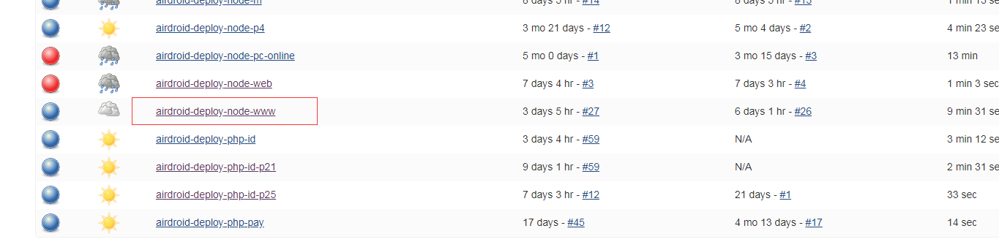
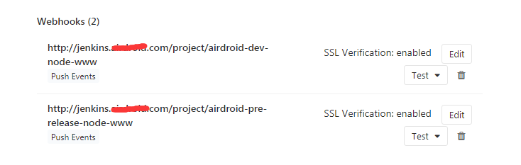
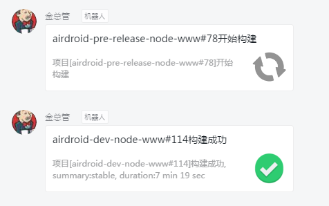

## 前言
之前官网的部署都是构建的时候，直接用 upload 和 shell 这两个指令去做部署，前者上传到服务器，后者执行执行shell指令，解压并覆盖。
但是这样其实并不灵活，一方面是这个项目是多人协作项目，如果每一个人，都要有部署的权限，那么就意味着运维要开多个权限。
所以后面决定将官网的构建和部署通过Jenkins来构建和自动化部署。(事实上，现在前后端三十几个项目，全部都用Jenkins来做到自动化构建和部署了)
<!--more-->
## 官网的Jenkins配置
这边不做具体的Jenkins配置描述，因为Jenkins这个其实也很多东西，完全可以再开一个系列来说。
主要是通过 Jenkins + gitlab + webhook 来做到提交(push 或者 打tag)触发部署和测试任务。 其中 gitlab 是我们自己内部的代码库， Jenkins 可以通过安装 **Gitlab Hook Plugin** 插件，从而可以配置 gitlab 的 webhook。
我们知道官网有三个任务：
```javascript
  "scripts": {
    "dev": "gulp watch",
    "d": "gulp d",
    "n": "gulp n",
    "r": "gulp r"
  },
```
所以对应的Jenkins也有三个任务：
### 1. 测试环境
触发条件： build_test 分支 push操作
注意事项：
- bower.json的md5值变化执行bower install
- 当package.json的md5值变化执行npm install 

执行命令： **npm run d**

### 2. 预发布环境
触发条件： build_new 分支 push操作
注意事项：
- bower.json的md5值变化执行bower install
- 当package.json的md5值变化执行npm install 

执行命令： **npm run n**

### 3. 生产环境
触发条件： 无hook，只能在Jenkins后台操作
注意事项：
- bower.json的md5值变化执行bower install
- 当package.json的md5值变化执行npm install 

执行命令： **npm run r**

注意，这边为了安全，不在gitlab上面设置生产环境的hook（有人误点会太危险），所以只允许在Jenkins后台进行点击构建，而且只有我有权限去点击：

其他两个因为不是生产环境，所以可以直接通过gitlab 的 webhook 来触发，会非常方便。


## 构建状态通知
既然有构建，肯定也要有状态通知的，因为我们办公是用钉钉办公的，所以就做了一个钉钉的webhook通知机器人，每次Jenkins构建状态改变的时候，就调用API来让机器人来发送状态通知，以便通知对应的开发人员。


## 总结
所以后面这个项目就全部用 Jenkins 来进行自动化和部署了。

