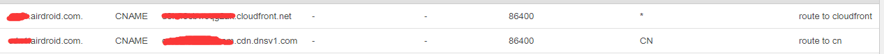

## 前因
之前有测试的同学反馈说，每次官网更新，速度都会变得很慢。这个其实是因为我们官网的服务器是在国外，所以国内访问的话，就会比较慢。
这个项目其实之前也有做了一些的优化，比如
- js， css 的 gzip 压缩 
- js， css 压缩，合并， html 压缩， 这些在构建的时候，就考虑过了
- 图片压缩，雪碧图，这些在做功能的时候，就考虑过了。

<!--more-->
## 解决方案
所以本篇主要是解决这个资源存放的问题。而且因为官网的nginx的跳转规则有点复杂（多语言跳转规则，https跳转规则， http 文件过滤规则， 爬虫过滤规则），导致之前在配CDN的时候，一直没法配，因为一些CDN服务，根本没法像nginx那样配置那么复杂的重定向规则。
所以决定效仿我们的另一个web项目，就是将打包的资源分成两部分，单纯的html资源放源服务器，然后其他资源（js，css，语言文件，字体文件，图片，swf 文件）放云服务商的 存储/CDN 服务， 国内就放 [腾讯云的对象存储 COS 服务](https://cloud.tencent.com/product/cos)， 然后国外放 [AWS 的存储服务 s3 bucket](https://aws.amazon.com/s3/), 然后引用 AWS 的另一个 CDN 服务 [cloudFront](https://aws.amazon.com/cloudfront/)，将回源地址指向这个S3 的bucket，最后再用 [AWS的域名解析服务Route 53](https://aws.amazon.com/route53/) 根据用户请求的地区来进行资源分配，如果是中国区，就将资源地址指向腾讯云的cos服务地址，如果是非中国区，就指向AWS 的 cloudFront 地址。 这样两个地区的人，都可以就近取到速度最快的资源。

这样子讲可能有点难以理解，我简单举个例子，我把钱(资源)存在银行，但是这个银行，国内有一个(腾讯云的cos)，国外也有一个(aws 的 s3)，这两个银行都有钱，这时候有个中国的用户要去取钱，他不知道银行在哪里，这时候他打电话给114(aws 的 route 53)问地址在哪里，然后114的客服人员一看这个号码的归属地是国内的，他就把国内的那家银行的地址发给他，让他去那边取钱(获取资源)， 反之如果是号码归属地是国外的，客服人员就把国外的那家银行的地址发过去。
这样就可以做到就近原则取资源了。
所以在route 53 这个存放资源的配置是这样子的：

第一个是cloudFront的域名地址，第二个是腾讯云COS的域名地址。
而且还有最重要的一点就是，我每次构建我都要把这个资源存放两份，一份放s3 bucket，一份放 cos bucket上。 如果是之前的那种本机构建还比较麻烦，但是后面我们换了Jenkins之后，这些都会在进行构建的时候，Jenkins都会帮我们去做，我们要做的就是写好对应的脚本即可。可以说也很方便呢。

而且官网的所有的除 html 的资源都是放在资源文件目录中的，而且为了便于跟另一个项目的的资源目录重命名，这边重新加了前缀：

也就是会在原来构建不变的基础上， **www_asset_xxxxxxxx** 这个目录源服务器会有，对象存储(cos 和 s3)也会有。
同时要注意一点的是，这次的资源目录里面， js 和 css 文件都不要再加上 gzip 头部了，因为构建的时候就没有进行 gzip 压缩了，所以上传的时候，也不要加上这个 gzip 头部了。（这个是为了跟另外一个项目做区别，因为另一个项目也有传 s3 和 cos，但是它在构建的时候，就有对js和css做gzip压缩了，所以上传的时候，还要人为的加上 **content-encoding: gzip** 才能work， 但是官网这个项目不需要）
所以将资源传上 cos 的截图是：

s3上的资源截图是这样的：

都是没有加 gzip 头部的。
然后在构建中，将所有的资源路径替换成这个资源的域名：

最后就是这样：

所有的资源请求都换成是那个专门放资源的那个域名来请求了。然后原来的html页面还是放在源服务器，因为很小，所以一般都不会影响加载速度。
而且这样分域名存放还有一个好处，因为浏览器对每一个域名的并行http请求都是有限制的，同一时间只能6条，超出了就只能等待。
最后放上一张Jenkins构建，上传到cos和s3的截图：

---
系列文章














