## 前言
通过  可以知道我们已经将官网的资源文件挪到云存储服务上了，并配上CDN了， 果然国内访问的话，速度快了很多。但是还是有发现了一个问题：
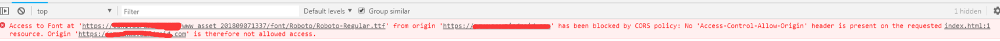
<!--more-->
在请求字体文件的时候，出现了跨域问题？？？
```javascript
Access to Font at 'https://cdn1.xxx.com/www_asset_201809071337/font/Roboto/Roboto-Regular.ttf' from origin 'https://www.xxx.com' has been blocked by CORS policy: 
No 'Access-Control-Allow-Origin' header is present on the requested resource. Origin 'https://www.xxx.com' is therefore not allowed access.
```
就是这个代码：
```javascript
@font-face {
  font-family: "Roboto";
  src: url(../font/Roboto/Roboto-Regular.ttf);
}
```
这个是因为不同域下的请求导致的。
## 解决方式
后面查了一下资料，可以由三种方式来解决
### 在nginx添加跨域头
例如：
```javascript
# nginx config
if ($filename ~* ^.*?\.(eot)|(ttf)|(woff)$){
  add_header Access-Control-Allow-Origin https://cdn1.xxx.com;
}
```
### 将资源文件转换为 base64编码的方式内嵌到样式文件中
```javascript
@font-face {
  font-family: "Roboto";
  src: url(../font/Roboto/Roboto-Regular.ttf);
}
```
变成
```javascript
@font-face {
  font-family: "Roboto";
  src : url("data:application/x-font-ttf;charset=utf-8;base64,XXXXXXXXXXXX") format("ttf");
}
```
实际使用过程将那一长串”X“换成自己的base64编码即可, 但是这样会加大这个css文件的体积(这个字体文件有一百多k)，这样就会变得很多的css文件都非常大， 还有就是这个字体只有英文语种下，才会加载，其他语种是不会的，所以也不太适合

### 将字体文件放到项目的目录下，也即让它们同源即可
这个不够灵活，意味着还要在项目的根目录下维护这个目录或者文件。

## S3/CloudFront/COS 设置跨域CORS
后面采取了第一种，就是添加跨域头部。但是又会涉及到另一个问题，那就是这个资源域名其实是云服务，国内对应的是 腾讯云的存储对象COS，国外对应的是AWS的S3。所以如果我们要配置域名设置CORS的话，两个地方的域名都得配置。
### S3 配置 CORS
首先尝试配置 s3 bucket 增加了 cors 配置： 直接在管理后台的bucket配置，添加即可：
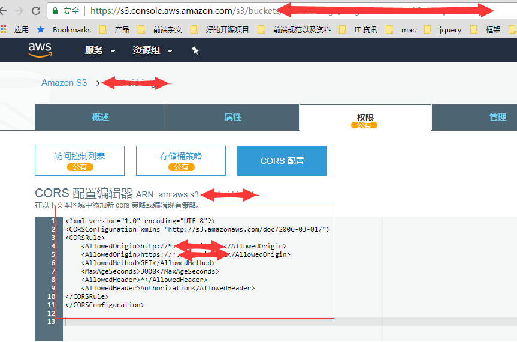
```javascript
<?xml version="1.0" encoding="UTF-8"?>
<CORSConfiguration xmlns="http://s3.amazonaws.com/doc/2006-03-01/">
<CORSRule>
    <AllowedOrigin>http://*.xxx.com</AllowedOrigin>
    <AllowedOrigin>https://*.xxx.com</AllowedOrigin>
    <AllowedMethod>GET</AllowedMethod>
    <MaxAgeSeconds>3000</MaxAgeSeconds>
    <AllowedHeader>*</AllowedHeader>
    <AllowedHeader>Authorization</AllowedHeader>
</CORSRule>
</CORSConfiguration>
```
参照这个配置： [S3 how do i enable cors](https://docs.aws.amazon.com/zh_cn/AmazonS3/latest/dev/cors.html#how-do-i-enable-cors), 这边设置成只允许Get 请求。
### COS 配置 CORS
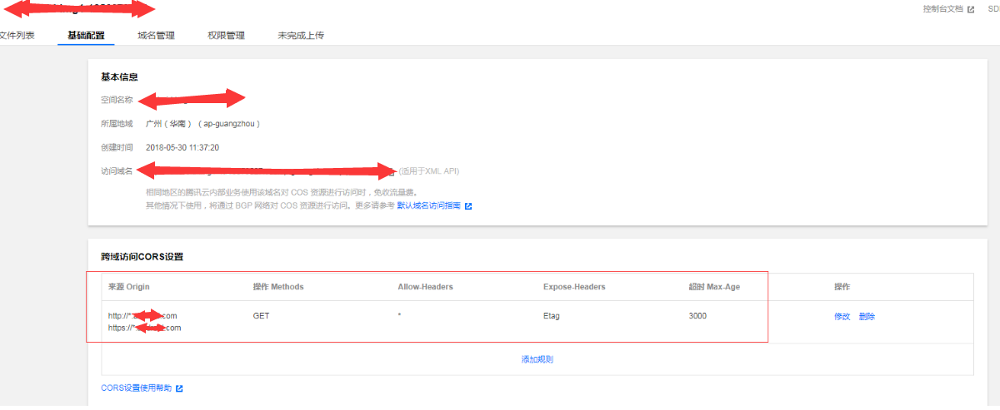
参照这个配置：[COS 配置跨域允许](https://cloud.tencent.com/document/product/436/13318)
这样设置完之后，在chrome试了一下，发现还是会报错？？ 
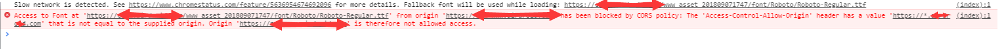
```javascript
Access to Font at 'https://cdn1.xxx.com/www_asset_201809071747/font/Roboto/Roboto-Regular.ttf' from origin 'https://www.xxx.com' has been blocked by CORS policy: 
The 'Access-Control-Allow-Origin' header has a value 'https://*.xxx.com' that is not equal to the supplied origin. Origin 'https://www.xxx.com' is therefore not allowed access.
```
根据后面的IP地址来源，发现这个应该是腾讯云 cos 的报错(国内的节点)， 原来是不能用星号，而是要具体指定??? 如果要用星号的话，就只能用 \*， 而不能是这一种 \*.xxx.com 这种形式，因为这种形式还是会进行精准匹配。
为了安全起见，我们当然是不能直接设置为： \*, 那样太不安全了，所以就决定设置具体的域名，包括http 和 https 协议， 所以 COS 这边改成：
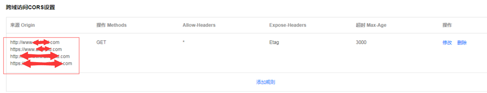
同时S3也要改一样的：
```javascript
<?xml version="1.0" encoding="UTF-8"?>
<CORSConfiguration xmlns="http://s3.amazonaws.com/doc/2006-03-01/">
<CORSRule>
    <AllowedOrigin>https://www.xxx.com</AllowedOrigin>
    <AllowedOrigin>http://www.xxx.com</AllowedOrigin>
    <AllowedMethod>GET</AllowedMethod>
    <MaxAgeSeconds>3000</MaxAgeSeconds>
    <AllowedHeader>*</AllowedHeader>
    <AllowedHeader>Authorization</AllowedHeader>
</CORSRule>
</CORSConfiguration>
```
然后访问了一下：腾讯云的cos这样设置是可以的，设置成功了：
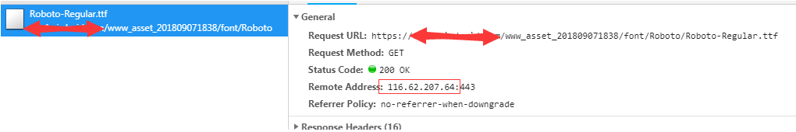
接下来翻墙试一下s3 的情况，发现 s3 那样设置是不行的：还是会报错，而且这个错误很奇怪，他提示我们没有设置 **Access-Control-Allow-Origin** 这个头部， 可是我们明明有设置啊？？
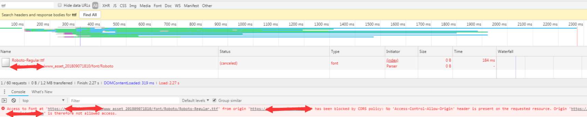
### CloudFront设置CORS
后面查了一下，原来因为我们有用了 **CloudFront**，所以单单设置 S3 bucket 还不够， **CloudFront** 上面也要设置。
因为默认 **CloudFront** 是不会转发 s3 配置的头部的。 所以要单独在 **CloudFront** 的 behavior 中设置所允许头部的白名单。 这样就会转发s3上对应的头部了。
参考文档：
[AmazonCloudFront set web cors](https://docs.aws.amazon.com/zh_cn/AmazonCloudFront/latest/DeveloperGuide/header-caching.html#header-caching-web-cors)
[correct configuration to fix cors issue with cloudfront](http://thelazylog.com/correct-configuration-to-fix-cors-issue-with-cloudfront/)
这边本来就有一个默认的Behavior了，直接点击Edit，然后因为我们只需要转发 s3 的 'Access-Control-Allow-Origin' 这个头部。 所以就把它添加到右边的白名单中。
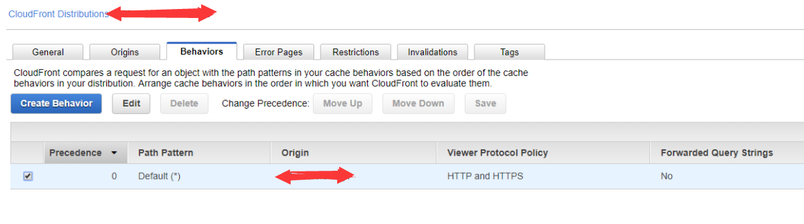
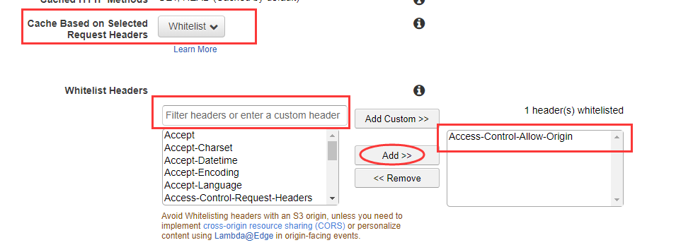
这样就可以了
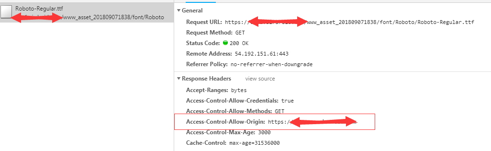
注意： 这边只配置了 Access-Control-Allow-Origin 这个白名单头部， 如果将来要配置 options 响应，请执行以下操作：（当然我们这次不需要这个操作）
- 为默认缓存行为设置选择启用 OPTIONS 响应缓存的选项。
- 将 CloudFront 配置为转发以下标头：Origin、Access-Control-Request-Headers 和 Access-Control-Request-Method。

## 怎么准确测试国外的CloudFront地址
这边测试的时候，因为要测试国内的 cos 和 国外的 CloudFront 的响应。
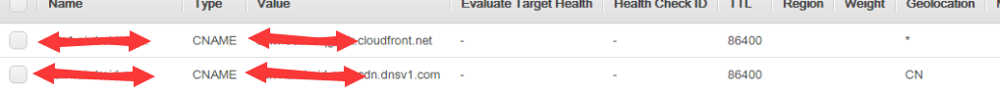
国内的比较好测，不翻墙的话，基本上访问的就是国内的 cos。
但是测国外的 CloudFront 会比较不好测， 这边有个方式，就是用 host 的方式，比如先通过 ping 得到 CloudFront 最近的一个节点地址：
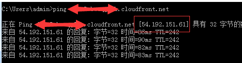
然后在host 文件，直接host到这个地址
```javascript
54.192.151.61 cdn1.xxx.com
```
这样子就可以访问的时候，直接指向这个地址了：
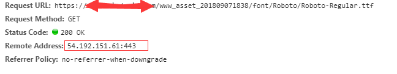
省的每次开代理，还往往翻不过去，或者是有 DNS 缓存。
而且这边要注意一点的是，这个 ip 地址，有效期很短的，所以测完之后，没问题之后，就可以把这个host 指向从 hosts 文件去掉了。下一次要测的话，再ping一个新的ip就行了。
<font color=red>因为之前我就有遇到这个一个情况，就是这个host没有删掉，结果等了一段时间之后，重新访问官网，结果全部出现 403 forbidden 提示，原来是这个ip地址 校验已经过期了。</font>

---
系列文章














