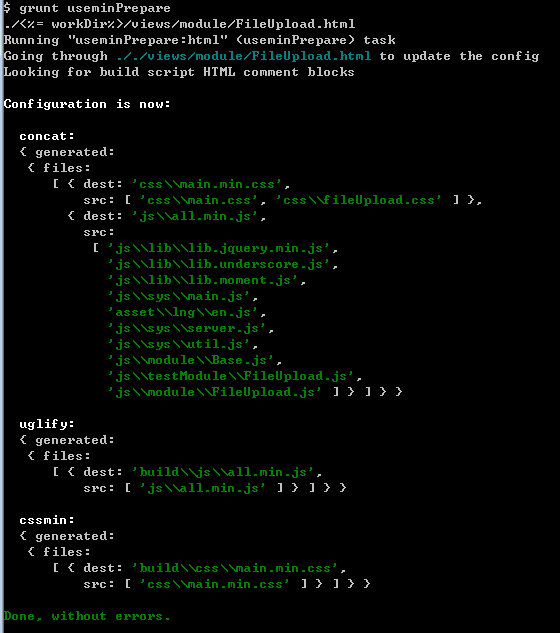
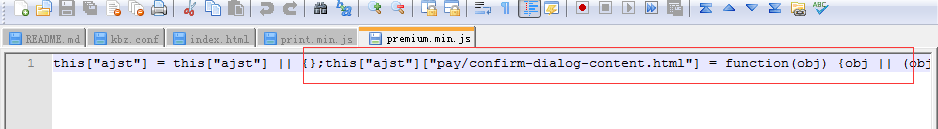

## 前言
这个主要是讲第一版的时候，用grunt来进行官网构建。
## 具体构建分析
具体的构建流程是：**Gruntfile.js** (我知道你们根本不会看，但是我还是要贴代码 ʅ（´◔౪◔）ʃ)
<!--more-->
```javascript
var _ = module.require('underscore');
module.exports = function (grunt) {
    'use strict';
    var taskName = grunt.cli.tasks[0];
    var isRelease = taskName === 'release' || taskName === 'r';
    var isDebug = taskName === 'debug' || taskName === 'd';

    var pkg = grunt.file.readJSON('package.json');

    // 构建目录
    var buildDir = './build';
    // 工作目录
    var workDir = pkg.workDir || 'workspace';

    // 源码目录
    var jsDir = pkg.jsDir || 'js';
    var cssDir = pkg.cssDir || 'css';
    var imgDir = pkg.imgDir || 'img';
    var langDir = pkg.langDir || 'lang';
    var lessDir = pkg.lessDir || 'less';
    var tplDir = pkg.tplDir || 'tpl';
    var supportLangObj = pkg.supportLangs;
    var supportLangs = _.keys(supportLangObj) || ['en'];

    var allDirs = [jsDir, cssDir, imgDir, langDir, tplDir];

    // 指定需要构建的 html 文件
    var htmlFiles = pkg.html_files || ['index.html'];

    // 自动版本号
    var version = grunt.template.today("yymmddHHMM");

    // api 版本
    var apiVersion = pkg.apiVersion;

    // 如果指定 static_base_url，那么所有链接最终会被换成带版本号的绝对路径
    // 以static_base_url = 'http://www.airdroid.com' 为例，
    // <script type="text/javascript" src="./js/all.js"></script>
    // 构建结果如下
    // <script type="text/javascript" src="http://www.airdroid.com/1406191728/js/all.js"></script>
    var staticBaseUrl = pkg.static_base_url || '.';
    if (isDebug) {
        staticBaseUrl = pkg.static_base_url.replace('//', '//test-');
    }

    var dist_no_version = './build/no_gzip/';
    var dist_gzip_no_version = './build/gzip/';

    var dist = dist_no_version + version;
    var dist_gzip = dist_gzip_no_version + version;

    // TODO 把正则表达式都放到这里来。
    var REG_EXP_RESOURCE = new RegExp("(url\\(|['\"])(\\.{0,2}\/)+.*?((" + allDirs.join("|") + ")\/(.*?\\.(png|jpg|gif|css|js|ico|html|json)))(['\")])", 'g');

    // Project configuration
    grunt.initConfig({
        pkg: pkg,
        apiVersion: apiVersion,
        version: version,
        dist_no_version: dist_no_version,
        dist_gzip_no_version: dist_gzip_no_version,
        dist: dist,
        dist_gzip: dist_gzip,
        static_base_url: staticBaseUrl,
        buildDir: buildDir,
        workDir: workDir,
        jsDir: jsDir,
        cssDir: cssDir,
        imgDir: imgDir,
        langDir: langDir,
        lessDir: lessDir,
        tplDir: tplDir,
        useminPrepare: {
            html: _.map(htmlFiles, function (htmlFile) {
                return '<%= dist %>/' + htmlFile;
            }),
            options: {
                dest: '<%= dist %>',
                root: '.'
            }
        },

        usemin: {
            html: (function () {
                var result = [];
                _.each(htmlFiles, function (htmlFile) {
                    result.push('<%= dist %>/' + htmlFile);
                });
                return result;
            })()
        },

        copy: {
            // 打包的时候，先把workDir 即，workspace 里面的文件，复制到build的version目录，接下来就直接操作build的version目录即可，不用管workspace目录
            prepare: {
                cwd: '<%=workDir%>/',
                expand: true,
                src: [
                    '**',
                    '!{Gruntfile.js,npm-debug.log}',
                    '!**/{framework,slice,demos,doc,docs,inc,test,less}/**'
                    //,
                    // css 和 js 是使用 usemin 构建的，不需要复制过去
                    //'!**/*.{css,js}',
                    // 语言目录要复制过来
                    //'**/<%= langDir %>/**'
                ],
                dest: '<%= dist %>'
            },
            // 将 dist 目录下的 html 向上提取二级目录
            movehtml: {
                cwd: '<%=dist%>/html',
                expand: true,
                src: [
                    '**/*.html',
                    '!**/<%= tplDir %>/**',
                    '**/robots.txt'
                ],
                dest: '<%= dist %>/..'
            },
            // 所有资源复制到 gzip 目录
            gzip: {
                cwd: '<%= dist_no_version %>',
                expand: true,
                src: [
                    '**'
                ],
                dest: '<%= dist_gzip_no_version %>'
            },
            // 预编译完之后，要把en的文件复制到上一层
            i18n: {
                cwd: '<%= dist_no_version %>/en/',
                expand: true,
                src: [
                    '**'
                ],
                dest: '<%= dist_no_version %>'
            }
        },

        clean: {
            // 打包前，先清除前次打包的一些文件
            prepare: ['build', 'build_gzip', ".tmp"],
            // usemin 之后，删除之前旧的js和css，只保留打包压缩后的js和css
            dist: [
                "<%= dist %>/<%= jsDir %>/module",
                "<%= dist %>/<%= jsDir %>/sys",
                "<%= dist %>/<%= cssDir %>/**/*.css",
                "<%= dist %>/<%= jsDir %>/**/*.js",
                "<%= dist %>/tpl2",
                "!<%= dist %>/<%= jsDir %>/**/*.min.js",
                "!<%= dist %>/<%= cssDir %>/**/*.min.css",
                ".tmp"
            ],
            // 最后去掉，版本目录里面的html目录(因为之前已经提到上两级目录去了)
            movehtml: [
                "<%= dist %>/html"
            ]
        },
        // 模板压缩
        jst: {
            compile: {
                options: {
                    namespace: "ajst",
                    prettify: true
                },
                files: [
                    {
                        expand: true,
                        cwd: '<%=dist %>/tpl/',
                        src: ['**/*.html'],
                        dest: '<%=dist %>/tpl2/',
                        ext: '.jst'
                    }
                ]
            }
        },


        //JST模版联合
        jst_concat: {
            custom_options: {
                options: {
                    separator_start: '',
                    separator_end: '',
                    jst_path: '<%=dist %>/tpl2/',
                    jst_ext: ".jst",
                    pattern: /getTemplate\s*\(\s*[\"']([\w/-]+)[\"']\s*\s*/g,
                    replace_text: "$1",
                    replace: function (jst) {
                        jst = jst.replace(/(this\["ajst"\]\[")(.*)\/tpl\/(.*)("\])/g, "$1$3$4");
                        jst = jst.replace(/\n|\r/g, "");
                        return jst;
                    }
                },
                files: [
                    {
                        expand: true,
                        cwd: '<%=dist %>/js',
                        src: ['**/*.min.js'],
                        dest: '<%=dist %>/js',
                        ext: '.min.js'
                    }
                ]
            }
        },

        //gzip压缩
        compress: {
            main: {
                options: {
                    mode: 'gzip'
                },
                files: [
                    {
                        expand: true,
                        cwd: '<%= dist %>',
                        // 语言文件不加 min.js
                        src: ['**/*.js', '!<%= langDir %>/*.js'],
                        dest: '<%= dist_gzip %>',
                        ext: '.min.js'
                    },
                    {
                        expand: true,
                        cwd: '<%= dist %>',
                        src: ['<%= langDir %>/*.js'],
                        dest: '<%= dist_gzip %>',
                        ext: '.js'
                    },
                    {
                        expand: true,
                        cwd: '<%= dist %>',
                        src: ['**/*.css'],
                        dest: '<%= dist_gzip %>',
                        ext: '.min.css'
                    }
                ]
            },

            zip_release: {
                options: {
                    archive: '<%= buildDir %>/../<%= pkg.name %><%= version %>正式.zip',
                    mode: 'zip'
                },
                files: [
                    {src: ['<%= buildDir %>/**']}
                ]
            },
            zip_debug: {
                options: {
                    archive: '<%= buildDir %>/../<%= pkg.name %><%= version %>测试.zip',
                    mode: 'zip'
                },
                files: [
                    {src: ['<%= buildDir %>/**']}
                ]
            }
        },

        'string-replace': {
            // 给提出来的html文件，加上版本号，并设置绝对地址(包括html文件里面的图片，url，等等都要)
            movehtmlSrcUrl: {
                files: {
                    '<%= dist %>/../': '<%= dist %>/../**/*.html',
                    '<%= dist %>/<%= tplDir %>/': '<%= dist %>/<%= tplDir %>/**/*.html'
                },
                options: {
                    replacements: [
                        {
                            pattern: REG_EXP_RESOURCE,
                            // $3 匹配的是资源路径
                            replacement: '$1/<%= version %>/$3$7'
                        }
                    ]
                }
            },
            // 修改打包后的模板地址，和语言包的路径
            movehtmlTplBaseUrl: {
                files: {
                    '<%= dist %>/<%= jsDir %>/framework.min.js': '<%= dist %>/<%= jsDir %>/framework.min.js'
                },
                options: {
                    replacements: [
                        {
                            // 模版地址修改
                            pattern: /(util\.setTemplateBaseUrl\(('|")).*?(('|")\))/,
                            replacement: '$1/<%= version %>$3'
                        },
                        {
                            // 语言文件地址修改
                            pattern: /(buildLangURl\s*:\s*)('|")(\S*?)('|"),/,
                            replacement: '$1$2/<%= version %>/lang/$4,'
                        },
                        {
                            // 修改资源路径
                            pattern: /(resourceUrl\s*:\s*['"]*)(.*?)(['"]*[,;\s])/,
                            replacement: '$1/<%= version %>/$3'
                        }
                    ]
                }
            },
            // 为资源添加完整的 静态地址，包括图片
            releaseStaticUrl: {
                files: {
                    '<%= dist %>/../': '<%= dist %>/../**/*.html',
                    '<%= dist %>/<%= tplDir %>/': '<%= dist %>/<%= tplDir %>/**/*.html'
                },
                options: {
                    replacements: [
                        {
                            pattern: REG_EXP_RESOURCE,
                            // $3 匹配的是资源路径
                            replacement: '$1<%= static_base_url %>/<%= version %>/$3$7'
                        },
                        {
                            pattern: new RegExp("('|\")(\\.{0,2}\/)+((" + langDir + ")\/*.*)('|\")", 'g'),
                            // $1 匹配的是引号
                            // $3 匹配的是资源路径
                            replacement: '$1<%= static_base_url %>/<%= version %>/$3$1'
                        }
                    ]
                }
            },
            // 更新服务端接口地址和版本号
            releaseServerUrl: {
                files: {
                    '<%= dist %>/<%= jsDir %>/framework.min.js': '<%= dist %>/<%= jsDir %>/framework.min.js'
                },
                options: {
                    replacements: [
                        {
                            // release url 修改
                            pattern: /(idUrl\s*:\s*['"]*)(.*?)(['"]*[,;\s])/,
                            replacement: '$1https://id4.airdroid.com/$3'
                        },
                        {
                            // release url 修改
                            pattern: /(payUrl\s*:\s*['"]*)(.*?)(['"]*[,;\s])/,
                            replacement: '$1https://pay.airdroid.com/$3'
                        },
                        {
                            // release url 修改
                            pattern: /(serverUrl\s*:\s*['"]*)(.*?)(['"]*[,;\s])/,
                            replacement: '$1https://srv3.airdroid.com/$3'
                        },
                        {
                            // api 版本修改
                            pattern: /(apiVersion\s*:\s*['"]*)(.*?)(['"]*[,;\s])/,
                            replacement: '$1<%= apiVersion %>$3'
                        }
                    ]
                }
            },
            // 预编译之后，把debug模式去掉
            i18n: {
                files: {
                    '<%= dist %>/<%= jsDir %>/framework.min.js': '<%= dist %>/<%= jsDir %>/framework.min.js'
                },
                options: {
                    replacements: [
                        {
                            // debug 模式修改
                            pattern: /(Airdroid_isDebug\s*:\s*['"]*)(.*?)(['"]*[,;\s])/,
                            replacement: '$1false$3'
                        }
                    ]
                }
            },

            // 需要添加 css 或者 js 的时候，就编辑一下下面，的内容，然后执行
            // grunt string-replace:framework，一次性将所有文件都替换好。
            framework: {
                files: {
                    '<%= workDir %>/': '<%= workDir %>/html/**/*.html'
                },
                options: {
                    replacements: [
                        {
                            pattern: /( *<!--\s*build:css.*main.min.css\s*-->)[\w\W]*?(<!-- endbuild -->)/,
                            replacement: '$1\n' +
                            '    <link rel="stylesheet" href="/workspace/css/base.css"/>\n' +
                            '    <link rel="stylesheet" href="/workspace/css/header.css"/>\n' +
                            '    <link rel="stylesheet" href="/workspace/css/footer.css"/>\n' +
                            '    $2'
                        },
                        {
                            pattern: /( *<!--\s*build:js.*framework.min.js\s*-->)[\w\W]*?(<!-- endbuild -->)/,
                            replacement: '$1\n' +
                            '    <script src="/bower_components/es5-shim/es5-shim.js"></script>\n' +
                            '    <script src="/bower_components/base64/base64.js"></script>\n' +
                            '    <script src="/bower_components/console-js/console.js"></script>\n' +
                            '    <script src="/bower_components/underscore/underscore.js"></script>\n' +
                            '    <script src="/bower_components/jquery/jquery.js"></script>\n' +
                            '    <script src="/bower_components/jquery-cookie/jquery.cookie.js"></script>\n' +
                            '    <script src="/bower_components/Placeholders.js/lib/utils.js"></script>\n' +
                            '    <script src="/bower_components/Placeholders.js/lib/main.js"></script>\n' +
                            '    <script src="/bower_components/Placeholders.js/lib/adapters/placeholders.jquery.js"></script>\n' +
                            '    <script src="/framework/js/lib/lib.jquery.jsonp.js"></script>\n' +
                            '    <script src="/framework/js/lib/lib.md5.js"></script>\n' +
                            '    <script src="/framework/js/util/util.js"></script>\n' +
                            '    <script src="/framework/js/util/valid/isValidEmail.js"></script>\n' +
                            '    <script src="/framework/js/util/url/getUrlParam.js"></script>\n' +
                            '    <script src="/framework/js/util/url/toUrlParam.js"></script>\n' +
                            '    <script src="/framework/js/util/tpl/getTpl.js"></script>\n' +
                            '    <script src="/framework/js/util/string/capitalize.js"></script>\n' +
                            '    <script src="/framework/js/util/browser/browser_os.js"></script>\n' +
                            '    <script src="/framework/js/util/analytics/analytics.js"></script>\n' +
                            '    <script src="/workspace/js/sys/server.js"></script>\n' +
                            '    <script src="/workspace/js/sys/i18n.js"></script>\n' +
                            '    <script src="/workspace/js/sys/util.js"></script>\n' +
                            '    <script src="/workspace/js/module/base.js"></script>\n' +
                            '    $2'
                        }
                    ]
                }
            }
        },
        // 给css文件，加浏览器前缀，只要写最标准的语言就行了，它会自动填上浏览器前缀
        autoprefixer: {
            options: {
                // 需要兼容的浏览器，默认兼容所有。
                browsers: pkg.browsers || ['> 1%', 'last 2 versions', 'Firefox ESR', 'Opera 12.1', 'Android 1', 'ios 7']
            },
            dist: {
                src: '<%= dist %>/**/*.css'
            }
        },
        // html 压缩（连同模板） 等操作
        htmlmin: {
            dist: {
                options: {
                    // 去掉空格，压缩一行显示
//                    collapseWhitespace: true,
                    // 去掉注释
                    removeComments: true
                },
                files: [
                    {
                        expand: true,
                        cwd: '<%= dist_no_version %>',
                        dest: '<%= dist_no_version %>',
                        src: '**/*.html'
                    }
                ]
            }
        },
        // 多语言预编译处理
        staticfy: (function () {
            var cfg = {};
            var files;
            _.each(supportLangs, function (lang) {
                files = {};
                _.each(htmlFiles, function (htmlFile) {
                    var file = htmlFile.replace('html/', '');
                    files['<%= dist_no_version %>/' + lang + '/' + file] = '<%= dist_no_version %>/' + file;
                });
                cfg[lang] = {
                    options: {
                        cwd: '<%= dist_no_version %>',
                        query_string: 'lang=' + lang,
                        onfinish: function (str) {
                            return str
                                // 预编译要跟进对应的语言，对 a 标签的相对路径进行替换
                                .replace(/(<a.*?href=['"])(\/.*?)(['"])/gi, '$1/' + lang + '$2$3')
                                // 删掉和重置一些页面访问时产生的内容
                                //.replace(/\n?<iframe.*https:\/\/accounts.google.com.*?<\/iframe>/, '')
                                //.replace(/<script.*google.*twitter.*?<\/script>/, '')
                                //.replace(/<style.*fb_hidden[\w\W]*?<\/style>/, '')
                                //.replace(/ data-twttr-rendered="true"/, '')
                                //.replace(/<iframe id="twitter-widget-0".*<\/iframe>/, '<a href="https://twitter.com/share" class="twitter-share-button" data-lang="en">Tweet</a>')
                                //.replace(/<div.*plusone.*?\/div>/, '<g:plusone size="medium"></g:plusone>')
                                //.replace(/<div.*fb-like.*<\/div>/, '<div class="fb-like item-social-buttons-fb-like" data-href="http://www.airdroid.com" data-send="false" data-layout="button_count" data-width="450" data-show-faces="true"></div>')
                                //.replace(/<div.*fb-root.*<\/div>/, '<div id="fb-root"></div>')

                                // 消除 jsonp 请求产生的 script 标签
                                .replace(/<script.*async="".*?<\/script>/g, '')
                                // 消除 首页加载Google字体请求产生的link标签
                                .replace(/<link.*http:\/\/fonts.googleapis.com.*?>/, '')
                                // 清理首页的图片，重设为隐藏
                                .replace(/()/g, '$1$2')

                                // 清理邮件验证页，重设为隐藏
                                .replace(/"(item-verify-send)"/, '"$1 i-hide"')

                                // signin 重置链接地址
                                .replace(/(href=".*signin\/)\?.*(")/, '$1$2')

                                // 重置 header 右侧的 item-actions 和 item-profile 的状态
                                .replace(/"(item-actions|item-profile)"/, '"$1 i-hide"')
                                // 去掉指定的要删除的脚本
                                .replace(/<script.*id="removeScript".*?<\/script>/g, '')
                                // 去掉自动下载的iframe中的url
                                .replace(/(<iframe id="downloadFrame".*?)(src=")(\S+)(".*><\/iframe>)/g, '$1$2$4')
                                // 去掉首页 Facebook twitter g+ 的 addthis widget 中间代码
                                .replace(/<div.*id="_atssh".*?<\/iframe><\/div>/g, '')
                                // 这条规则要特别注意(用于首页清除addthis的样式)，很容易请到别的页面，所以尽量不要在页面内加上style标签
                                .replace(/<style.*type="text\/css".*?<\/style><\/head>/g, '</head>')
                                // 最后把对应的语言文件再加到里面去
                                .replace(/<\/head>/, '<script src="/' + version + '/lang/' + supportLangObj[lang].code + '.js"></script></head>');
                        }
                    },
                    files: files
                };
            });
            return cfg;
        })(),
        processhtml: {
            options: {
                includeBase: workDir,
                data: {
                    apiVersion: apiVersion
                }
            },
            // 扩大usemin 功能，增加 remove include 等功能
            dist: {
                files: (function () {
                    var result = {};
                    _.map(htmlFiles, function (htmlFile) {
                        result['<%= dist %>/' + htmlFile] = '<%= dist %>/' + htmlFile;
                    });
                    return result;
                })()
            },
            release: {
                files: (function () {
                    var result = {};
                    _.map(htmlFiles, function (htmlFile) {
                        result['<%= dist %>/' + htmlFile] = '<%= dist %>/' + htmlFile;
                    });
                    return result;
                })()
            }
        },

        // 使用less编译
        // 编译less文件
        less: {
            update: {
                options: {
                    // 设置为sourceMap，如果在chrome的workspace环境，并设置为可编辑路径的话，该属性会无效
                    sourceMap: true,
                    sourceMapRootpath: "../../"
                },
                files: [
                    {
                        expand: true,
                        cwd: '<%=workDir%>/<%=lessDir%>/',
                        src: ['*.less'],
                        dest: '<%=workDir%>/<%=cssDir%>/',
                        ext: '.css'
                    }
                ]
            }
        },
        // 监听less文件
        watch: {
            less: {
                files: ['<%= workDir %>/<%= lessDir %>/*.less'],
                tasks: ['newer:less:update'],
                options: {
                    livereload: true,
                    spawn: false
                }
            },
            livereload: {
                files: ['<%= workDir %>/<%= lessDir %>/**.less', '<%= workDir %>/**.html'],
                options: {
                    livereload: true,
                    spawn: false
                }
            }
        },
        unused: {
            options: {
                reference: '<%= workDir %>/<%= imgDir %>/',
                directory: [
                    '<%= workDir %>/**/*.{css,html,js,less}'
                ]
            }
        }
    });

    // These plugins provide necessary tasks
    grunt.loadNpmTasks('grunt-contrib-clean');
    grunt.loadNpmTasks('grunt-contrib-concat');
    grunt.loadNpmTasks('grunt-contrib-uglify');
    grunt.loadNpmTasks('grunt-contrib-cssmin');
    grunt.loadNpmTasks('grunt-contrib-copy');
    grunt.loadNpmTasks('grunt-autoprefixer');
    grunt.loadNpmTasks('grunt-contrib-compress');
    grunt.loadNpmTasks('grunt-string-replace');
    grunt.loadNpmTasks('grunt-jst-concat');
    grunt.loadNpmTasks('grunt-contrib-jst');
    grunt.loadNpmTasks('grunt-usemin');
    grunt.loadNpmTasks('grunt-staticfy');
    grunt.loadNpmTasks('grunt-processhtml');
    grunt.loadNpmTasks('grunt-newer');
    grunt.loadNpmTasks('grunt-contrib-less');
    grunt.loadNpmTasks('grunt-contrib-watch');
    grunt.loadNpmTasks('grunt-contrib-htmlmin');
    grunt.loadNpmTasks('grunt-unused');

    /* 构建步骤 */
    // 准备工作
    grunt.registerTask('prepare', ['clean:prepare', 'less:update', 'copy:prepare', 'autoprefixer']);
    // 压缩 js css 并更新相应的 html 文件
    grunt.registerTask('min', ['jst', 'useminPrepare', 'concat', 'uglify', 'jst_concat', 'cssmin', 'usemin', isRelease ? 'processhtml:release' : 'processhtml:dist', 'clean:dist']);
    // 把 html 文件从 html 文件夹移动出来
    grunt.registerTask('movehtml', ['copy:movehtml', 'string-replace:movehtmlSrcUrl', 'string-replace:movehtmlTplBaseUrl', 'clean:movehtml']);
    // 多语言
    grunt.registerTask('i18n', ['staticfy', 'htmlmin', 'copy:i18n', 'string-replace:i18n']);
    // 绝对地址 + 服务端正式接口地址
    grunt.registerTask('release', ['string-replace:releaseStaticUrl', 'string-replace:releaseServerUrl']);

    // gzip 压缩
    grunt.registerTask('gzip', ['copy:gzip', 'compress:main']);

    /* 完整的构建流程 */
    // 最基础的构建
    grunt.registerTask('build', ['prepare', 'min', 'movehtml']);
    grunt.registerTask('default', ['build']);

    // 多语言预编译
    grunt.registerTask('i', ['build', 'i18n', 'gzip']);

    // 正式地址
    grunt.registerTask('r', ['build', 'i18n', 'release', 'gzip', 'compress:zip_release']);
    // 测试地址
    grunt.registerTask('d', ['build', 'i18n', 'string-replace:releaseStaticUrl', 'gzip', 'compress:zip_debug']);

    // less 编译
    grunt.registerTask('start', ['less:update', 'watch']);
}
```
假设以打正式地址为例：  **grunt r** 执行的流程如下：
即执行  **'build', 'i18n', 'release', 'gzip', 'compress:zip_release'**  
同时 build 又分为 **'prepare', 'min', 'movehtml'**
 全部切换成单个执行任务就是：
 ### step 1. prepare 
 ```
prepare => ['clean:prepare', 'less:update', 'copy:prepare', 'autoprefixer']
```
即构建前的准备工作。即
1. **clean:prepare** 清除前次打包的一些文件
2. **less:update** 编译生成新的css文件
3. **copy:prepare** 打包的时候，先把workDir， 即workspace 里面的文件，复制到build的version目录，接下来就直接操作build的version目录即可，不用管workspace目录

### step 2. min
```
min => ['jst', 'useminPrepare', 'concat', 'uglify', 'jst_concat', 'cssmin', 'usemin', isRelease ? 'processhtml:release' : 'processhtml:dist', 'clean:dist']
```
即 压缩 js css 并更新相应的 html 文件， 即
1. **jst** =>  html模板编译，将 <%=dist %>/tpl/ 目录里面的html模板编译成jst后缀的文件，并放在 <%=dist %>/tpl2/
2. **useminPrepare** => 进行usemin的准备操作， 生成一份 usemin 的grunt配置文件（即合并文件，压缩js，压缩css）（usemin 分为两个步骤，第一要先进行预构建， 即 useminPrepare , 生成 contat 和 uglify  配置, 以便第三步，第四步， 第六步操作 ) 

3. **concat** => 文件合并，针对第二步的grunt配置
4. **uglify** => js 文件压缩，针对第二步的grunt配置
5. **jst_concat** => JST模版联合,  即遍历所有的js文件，如果里面有用到模板的地方，那么就将该模板的调用代码，并入到js文件头部。
以**premium.min.js** 为例。这个js用到了**pay/confirm-dialog-content.html** 这个模板，那么就把这个模板的编译js模板放到这个文件的头部。
（这样做的好处就是，请求模板的时候，不会再去进行一次http请求去请求模板，因为js文件本身已经自带了这个模板了，减少了网络请求）

然后在调用模板的时候，判断如果是publish方式的话，就直接 执行 
```
window["ajst"][name + '.html'](obj)
```
来获取模板,调用模板的代码如下：
```javascript
window.util.getTemplate = function (name, obj) {
  var tpl, url, file_url;
  url = this.getTemplateBaseUrl() + '/tpl/' + name;
  file_url = url + '.js';
  obj = obj || {};
  obj = $.extend(true, {lang: Airdroid ? Airdroid.Lang : {}}, obj);
  // 非debug模块，就用内联模板
  if(I18n && !I18n.Airdroid_isDebug){
    return window["ajst"][name + '.html'](obj);
  }else{
    tpl = this.cacheTpls[file_url] || $.ajax({ url: url + '.html', async: false, cache: true }).responseText;
    return _.template(tpl, obj);
  }
};
```

6. **cssmin** => css 文件压缩，针对第二步的grunt配置
7. **usemin** => 进行 usemin 操作，并且对html文件进行路径调整
8. **processhtml:release** => 扩大usemin 功能，增加 remove include 等功能
9. **clean:dist** => usemin 之后，删除之前旧的js和css，只保留打包压缩后的js和css

### step 3. movehtml
```
movehtml=> ['copy:movehtml', 'string-replace:movehtmlSrcUrl', 'string-replace:movehtmlTplBaseUrl', 'clean:movehtml']
```
主要功能就是 把 html 文件从 html 文件夹移动出来， 之前的html文件都是在workspace/html 这个目录里面的，现在要移到打包的根目录下。
1. **copy:movehtml** => 将 dist 目录下的 html 向上提取二级目录
2. **string-replace:movehtmlSrcUrl** =>  给提出来的html文件，加上版本号，并设置绝对地址(包括html文件里面的图片，url，等等都要)
3. **string-replace:movehtmlTplBaseUrl** => 修改打包后的模板地址，和语言包的路径
4. **clean:movehtml** => 最后去掉，版本目录里面的html目录(因为之前已经提到上两级目录去了)

### step 4. i18n
```
i18n=> ['staticfy', 'htmlmin', 'copy:i18n', 'string-replace:i18n']
```
主要功能就是进行多语言的静态文件编译
1. **staticfy** => 多语言预编译处理，即用**phantom.js**来加载不同语言下的所有页面，然后保存起来
2. **htmlmin** => html 压缩（连同模板） 等操作
3. **copy:i18n** => 预编译完之后，要把en的文件复制到上一层, 即默认没有加语音路径参数的，就是英文
4. **string-replace:i18n** => 预编译之后，把debug模式去掉, 即 Airdroid_isDebug 改为 false

### step 5. release
```
release=>['string-replace:releaseStaticUrl', 'string-replace:releaseServerUrl']
```
主要就是打release包的时候，将静态资源修改成绝对地址，并修改成服务端的正式接口地址
1. **string-replace:releaseStaticUrl** => 为资源添加完整的 静态地址，包括图片
2. **string-replace:releaseServerUrl** => 更新服务端接口地址和版本号

### step 6. gzip （官网不放s3上，这一步可以不做）
```
gzip=>['copy:gzip', 'compress:main']
```
将资源进行 **gzip** 压缩，主要是js和css
1. **copy:gzip** => 所有资源复制到 gzip 目录
2. **compress:main** => 对所有的js和css进行gzip压缩

### step 7.compress:zip_release
将打的zip改名字

### package.json 文件
以上就是所有的详细步骤，其实还有没有说的一点就是，上面没有指定要构建哪些html文件，其实不是所有的html文件都要构建的，其实是要在setting文件指定的。
**package.json**:
```javascript
{
  "name": "airdroid_web_www",
  "version": "1.0.0",
  "dependencies": {},
  "workDir": "workspace",
  "jsDir": "js",
  "cssDir": "css",
  "imgDir": "img",
  "langDir": "lang",
  "tplDir": "tpl",
  "scripts": {
    "dev": "supervisor server.js",
    "buid_test": "grunt d",
    "buid_release": "grunt r"
  },
  "supportLangs": {
    "en": {
      "code": "en"
    },
    "ja": {
      "code": "ja"
    },
    "it": {
      "code": "it"
    },
    "de": {
      "code": "de"
    },
    "pt-br": {
      "code": "pt-BR"
    },
    "es-es": {
      "code": "es-ES"
    },
    "fr": {
      "code": "fr"
    },
    "zh-cn": {
      "code": "zh-CN"
    },
    "pt-pt": {
      "code": "pt-PT"
    },
    "ru": {
      "code": "ru"
    }
  },
  "html_files": [
    "html/legal/eula.html",
    "html/download.html",
    "html/index.html",
    ... 省略一大堆的html 文件，只有在这个数组里面的html文件才会构建 ...
    "html/attachment.html"
  ],
  "apiVersion": "p14",
  "static_base_url": "//www.airdroid.com",
  "devDependencies": {
    "grunt": "~0.4.2",
    "grunt-autoprefixer": "~0.8.1",
    "grunt-contrib-clean": "~0.5.0",
    "grunt-contrib-compress": "~0.9.1",
    "grunt-contrib-concat": "~0.4.0",
    "grunt-contrib-copy": "~0.5.0",
    "grunt-contrib-cssmin": "~0.9.0",
    "grunt-contrib-htmlmin": "^0.3.0",
    "grunt-contrib-jst": "~0.5.0",
    "grunt-contrib-less": "~0.8.1",
    "grunt-contrib-uglify": "~0.4.0",
    "grunt-contrib-watch": "~0.5.3",
    "grunt-jst-concat": "~0.1.0",
    "grunt-newer": "~0.6.0",
    "grunt-processhtml": "^0.3.3",
    "grunt-staticfy": "^0.4.6",
    "grunt-string-replace": "~0.2.7",
    "grunt-unused": "^0.1.0",
    "grunt-usemin": "~2.3.0",
    "jquery": "^2.1.1",
    "underscore": "~1.6.0"
  }
}
```


