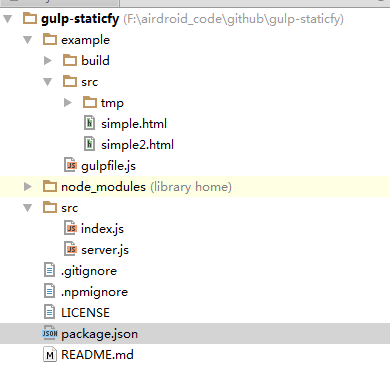

## 前言
通过  可以看到通过这个 grunt-staticfy 组件可以实现 模板静态化预编译，但是会有几个问题。
后面决定采用gulp来重写这个组件： 
[github 传送门 gulp-staticfy](https://github.com/AxesTeam/gulp-staticfy)
[npm 组件传送门 gulp-staticfy](https://www.npmjs.com/package/gulp-staticfy)
用gulp 的几个好处就是：
1. gulp 是基于流的方式，不需要像grunt那样进行那么多的io操作
2. npm 有一个 phantom 的插件： [phantomjs-node](https://github.com/amir20/phantomjs-node)，在安装这个npm 插件的时候，不用单独再去安装phantomjs 客户端。而是插件在安装的时候，就会去下载**phantomJS**。而且整个调用非常方便。可以用 promise， 也可以用 co同步（还有最新的async  await语法), 而如果是之前grunt-staticfy 那种处理，就比较麻烦，还要用到 exec 去执行 phantom 的脚本， 非常不友好。
<!--more-->      

## 代码分析
新版gulp组件的原理跟旧版grunt差不多，但是会简洁很多。
文件目录如下：

主要的文件就两个，都在src目录里面，其中**index** 是主要逻辑，**server**是创建简易http server的逻辑。
**src/index.js**:
```javascript
'use strict';

var gutil = require('gulp-util');
var path = require('path');
var phantom = require("phantom");
var SimpleServer = require('./server.js');
var map = require('map-stream');

module.exports = function(options) {
    var totalFileSize = 0;
    var finishFileSize = 0;
    var ph;
    var createPhPage = function(){
        if(ph){
            return ph.createPage();
        }else{
            return phantom.create().then(_ph => {
                ph = _ph;
                return ph.createPage();
            })
        }
    };
    // close all http server
    var doAllFinish = () => {
        ph.exit();
        SimpleServer.closeAll();
        console.log(gutil.colors.green("staticfy success"));
    };
    var doFinish = () => {
        finishFileSize += 1;
        if(finishFileSize === totalFileSize){
            doAllFinish();
        }
    };
    return map(function (file, callback) {
        if (file.isNull()) {
            console.log("null");
            return callback(null, file);
        }
        if (file.isStream()) {
            console.log("stream");
            return callback(null, file);
        }

        if (file.isBuffer()) {
            totalFileSize += 1;
            // custom server url
            var wwwDir = options.server_url || file.cwd;
            var baseName = path.relative(wwwDir, file.path);
            var url = 'http://localhost:{{port}}/';
            var query_string = options.query_string ? `?${options.query_string}` : '';
            console.log(gutil.colors.blue(`${baseName} loading ...`));
            SimpleServer.start(wwwDir, server => {
                // Replace {{port}} with server.port
                url = url.replace('{{port}}', server.port) + baseName + query_string;
                var ph_page;
                createPhPage().then(page => {
                    ph_page = page;
                    return ph_page.open(url);
                }).then(status => {
                    //console.log(status);
                    return ph_page.property('content')
                }).then(content => {
                    console.log(gutil.colors.blue(baseName) + gutil.colors.green(" load success"));
                    ph_page.close();
                    doFinish();
                    file.contents = new Buffer(content);
                    callback(null, file);
                }).catch(e => {
                    ph_page && ph_page.close();
                    doFinish();
                    console.log(e)
                });
            });
        }
    });
};
```
**src/server.js**:
```javascript
var http = require('http');
var nodeStatic = require('node-static');
var portfinder = require('portfinder');
var _ = require("lodash");
var fileServerList = [];
function startServer(wwwDir, callback) {
  if(fileServerList[wwwDir]){
    callback(fileServerList[wwwDir]);
  }else{
    var fileServer = new nodeStatic.Server(wwwDir);
    portfinder.getPort(function (err, port) {
      var server = http.createServer(function (request, response) {
        request.addListener('end', function () {
          fileServer.serve(request, response);
        }).resume();
      }).listen(port);
      server.port = port;
      fileServerList[wwwDir] = server;
      callback(server);
    });
  }
}

function closeServer(){
  //console.log("close http server");
  _.each(_.keys(fileServerList), function(key){
    fileServerList[key].close();
    delete fileServerList[key];
  });
}

module.exports = {
  start: startServer,
  closeAll: closeServer
};
```
这边要注意几个细节：
1. 当前任务的file都加载完成之后，http server 要记得关闭， 即调用 **SimpleServer.closeAll()** ，因为 gulp 进程不会主动退出，会导致资源浪费;
2. phantom exe 程序调用的时候，只需要开启一次，当所有的file都预编译完之后，才关掉，即调用 **ph.exit()**，因为每一次开启都要耗时间，这样做重复利用才能省时间;
3. 虽然phantom 的主进程只需要开启一次，但是加载页面的每一个子线程，在加载结束的时候，都要关掉。 即调用 **ph_page.close()**;

## 举个栗子
example 的 gulpfile 实例：
```javascript
var gulp  = require('gulp');
var staticfy  = require('../src/index');
var del    = require('del');
var _ = require('lodash');
var seq = require("gulp-sequence");
// 多语言列表
var langArr = ['', 'zh-cn', 'ja', 'en'];
var langTaskListMap = {};
var fileArr = [
    "src/simple.html",
    "src/simple2.html",
    "src/tmp/query_string.html"
];

gulp.task('clean', function(cb) {
    return del(['build'], cb);
});

// 批量注册任务
langArr.forEach(lang => {
    langTaskListMap[`${lang}-staticfy`] = gulp.task(`${lang}-staticfy`, function() {
        // 这边要指定路径，dest才会复制目录结构
        // 这边一定要return，不然就会变成异步，而不会同步
        return gulp.src(fileArr, {base: '.'})
            .pipe(staticfy({
                query_string: `lang=${lang}`
            }))
            .pipe(gulp.dest(`build/${lang}`));
    });
});

gulp.task('default', seq.apply(null,['clean'].concat( _.keys(langTaskListMap))));
```

## 在官网新版gulp打包的应用
```javascript
var langArr = _.keys(global.config.supportLangs);
langArr.indexOf("en") === 0 && langArr.push("en");
var langTaskListMap = {};

// 批量注册任务
langArr.forEach(lang => {
    langTaskListMap[`${lang}-staticfy`] = gulp.task(`${lang}-staticfy`, function() {
        // 这边要指定路径，dest才会复制目录结构
        // 这边一定要return，不然就会变成异步，而不会同步
        return gulp.src(`${global.config.buildVersionDir}/${global.config.htmlDir}/**/*.html`)
            .pipe(staticfy({
                server_url: path.resolve(global.config.buildDir),
                query_string: `lang=${lang}`
            }))
            // 接下来就是各种替换
            // 预编译要跟进对应的语言，对 a 标签的相对路径进行替换
            .pipe(replace(/(<a.*?href=['"])(\/.*?)(['"])/gi, `$1/${lang}$2$3`))
            // 消除 jsonp 请求产生的 script 标签
            .pipe(replace(/<script.*async="".*?<\/script>/g, ''))
            // 消除 首页加载Google字体请求产生的link标签
            .pipe(replace(/<link.*http:\/\/fonts.googleapis.com.*?>/, ''))
            // 清理首页的图片，重设为隐藏
            .pipe(replace(/()/g, '$1$2'))
            // 清理邮件验证页，重设为隐藏
            .pipe(replace(/"(item-verify-send)"/, '"$1 i-hide"'))
            // signin 重置链接地址
            .pipe(replace(/(href=".*signin\/)\?.*(")/, '$1$2'))
            // 重置 header 右侧的 item-actions 和 item-profile 的状态
            .pipe(replace(/"(item-actions|item-profile)"/, '"$1 i-hide"'))
            // 去掉指定的要删除的脚本
            .pipe(replace(/<script.*id="removeScript".*?<\/script>/g, ''))
            // 去掉自动下载的iframe中的url
            .pipe(replace(/(<iframe id="downloadFrame".*?)(src=")(\S+)(".*><\/iframe>)/g, '$1$2$4'))
            // 去掉首页 Facebook twitter g+ 的 addthis widget 中间代码
            .pipe(replace(/<div.*id="_atssh".*?<\/iframe><\/div>/g, ''))
            // 这条规则要特别注意(用于首页清除addthis的样式)，很容易请到别的页面，所以尽量不要在页面内加上style标签
            .pipe(replace(/<style.*type="text\/css".*?<\/style><\/head>/g, '</head>'))
            // 最后把对应的语言文件再加到里面去
            .pipe(replace(/<\/head>/, `<script src="/${global.config.version}/lang/${global.config.supportLangs[lang].code || lang}.js"></script></head>`))
            .pipe(gulp.dest(`${global.config.buildDir}/${lang}`));
    });
});

gulp.task('staticfy', seq.apply(null,_.keys(langTaskListMap)));
```
这时候就要把语言参数当做url参数传进去，这时候 html 页面的js就会得到这个语言参数，从而加载对应的语言json文件，然后进行语种渲染，最后得到该语种的html静态文件。
传server_url是为了指定开启静态web server的位置。**它虽然是一个语种一个语种是同步串行的，但是一个语种里面有多个html文件，这时候是并行编译的，所以会开很多的web server，这个是为了更快的进行页面预编译。这也是为什么后面编译完之后，要记得关闭web server的原因，因为如果开那么多的web server，最后却没有关闭的话，会导致资源泄露**

这边需要注意的一点是：在进行gulp构建的时候，如果是同步的话，最后一定要有return，不然任务就不能按顺序执行, 因为我们要同步按顺序将一门一门语言都预编译出来，如果异步的话，有时候会漏掉一些。
```javascript
langTaskListMap[`${lang}-staticfy`] = gulp.task(`${lang}-staticfy`, function() {
    // 这边要指定路径，dest才会复制目录结构
    // 这边一定要return，不然就会变成异步，而不会同步
    return gulp.src(fileArr, {base: '.'})
        .pipe(staticfy({
            query_string: `lang=${lang}`
        }))
        .pipe(gulp.dest(`build/${lang}`));
});
```
也就是说，在这个任务中，要让每一个语言都串行的执行，那么就要有这个return。不然就会全部走异步并行，导致出错。
<font color=red>ps：这地方当时在做的时候，踩过坑，当时搞了好久，所以这边也着重再提下</font>

---
系列文章















