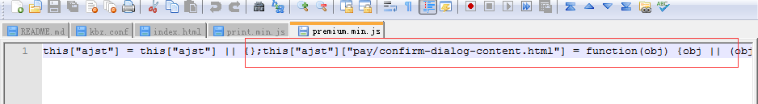

## 前言
通过  可以知道我们重新用gulp 做了一个静态页面预编译组件，并且效率提高了一大截。既然已经选择把官网的打包构建从 grunt 转为 gulp 了，那么还有一个组件还需要编写成gulp，那就是 **grunt-jst-concat** 组件：[npm 组件传送门 grunt-jst-concat](https://www.npmjs.com/package/grunt-jst-concat)
这个组件也是我们项目的人自己写的，其目的就是项目中有用到 **underscore** 模板的js文件，将模板html文件编译成jst（或者js后缀）后缀的模板编译文件，然后插入到其调用js的文件内容前面。
这样子就可以在js调用**underscore** 模板的时候，直接执行该js，而不需要再去请求模板，而从节省了一次http请求。
<!--more-->

然后在调用模板的时候，判断如果是publish方式的话，就直接执行 
```
window["ajst"][name + '.html'](obj)
```
来获取模板,调用模板的代码如下：
```javascript
window.util.getTemplate = function (name, obj) {
  var tpl, url, file_url;
  url = this.getTemplateBaseUrl() + '/tpl/' + name;
  file_url = url + '.js';
  obj = obj || {};
  obj = $.extend(true, {lang: Airdroid ? Airdroid.Lang : {}}, obj);
  // 非debug模块，就用内联模板
  if(I18n && !I18n.Airdroid_isDebug){
    return window["ajst"][name + '.html'](obj);
  }else{
    tpl = this.cacheTpls[file_url] || $.ajax({ url: url + '.html', async: false, cache: true }).responseText;
    return _.template(tpl, obj);
  }
};
```
## 旧版grunt代码分析
**grunt-jst-concat** 代码如下：
```javascript
'use strict';

module.exports = function (grunt) {

  grunt.registerMultiTask('jst_concat', 'Your task description goes here.', function () {
    var options = this.options({
      separator_start: '',
      separator_end: '',
      jst_path: 'tmp/template/',
      jst_ext: ".jst",
      namespace: 'JST',
      pattern: /CustomGetTemplateFn\s*\(\'(.*?).html\'\)/g,
      replace_text: "$1",
      replace: null
    });

    // Iterate over all specified file groups.
    this.files.forEach(function (f) {
      f.src.filter(function (filepath) {
        // Warn on and remove invalid source files (if nonull was set).
        if (!grunt.file.exists(filepath)) {
          grunt.log.warn('Source file "' + filepath + '" not found.');
          return false;
        } else {
          return true;
        }
      }).map(function (filepath) {

          var js_source = grunt.file.read(filepath);

          //通过正则找出所有的 GetTemplate() 方法，得到模版文件列表
          var myregexp = options.pattern;
          var group = js_source.match(myregexp);

          if (group) {

            var output = "";
            var arr = {};

            for (var i = 0; i < group.length; i++) {

              var file_name = group[i].replace(myregexp, options.replace_text);

              //当前JS文件中，此模版还未被合并
              if (!arr[file_name]) {

                //标识此模版已经合并
                arr[file_name] = true;
                var jst = grunt.file.read(options.jst_path + file_name + options.jst_ext);

                //运行自定义替换函数
                if (options.replace) {
                  jst = options.replace(jst);
                }

                output = output + jst;
              }
            }

            js_source = options.separator_start + output + options.separator_end + js_source;

            grunt.log.writeln('File "' + filepath + '" contact jst.');
          }

          grunt.file.write(f.dest, js_source);

        });
    });
  });
};
```
在 **gruntfile.js** 的调用方式如下：
```javascript
// 模板压缩
jst: {
    compile: {
        options: {
            namespace: "ajst",
            prettify: true
        },
        files: [
            {
                expand: true,
                cwd: '<%=dist %>/tpl/',
                src: ['**/*.html'],
                dest: '<%=dist %>/tpl2/',
                ext: '.jst'
            }
        ]
    }
},


//JST模版联合
jst_concat: {
    custom_options: {
        options: {
            separator_start: '',
            separator_end: '',
            jst_path: '<%=dist %>/tpl2/',
            jst_ext: ".jst",
            pattern: /getTemplate\s*\(\s*[\"']([\w/-]+)[\"']\s*\s*/g,
            replace_text: "$1",
            replace: function (jst) {
                jst = jst.replace(/(this\["ajst"\]\[")(.*)\/tpl\/(.*)("\])/g, "$1$3$4");
                jst = jst.replace(/\n|\r/g, "");
                return jst;
            }
        },
        files: [
            {
                expand: true,
                cwd: '<%=dist %>/js',
                src: ['**/*.min.js'],
                dest: '<%=dist %>/js',
                ext: '.min.js'
            }
        ]
    }},
```
其具体逻辑如下：
1. 将 所有的模板编译成 jst 模板文件，即 jst 目录 （这个是另一个grunt任务 jst）
2. 遍历所传入的所有js文件，通过正则(即pattern参数 和 replace_text)找出所有调用文件模板的所有文件模板列表
3. 根据传入的jst_path 和 jst_ext 获取到该jst模板文件的内容，并运行自定义替换函数进行修改，最后塞到js文件的头部，最后返回这个修改过的js文件。

## gulp 代码分析
而重写后的gulp组件 gulp-conat-jst 逻辑基本不变，只不过换成用gulp的方式来写而已: [npm 组件传送门 gulp-concat-jst](https://www.npmjs.com/package/gulp-concat-jst)
**gulp-concat-jst/index.js**:
```javascript
'use strict';

var gutil = require('gulp-util');
var fs = require('graceful-fs');
var map = require('map-stream');
var _ = require("lodash");

module.exports = function(options) {
    options = _.extend({
        separator_start: '',
        separator_end: '',
        jst_path: 'tmp/template/',
        jst_ext: ".jst",
        pattern: /CustomGetTemplateFn\s*\(\'(.*?).html\'\)/g,
        replace_text: "$1",
        replace: null
    }, options);
    return map(function (file, cb) {
      if (file.isNull()) {
          console.log("null");
          return callback(null, file);
      }
      if (file.isStream()) {
          console.log("stream");
          return callback(null, file);
      }

      if (file.isBuffer()) {
          var js_source = fs.readFileSync(file.path,  { encoding : 'UTF-8'});
          //通过正则找出所有的 GetTemplate() 方法，得到模版文件列表
          var myregexp = options.pattern;
          var group = js_source.match(myregexp);
          if (group) {
              var output = "";
              var arr = {};
              for (var i = 0; i < group.length; i++) {
                  var file_name = group[i].replace(myregexp, options.replace_text);
                  //当前JS文件中，此模版还未被合并
                  if (!arr[file_name]) {
                      //标识此模版已经合并
                      arr[file_name] = true;
                      var jst = fs.readFileSync(options.jst_path + file_name + options.jst_ext, { encoding : 'UTF-8'});
                      // 这个jst的组件最后没有加上分号，这边要手动加下，免得后面合并的时候，有语法错误
                      jst += ";";
                      //运行自定义替换函数
                      if (options.replace) {
                          jst = options.replace(jst, file_name);
                      }
                      output = output + jst;
                  }
              }
              js_source = `${options.separator_start}${output}${options.separator_end}${js_source}`;
              console.log(gutil.colors.green(`File ${file.path} contact jst.`));
              file.contents = new Buffer(js_source);
              cb(null, file);
          }else{
              return cb(null, file);
          }
      }
    });
};
```
最后在官网的新版的gulp的应用如下：
```javascript
gulp.task('jst', function(){
    return gulp.src(`${global.config.workDir}/${global.config.tplDir}/**/*.html`)
        .pipe(jst())
        .pipe(gulp.dest(`${global.config.buildDir}/jst`))
});

// 读取js文件，然后将需要的模板放置到js里面
gulp.task('concat_jst', function(){
    return gulp.src(`${global.config.buildVersionDir}/${global.config.jsDir}/*.js`)
        .pipe(concat_jst({
            jst_path: `${global.config.buildDir}/jst/`,
            jst_ext: ".js",
            pattern: /getTemplate\s*\(\s*[\"']([\w/-]+)[\"']\s*\s*/g,
            replace_text: "$1",
            replace: function(jst, tmpFile){
                return `this["ajst"] = this["ajst"] || {};this["ajst"]["${tmpFile}.html"] = ${jst}`;
            }
        }))
        .pipe(uglify())
        .pipe(gulp.dest(`${global.config.buildVersionDir}/${global.config.jsDir}`))
});
```

---
系列文章















