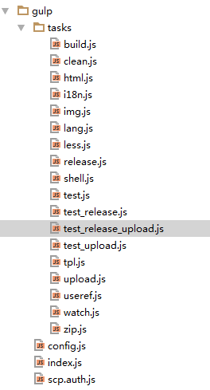
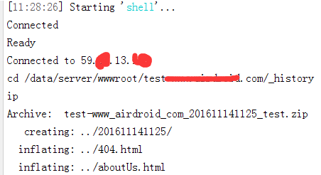

## 前言
通过  可以知道grunt打包构建的流程。
本篇主要是把之前官网的grunt构建换成扩展更好，可读性更强，速度更快的gulp构建。
目录结构如下：
<!--more-->

当然还有一个就是 **gulpfile.js** 这边截图没有看到，其实这个文件很简单，就是引用上面的 gulp 目录, 其实就是 require  gulp/index.js 这个文件。
具体 **gulpfile.js** :
```javascript
'use strict';
require('./gulp');
```
没错，就是这么简单，所以接下来就分析 gulp 目录下的 gulp/index.js。
## 分析任务
### index.js
直接看头文件 **gulp/index.js**：
```javascript
'use strict';
var fs = require('fs');
var config = require('./config');
var task = fs.readdirSync('./gulp/tasks/');
var moment = require('moment');
// 初始化版本号和对应的配置文件
global.buildVersion = moment().format("YYYYMMDDHHmm");
global.config = config(global.buildVersion);
task.forEach(function (task) {
    require('./tasks/' + task);
});
```
主要确认了一个当前打包的版本号，一个是打包过程中，所用的一些配置文件，即 config.js
### config.js
```javascript
'use strict';
module.exports = function(version) {
    var config =  {
        "version": version,
        "workDir": "workspace",
        "jsDir": "js",
        "cssDir": "css",
        "lessDir": "less",
        "imgDir": "img",
        "langDir": "lang",
        "tplDir": "tpl",
        "htmlDir": "html",
        "delFileList": ['build', 'build_gzip', ".tmp"],
        "supportLangs": {
            "en": {
                "code": "en"
            },
            "ja": {
                "code": "ja"
            },
            "it": {
                "code": "it"
            },
            "de": {
                "code": "de"
            },
            "pt-br": {
                "code": "pt-BR"
            },
            "es-es": {
                "code": "es-ES"
            },
            "fr": {
                "code": "fr"
            },
            "zh-cn": {
                "code": "zh-CN"
            },
            "pt-pt": {
                "code": "pt-PT"
            },
            "ru": {
                "code": "ru"
            }
        },
        "htmlFiles": [
            "html/legal/eula.html",
            "html/index.html",
            <!-- .... 这边省略了一堆的 html 文件 ... -->
            "html/get.html"
        ],
        "apiVersion": "p14",
        "static_base_url": "//www.xxx.com"
    };
    config.buildDir = 'build/';
    config.buildVersionDir = config.buildDir + version + "/";
    // 匹配正则
    var allDirs = [config.jsDir, config.cssDir, config.imgDir, config.langDir, config.tplDir];
    config.REG_EXP_RESOURCE = new RegExp("(url\\(|['\"])(\\.{0,2}\/)+.*?((" + allDirs.join("|") + ")\/(.*?\\.(png|jpg|gif|css|js|ico|html|json)))(['\")])", 'g');
    return config;
};
```
主要是一些目录和文件的配置， 即各个目录的位置。 而接下来的 **gulp/tasks** 目录下的各个文件就是一些gulp的任务。
其中一般打包的执行任务就是下面几个：
### 不同环境打包任务
#### 测试环境模式
**test.js** => **gulp d** 即测试环境模式
```javascript
'use strict';
var gulp = require('gulp');
var run_seq = require("run-sequence");
// 开发模式
gulp.task('d', cb => {
    global.config.static_base_url = global.config.static_base_url.replace('//', '//test-');
    run_seq("build", "zip", cb);
});
```
#### 测试环境模式，并且上传到测试服务器并解压到对应目录
**test_upload.js** => **gulp du** 即测试环境模式，并且上传到测试服务器并解压到对应目录
```javascript
'use strict';
var gulp = require('gulp');
var seq = require("gulp-sequence");
// 开发模式, 并上传到服务器并解压
gulp.task('du', seq("d", "upload", "shell"));
```
#### 正式环境模式
**release.js** => **gulp r** 即正式环境模式
```javascript
'use strict';
var gulp = require('gulp');
var replace = require("gulp-replace");
var seq = require("gulp-sequence");
// release 版本， 更新服务端接口地址和版本号
gulp.task('release_server_url', cb => {
    return gulp.src(`${global.config.buildVersionDir}/${global.config.jsDir}/framework.min.js`)
    // release url 修改
    .pipe(replace(/(idUrl\s*:\s*['"]*)(.*?)(['"]*[,;\s])/, '$1https://id4.xxx.com/$3'))
    .pipe(replace(/(payUrl\s*:\s*['"]*)(.*?)(['"]*[,;\s])/, '$1https://pay.xxx.com/$3'))
    .pipe(replace(/(serverUrl\s*:\s*['"]*)(.*?)(['"]*[,;\s])/, '$1https://srv3.xxx.com/$3'))
    // api 版本修改
    .pipe(replace(/(apiVersion\s*:\s*['"]*)(.*?)(['"]*[,;\s])/, `$1${global.config.apiVersion}$3`))
    .pipe(gulp.dest(`${global.config.buildVersionDir}/${global.config.jsDir}`));
});
gulp.task('r', seq("build", "release_server_url", "zip"));
```
#### 正式环境模式，但是域名有变，即预发布环境
**test_release.js** => **gulp n** 即正式环境模式，但是域名有变，即预发布环境（测试服务器上的域名
```javascript
'use strict';
var gulp = require('gulp');
var run_seq = require("run-sequence");
// 开发模式
gulp.task('n', cb => {    
    global.config.static_base_url = global.config.static_base_url.replace('//', '//new-');    
    run_seq("r", cb);
});
```
#### 正式环境模式，即预发布环境, 并上传到测试服务器并解压到对应目录
**test_release_upload.js** => **gulp nu** 即正式环境模式，即预发布环境, 并上传到测试服务器并解压到对应目录
```javascript
'use strict';
var gulp = require('gulp');
var seq = require("gulp-sequence");
// 正式地址的预发布环境, 并上传到服务器并解压
gulp.task('nu', seq("n", "upload", "shell"));
```
### 构建完之后的任务
以上这5个任务，除了打包时的处理build任务，之外，还有3个任务是打包后的逻辑
#### 打包目录打成zip包
将打包目录打成zip包， 即 **gulp zip**
```javascript
'use strict';
var gulp = require('gulp');
var zip = require('gulp-zip');
// 打成zip包
gulp.task('zip', function() {
    var task_name = this.seq.slice(-1)[0] === "r" ? "release" : "test";
    global.config.zipName = `${global.config.static_base_url.replace(/\//g,"").replace(/\./g,"_")}_${global.config.version}_${task_name}.zip`;
    return gulp.src(`${global.config.buildDir}/**`)
        .pipe(zip(global.config.zipName))
        .pipe(gulp.dest('.'));});
```
#### 将zip上传到对应的服务器
将打成的zip，上传到对应的服务器 **gulp upload**
```javascript
'use strict';
var path = require('path');
var fs = require('fs');
var gulp = require('gulp');
var scp = require('gulp-scp2');
// 上传到测试服务器 （支持 test-www 和 new-www）
gulp.task('upload', cb => {
    var auth;
    if (fs.existsSync(path.join(__dirname, '../scp.auth.js'))) {
        auth = require('../scp.auth.js');
    }
    if (!auth) {
        // 要上传到服务器，需要提供 .ssh 文件做身份验证。
        console.log('要上传到服务器，需要提供 .ssh 文件做身份验证。');
        return;
    }
    global.config.server_folder_path = `/data/server/wwwroot/${global.config.static_base_url.replace('//', '')}/_history`;
    return gulp.src(global.config.zipName)
        .pipe(scp({
            host: '59.xx.13.xx',
            username: auth.username,
            privateKey: auth.privateKey,
            dest: global.config.server_folder_path
        })).on('error', function(err) {
            console.log(err);
        });
});
```
#### 将zip包解压缩到指定的目录 shell 任务
最后是将上传到服务器的zip包进行解压缩到指定的目录 shell 任务 **gulp shell**
```javascript
'use strict';
var gulp = require('gulp');
var path = require('path');
var fs = require('fs');
var SSH2Shell = require ('ssh2shell');
// 上传到测试服务器后，进行一些shell操作，解压这个上传的zip包
gulp.task('shell', cb => {
    var auth;
    if (fs.existsSync(path.join(__dirname, '../scp.auth.js'))) {
        auth = require('../scp.auth.js');
    }
    if (!auth) {
        // 要上传到服务器，需要提供 .ssh 文件做身份验证。
        console.log('要上传到服务器，需要提供 .ssh 文件做身份验证。');
        return;
    }
    var host = {
        server: {
            host: '59.xx.13.xx',
            userName: auth.username,
            privateKey: auth.privateKey
        },
        commands: [`cd ${global.config.server_folder_path}`, `unzip -o -d .. ${global.config.zipName}`]
    };
    //Create a new instance passing in the host object
    var SSH = new SSH2Shell(host);
    //Use a callback function to process the full session text
    var callback = function(sessionText){
        console.log(sessionText);
        cb();
    };
    //Start the process
    SSH.connect(callback);
});
```
就执行两个指令，一个是定位到对应目录的history目录，然后解压对应的zip包到上级目录。
其中-o指令是忽略提示直接覆盖文件， -d 是指定要解压后的目录，这里就是上级目录 ..
而且 **scp.auth.js** 是关于服务器权限的认证文件，大约长这样：
```javascript
var fs = require('fs');
module.exports = {
    username: 'foo',
    privateKey: fs.readFileSync('F:/xxx/id_rsa')
};
```
### 真正负责打包的build任务
真正打包的处理任务是 build 任务： **tasks/build.js**
```javascript
'use strict';
var gulp = require('gulp');
var seq = require("gulp-sequence");
gulp.task('build', seq("clean", "less", "lang", "img", "useref", "tpl", "html", "i18n"));
```
上面有八个任务，即把打包分成8个步骤：
#### 1 clean 任务，即先清理上次打包的残渣
**tasks/clean.js**:
```javascript
'use strict';
var gulp = require('gulp');
var del = require('del');
// 清理
gulp.task('clean', cb => {    
    return del(global.config.delFileList, cb);
});
```
#### 2 less 任务，即将workspace里面的less编译成css
**tasks/less.js**:
```javascript
'use strict';
var gulp = require('gulp');
var less = require('gulp-less');
gulp.task('less', () => {
    return gulp.src(`${global.config.workDir}/${global.config.lessDir}/*.less`)
        .pipe(less())
        .pipe(gulp.dest(`${global.config.workDir}/${global.config.cssDir}`));});
```
#### 3 lang 任务，语言文件处理
即将workspace里面的lang目录放到build/<version>目录里面, **tasks/lang.js**:
```javascript
'use strict';
var gulp = require('gulp');
var uglify = require('gulp-uglify');
// lang 处理, 主要是复制
gulp.task('lang', cb => {
    return gulp.src(`${global.config.workDir}/${global.config.langDir}/*.js`)
        .pipe(uglify({
            compress: { drop_console: true }
        }))
        .pipe(gulp.dest(`${global.config.buildVersionDir}/${global.config.langDir}`));
});
```
#### 4 img 任务，图片处理
即将workspace里面的img目录放到build/<version>目录里面, **tasks/img.js**:
```javascript
'use strict';
var gulp = require('gulp');
// 针对图片进行处理，这边只进行文件迁移
gulp.task('img', function(){
    return gulp.src(`${global.config.workDir}/${global.config.imgDir}/**/*`)
        .pipe(gulp.dest(`${global.config.buildVersionDir}/${global.config.imgDir}`))
});
```
#### 5 useref 任务，针对html进行处理
即对html文件引用的js和css进行压缩和合并(相当于grunt打包的usemin，不过更强大), **tasks/useref.js**:
```javascript
'use strict';
var gulp = require('gulp');
var gulpIf = require('gulp-if');
var minifyCSS = require('gulp-minify-css');
var uglify = require('gulp-uglify');
var autoprefixer = require('gulp-autoprefixer');
var useref = require('gulp-useref');
// 针对html进行处理，即对html文件进行压缩和合并
gulp.task('useref', function(){
    return gulp.src(global.config.htmlFiles.map(item => {
        return `${global.config.workDir}/${item}`
    }), {base: './html'})
        .pipe(useref({searchPath: "."}))
        // Minifies only if it's a CSS file
        .pipe(gulpIf('*.css', minifyCSS()))
        .pipe(gulpIf('*.css', autoprefixer()))
        // Uglifies only if it's a Javascript file
        .pipe(gulpIf('*.js', uglify()))
        // 这时候生成的html文件会在 build/<version>/workspace/html 里面，这个是临时的，后面要去掉
        .pipe(gulp.dest(global.config.buildVersionDir))
});
```
#### 6 tpl 任务，针对模板处理
先把html模板编译成 jst 模板，然后读取js，将jst模板的内容合并到js文件的前面, **tasks/tpl.js**:
```javascript
'use strict';
var gulp = require('gulp');
var jst = require("gulp-jst");
var uglify = require('gulp-uglify');
var concat_jst = require("gulp-concat-jst");
var seq = require("gulp-sequence");
var del = require('del');

// 这边针对html 模板进行处理，总共分两步
// 第一是将html模板编译成 jst 模板
// 然后读取js，将jst模板的内容合并到js文件的前面

// 第一是将html模板编译成 jst 模板
gulp.task('jst', function(){
    return gulp.src(`${global.config.workDir}/${global.config.tplDir}/**/*.html`)
        .pipe(jst())
        .pipe(gulp.dest(`${global.config.buildDir}/jst`))
});
// 读取js文件，然后将需要的模板放置到js里面
gulp.task('concat_jst', function(){
    return gulp.src(`${global.config.buildVersionDir}/${global.config.jsDir}/*.js`)
        .pipe(concat_jst({
            jst_path: `${global.config.buildDir}/jst/`,
            jst_ext: ".js",
            pattern: /getTemplate\s*\(\s*[\"']([\w/-]+)[\"']\s*\s*/g,
            replace_text: "$1",
            replace: function(jst, tmpFile){
                return `this["ajst"] = this["ajst"] || {};this["ajst"]["${tmpFile}.html"] = ${jst}`;
            }
        }))
        .pipe(uglify())
        .pipe(gulp.dest(`${global.config.buildVersionDir}/${global.config.jsDir}`))
});
// 去掉生成的 jst 的临时文件夹
gulp.task('del_jst', cb => {
    return del(`${global.config.buildDir}/jst/`, cb);
});
gulp.task('tpl', seq("jst", "concat_jst", "del_jst"));
```
#### 7 html 任务，针对html文件进行处理
加上版本号和绝对地址，修改打包后的模板地址，和语言包的路径, **tasks/html.js**:
```javascript
'use strict';
var gulp = require('gulp');
var uglify = require('gulp-uglify');
var seq = require("gulp-sequence");
var del = require('del');
var replace = require("gulp-replace");

// html 处理
// 之前在执行 useref 任务的时候，有在 build 目录下，生成 build/workspace/html 目录， 第一步先把这个html目录提到 build/<version>
gulp.task('html_move', cb => {
    return gulp.src(`${global.config.buildDir}/${global.config.workDir}/${global.config.htmlDir}/**/*.html`)
        .pipe(gulp.dest(`${global.config.buildVersionDir}/${global.config.htmlDir}`));
});
// 去掉那个临时目录
gulp.task('del_tmp_html', cb => {
    return del(`${global.config.buildDir}/${global.config.workDir}`, cb);
});
// 给提出来的html文件，加上版本号，并设置绝对地址(包括html文件里面的图片，url，等等都要)
gulp.task('html_replace_src_url', cb => {
    return  gulp.src(`${global.config.buildVersionDir}/${global.config.htmlDir}/**/*.html`)
        .pipe(replace(global.config.REG_EXP_RESOURCE, `$1/${global.config.version}/$3$7`))
        .pipe(gulp.dest(`${global.config.buildVersionDir}/${global.config.htmlDir}`));
});
// 修改打包后的模板地址，和语言包的路径
gulp.task('html_replace_base_url', cb => {
    return  gulp.src(`${global.config.buildVersionDir}/${global.config.jsDir}/framework.min.js`)
        // 模版地址修改
        .pipe(replace(/(util\.setTemplateBaseUrl\(('|")).*?(('|")\))/, `$1/${global.config.version}$3`))
        // 语言文件地址修改
        .pipe(replace(/(buildLangURl\s*:\s*)('|")(\S*?)('|"),/, `$1$2/${global.config.version}/lang/$4,`))
        // 修改资源路径
        .pipe(replace(/(resourceUrl\s*:\s*['"]*)(.*?)(['"]*[,;\s])/, `$1/${global.config.version}/$3`))
        .pipe(gulp.dest(`${global.config.buildVersionDir}/${global.config.jsDir}`));
});
gulp.task('html', seq("html_move", "del_tmp_html", "html_replace_src_url", "html_replace_base_url"));
```
#### 8 i18n任务，主要是多语言静态化页面编译
**tasks/i18n.js**:
```javascript
'use strict';

var gulp = require('gulp');
var path = require("path");
var staticfy = require('gulp-staticfy');
var seq = require("gulp-sequence");
var _ = require("lodash");
var del = require('del');
var replace = require("gulp-replace");
var htmlmin = require("gulp-htmlmin");
// 这边还要有个默认的(默认都把英语加上去)
var langArr = _.keys(global.config.supportLangs);
langArr.indexOf("en") === 0 && langArr.push("en");
var langTaskListMap = {};

// i18n 处理，主要是多语言静态化页面编译

// 首先要把tpl模板拷贝过来
gulp.task('move_tpl', function(){
    return gulp.src(`${global.config.workDir}/${global.config.tplDir}/**/*`)
        .pipe(gulp.dest(`${global.config.buildVersionDir}/${global.config.tplDir}`))
});
// 批量注册任务
langArr.forEach(lang => {
    langTaskListMap[`${lang}-staticfy`] = gulp.task(`${lang}-staticfy`, function() {
        // 这边要指定路径，dest才会复制目录结构
        // 这边一定要return，不然就会变成异步，而不会同步
        return gulp.src(`${global.config.buildVersionDir}/${global.config.htmlDir}/**/*.html`)
            .pipe(staticfy({
                server_url: path.resolve(global.config.buildDir),
                query_string: `lang=${lang}`
            }))
            // 接下来就是各种替换
            // 预编译要跟进对应的语言，对 a 标签的相对路径进行替换
            .pipe(replace(/(<a.*?href=['"])(\/.*?)(['"])/gi, `$1/${lang}$2$3`))
            // 消除 jsonp 请求产生的 script 标签
            .pipe(replace(/<script.*async="".*?<\/script>/g, ''))
            // 消除 首页加载Google字体请求产生的link标签
            .pipe(replace(/<link.*http:\/\/fonts.googleapis.com.*?>/, ''))
            // 清理首页的图片，重设为隐藏
            .pipe(replace(/()/g, '$1$2'))
            // 清理邮件验证页，重设为隐藏
            .pipe(replace(/"(item-verify-send)"/, '"$1 i-hide"'))
            // signin 重置链接地址
            .pipe(replace(/(href=".*signin\/)\?.*(")/, '$1$2'))
            // 重置 header 右侧的 item-actions 和 item-profile 的状态
            .pipe(replace(/"(item-actions|item-profile)"/, '"$1 i-hide"'))
            // 去掉指定的要删除的脚本
            .pipe(replace(/<script.*id="removeScript".*?<\/script>/g, ''))
            // 去掉自动下载的iframe中的url
            .pipe(replace(/(<iframe id="downloadFrame".*?)(src=")(\S+)(".*><\/iframe>)/g, '$1$2$4'))
            // 去掉首页 Facebook twitter g+ 的 addthis widget 中间代码
            .pipe(replace(/<div.*id="_atssh".*?<\/iframe><\/div>/g, ''))
            // 这条规则要特别注意(用于首页清除addthis的样式)，很容易请到别的页面，所以尽量不要在页面内加上style标签
            .pipe(replace(/<style.*type="text\/css".*?<\/style><\/head>/g, '</head>'))
            // 最后把对应的语言文件再加到里面去
            .pipe(replace(/<\/head>/, `<script src="/${global.config.version}/lang/${global.config.supportLangs[lang].code || lang}.js"></script></head>`))
            .pipe(gulp.dest(`${global.config.buildDir}/${lang}`));
    });
});
// 接下来把 英语 的文件复制一份，往上提一份，当做默认路径的语言
gulp.task('copy_and_move_en', function(){
    return gulp.src(`${global.config.buildDir}/en/**/*`)
        .pipe(gulp.dest(global.config.buildDir))
});
// 预编译之后，把debug模式去掉
gulp.task('change_debug_mode', cb => {
    return  gulp.src(`${global.config.buildVersionDir}/${global.config.jsDir}/framework.min.js`)
        // 模版地址修改
        .pipe(replace(/(Airdroid_isDebug\s*:\s*['"]*)(.*?)(['"]*[,;\s])/, '$1false$3'))
        .pipe(gulp.dest(`${global.config.buildVersionDir}/${global.config.jsDir}`));
});
// 如果都已经静态化编译成功了，那么就把原来的那一份html目录 和 tpl 目录去掉
gulp.task('del_staticfy_file', cb => {
    return del([
        `${global.config.buildVersionDir}/${global.config.htmlDir}`,
        `${global.config.buildVersionDir}/${global.config.tplDir}`
    ], cb);
});
// 接下来把html进行一些压缩优化
gulp.task('htmlmin', cb => {
    return gulp.src(`${global.config.buildDir}/**/*.html`)
        .pipe(htmlmin({
            // 去掉空格，压缩一行显示
            //collapseWhitespace: true,
            // 去掉注释
            removeComments: true
        }))
        .pipe(gulp.dest(global.config.buildDir));
});
// 接下来遍历 html 文件，为资源添加完整的 静态地址，包括图片
gulp.task('release_static_url', cb => {
    return  gulp.src(`${global.config.buildDir}/**/*.html`)
        // $3 匹配的是资源路径
        .pipe(replace(global.config.REG_EXP_RESOURCE, `$1${global.config.static_base_url}/${global.config.version}/$3$7`))
        // $1 匹配的是引号
        // $3 匹配的是资源路径
        .pipe(replace(new RegExp(`('|\")(\\.{0,2}\/)+((${global.config.langDir})\/*.*)('|\")`, 'g'), `$1${global.config.static_base_url}/${global.config.version}/$3$1`))
        .pipe(gulp.dest(global.config.buildDir));
});

gulp.task('staticfy', seq.apply(null,_.keys(langTaskListMap)));
gulp.task('i18n', seq("move_tpl", "staticfy", "copy_and_move_en", "change_debug_mode", "del_staticfy_file", "htmlmin", "release_static_url"));
```
## 总结
所以大概改成 gulp 构建之后就是这样了，后面测试了一下，无论是整个结构还是打包的速度，都比grunt构建还要快，而且更容易维护，因为他是一个一个任务分开的，不像grunt那样全部写在一块。每次看代码，都要找半天。
当然，这个虽然已经可以work了，并且测了一下，可以正常打包，并且会自动上传到服务器，并进行解压覆盖了，看起来非常完美 o(*￣︶￣*)o
```
[14:25:44] Starting 'd'...
[14:25:44] Starting 'build'...
[14:25:44] Starting 'clean'...
[14:25:45] Finished 'clean' after 306 ms
[14:25:45] Starting 'less'...
[14:25:47] Finished 'less' after 2.5 s
[14:25:47] Starting 'lang'...
[14:25:51] Finished 'lang' after 4.07 s
[14:25:51] Starting 'img'...
[14:25:51] Finished 'img' after 236 ms
[14:25:51] Starting 'font'...
[14:25:51] Finished 'font' after 6.77 ms
[14:25:51] Starting 'useref'...
[14:29:07] Finished 'useref' after 3.25 min
[14:29:07] Starting 'tpl'...
[14:29:07] Starting 'jst'...
[14:29:07] Finished 'jst' after 223 ms
[14:29:07] Starting 'concat_jst'...
[14:29:20] Finished 'concat_jst' after 13 s
[14:29:20] Starting 'del_jst'...
[14:29:20] Finished 'del_jst' after 61 ms
[14:29:20] Finished 'tpl' after 13 s
[14:29:20] Starting 'html'...
[14:29:20] Starting 'html_move'...
[14:29:20] Finished 'html_move' after 54 ms
[14:29:20] Starting 'del_tmp_html'...
[14:29:20] Finished 'del_tmp_html' after 16 ms
[14:29:20] Starting 'html_replace_src_url'...
[14:29:20] Finished 'html_replace_src_url' after 53 ms
[14:29:20] Starting 'html_replace_base_url'...
[14:29:20] Finished 'html_replace_base_url' after 15 ms
[14:29:20] Finished 'html' after 141 ms
[14:29:20] Starting 'i18n'...
[14:29:20] Starting 'move_tpl'...
[14:29:20] Finished 'move_tpl' after 138 ms
[14:29:20] Starting 'staticfy'...
[14:29:20] Starting 'en-staticfy'...
201809131425/html/404.html loading ...
201809131425/html/aboutUs.html loading ...
```

但是这个其实不是最终版本，后面还会遇到一些问题。


