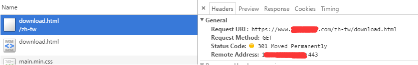
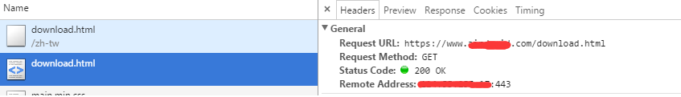

## 前言
之前那么多篇幅，其实有很大一部分是要将官网的多语言的页面进行静态化预编译，以对SEO进行优化。 本篇主要是讲一讲官网的多语言的跳转规则。
## 现象
先说一下现象吧。
**就是如果尝试请求一个没有该语言的页面。那么就会跳转到默认语言的对应页面。如果这个页面还不存在，最后才跳转到404页面**
<!--more-->
比如我请求一个没有该语种的页面，比如： 
```
https://www.xxx.com/zh-tw/download.html
```
事实上这个页面在服务器上是不存在的，因为官网没有**zh-tw**这一门语言。
但是这时候不会直接显示404页面。因为download这个页面，其实在服务器上是存在的。因此页面会跳转到本地默认语言的download页面，假设我是默认语言是中文，那么就会跳转成
**https://www.xxx.com/zh-cn/download.html**， 如果我请求的是 **https://www.xxx.com/zh-tw/download111.html**， 那么这时候就会出现404页面了，因为 **download111** 这个页面在任何语言都不存在。
## 分析
上述情况的发生，主要是归功于一个 nginx 的配置(这边没有把整个都列出来)：
```javascript
<!-- 其他配置 -->
error_page 404 /404.html;
location / {
    if (!-e $request_filename) {
        rewrite ^/([A-Za-z0-9_-]+)/(.*) /$2 permanent;
    }
}
```
跳转的规则，就是如果nginx上找不到这个对应的页面。那么就把前一层的路径去掉，并重定向。
所以上述例子的 **https://www.xxx.com/zh-tw/download.html**，就会去掉前一层的路径 **zh-tw/**, 最后变成 **https://www.xxx.com/download.html**， 这个页面是存在的。所以成功返回给前端了。


这时候成功加载 **https://www.xxx.com/download.html**
如果这时候这个页面还是在服务器上不存在的，如果还有前一层的路径，就继续去掉前一层的路径，然后再重定向，如果都没有前一层了，并且还不存在，那么就会返回 404， 并最后重定向到 404.html 页面
当前端收到这个不带语言路径的页面的时候 **https://www.xxx.com/download.html**，这时候这个页面回去请求js，其中有一个 **i18n.js** 的文件，请求加载的时候，就会执行 init 事件：
```javascript
(function (_window) {
    _window.I18n = {
        // 设置是否是debug 模式,如果是debug模式，那么就同步加载语言,打包的时候，要设置为true
        Airdroid_isDebug: true,
        // 设置设置语言的路径，打包的时候，要替换成打包地址
        buildLangURl: "/workspace/lang/",
        // 当前语言
        currLang: 'en',
        // 所支持的语言
        supportLang: {
            "en": {
                name: "English",
                code: "en"
            },
            "de": {
                name: "Deutsch",
                code: "de"
            },
            "es-es": {
                name: "Español",
                code: "es-ES"
            },
            "fr": {
                name: "Français",
                code: "fr"
            },
            "it": {
                name: "Italiano",
                code: "it"
            },
            "pt-br": {
                name: "Português(BR)",
                code: "pt-BR"
            },
            "ja": {
                name: "日本語",
                // 这个对应 语言文件的名字，因为有些文件有大小写之分
                code: "ja"
            },
            "zh-cn": {
                name: "简体中文",
                code: "zh-CN"
            },
            "pt-pt": {
                name: "Português(PT)",
                code: "pt-PT"
            },
            "ru": {
                name: "русский",
                code: "ru"
            }
        },

        init: function () {
            var self = this,
                urlParamLang, originLang, lang, urlPathLang;

            urlParamLang = this.getUrlParamLang();
            originLang = this.getOriginLang();
            urlPathLang = this.getUrlPathLang();

            // 语言被支持，则更换当前语言，不被支持，则维持原语言
            lang = this.isSupportedLang(urlParamLang) ? urlParamLang : originLang;
            this.setLang(lang);

            if (this.Airdroid_isDebug) {
                // 同步获取语言文件
                $.ajax({
                    url: self.buildLangURl + self.supportLang[lang].code + ".js",
                    dataType: "script",
                    async: false
                }).done(function () {
                    console.log("同步加载语言文件成功");
                });
            } else if (lang != urlPathLang && lang != 'en') {
                // 跳转到对应的地址
                console.log('check not found');
                if($("#pageNoFound").length > 0){
                    // 如果是404页面，那么就不管
                    console.log('page not found');
                    return ;
                }
                this.redirectByLang(lang);
                console.log('redirectByLang:' + lang);
            }
        },

        redirectByLang: function (newLang) {
            newLang = newLang.toLowerCase();
            // 这边替换语言的时候，要用//包起来，不然会出现 code 后面的 de 识别成 德语的bug
            var supportLangs = _.map(_.keys(this.supportLang), function (lang) {
                return '/' + lang + '/';
            });
            var re = new RegExp('(' + supportLangs.join('|') + ')');

            _window.location = _window.location.protocol + '//' + _window.location.host + "/" + newLang
            + _window.location.pathname.replace(re, '/')
            + _window.location.search + _window.location.hash;
        },

        /**
         * 获取浏览器语言
         * @returns {*}
         */
        getBrowserLang: function () {
            var browserLang = navigator.language || navigator.browserLanguage;
            browserLang = browserLang.toLowerCase();
            switch (browserLang.split('-')[0]) {
                case 'pt':
                    return 'pt-br';
                case 'es':
                    return 'es-es';
                default :
                    return browserLang;
            }
        },

        /**
         * 获取当前本地语言, 没有就默认英语
         * @returns {*|string|string}
         */
        getOriginLang: function () {
            var browserLang = this.getBrowserLang();
            // 优先级是 路径中的语言， cookie中的语言，浏览器中的语言，最后才是默认语言
            return (this.getUrlPathLang()    // url 路径中的语言
            || this.Airdroid_isDebug && $.cookie("lang")        // cookie 中的语言
            || this.isSupportedLang(browserLang) && browserLang // 浏览器语言
            || 'en') // 都没有就默认英语
                .toLowerCase();
        },

        /**
         * 获取 url 路径中的语言
         * @returns {*}
         */
        getUrlPathLang: function () {
            var re = new RegExp('\/(' + _.keys(this.supportLang).join('|') + ')\/');
            return (re.exec(location.pathname) || [])[1];
        },

        /**
         * 获取 url 参数中的语言
         * @returns {string}
         */
        getUrlParamLang: function () {
            return util.getUrlParam("lang").toLowerCase();
        },

        /**
         * 是否支持某个语言
         * @param lang
         * @returns {boolean}
         */
        isSupportedLang: function (lang) {
            return _.keys(this.supportLang).indexOf(lang) > -1;
        },

        setLang: function (lang) {
            lang = lang.toLowerCase();
            if (!this.isSupportedLang(lang)) return;
            this.currLang = lang;
            $.cookie("lang", lang, {
                path: "/",
                domain: '.xxx.com'
            });
        },

        getLang: function () {
            return this.currLang;
        },

        getLangName: function (lang) {
            return this.supportLang[lang].name;
        }
    };
    _window.I18n.init();
})(window);
```
通过
```javascript
urlParamLang = this.getUrlParamLang();
originLang = this.getOriginLang();
lang = this.isSupportedLang(urlParamLang) ? urlParamLang : originLang;
```
得到应该显示哪种语言，有三种方式可以获取要显示的语言，按优先级是这个：
1 从后面带的参数
2 获取本地cookie保存的语言
3 获取浏览器本地语言

主要判断的逻辑是这个
```javascript
if (lang != urlPathLang && lang != 'en') {
    // 跳转到对应的地址
    console.log('check not found');
    if($("#pageNoFound").length > 0){
        // 如果是404页面，那么就不管
        console.log('page not found');
        return ;
    }
    this.redirectByLang(lang);
    console.log('redirectByLang:' + lang);
}
```
如果 url里面已经带了语种了，并且不等于本地获取的语种，并且该语种不等于 en，并且不是 404 页面，那么就会进行跳转。
还是以 **https://www.xxx.com/download.html** 为例， 这时候可以看到他的 urlPathLang 是空的, 然后lang是有的，**zh-cn**（参数没有，cookie没有，从浏览器中有获取 zh-cn，并且在语言列表里面，所以就是 zh-cn），所以条件成立，并且不是 404 页面，所以前端就会再进行一次重定向到： **https://www.xxx.com/zh-cn/download.html**


