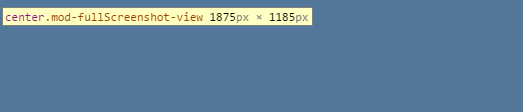
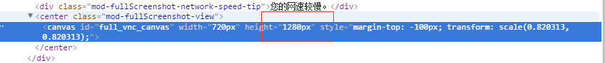
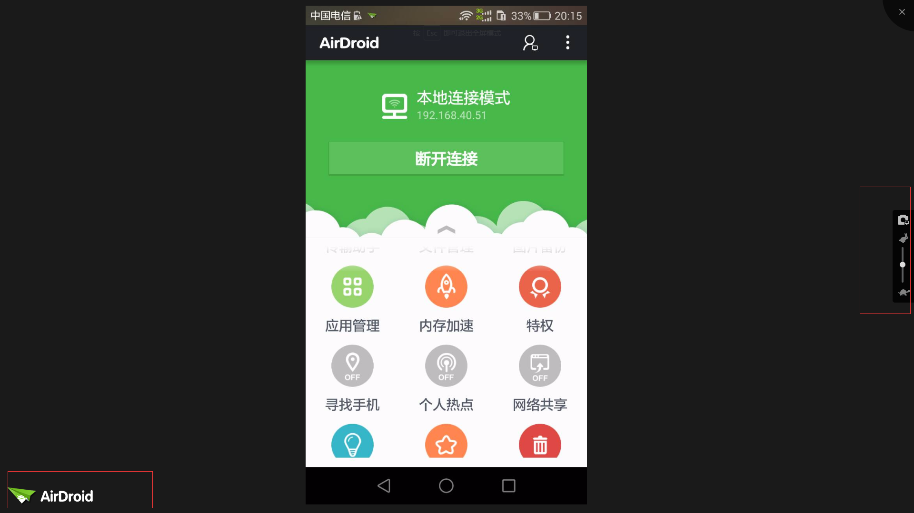
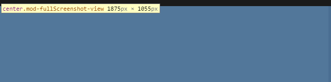
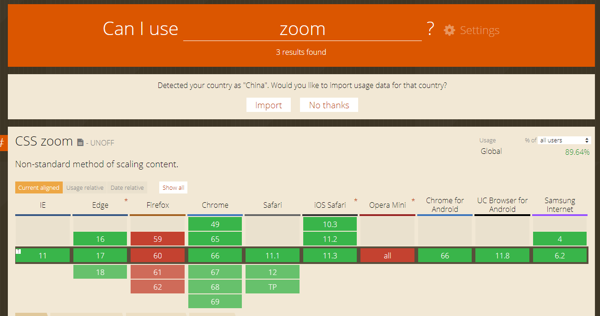
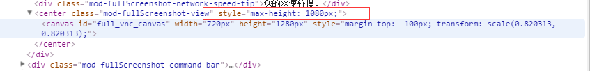

之前在做 [web.airdroid.com](http://web.airdroid.com/) 截屏模块的时候， 有遇到一个问题。就是如果截屏全屏的时候，如果有些机子的屏幕图片的高度比浏览器当前的高度还大，就会出现左下角的AirDroid LOGO 消失不见。
截图如下：

<!--more-->
可以看到右下角的AirDroid LOGO 不见了，而且可以看到操作栏是偏下的。查看了控制台的样式，发现 canvas 的父对象已经超出了屏幕的高度 1080 了，下图的高度是 1185px。

因为 canvas 图片的高度是 1280

虽然我们在代码里面用 transform:scale 来缩放图片，让图片看起来没有问题。

this.fullPlayView.css({
    "transform": "scale(" + minRatio + "," + minRatio + ")",
    "marginTop": (BODY_MAX_HIGHT_SIZE - viewHeight)/2 + 15 + "px"
});

但其实容器已经超出了，才会导致这种情况。也就是说，虽然我们用 transform:scale 让图片看起来没有超出，刚刚好。但是其实在dom结构中，canvas的高度还是没有改变的，即元素的空间还是跟缩放前的一样。所以canvas的父对象 mod-fullDcreenshot-view 的高度已经超出了浏览器高度 1080了。才会导致下面的AirDroid LOGO 跑到最下面去。
那么有没有一种方式，既可以缩放，又能够改变canvas的布局,即原始尺寸也要改变。
后面查了以下这篇文章：[小tips: zoom和transform:scale的区别](https://www.zhangxinxu.com/wordpress/2015/11/zoom-transform-scale-diff/)
其实是有的，就是 zoom,zoom 这个属性，既可以缩放，又可以改变布局，使得元素的空间跟缩放后的空间一致。
而 zoom 和 transform:scale 两者的差别在于：
1. 控制缩放的值不一样。zoom更全面，但是不能是负数，只能等比例控制；而scale虽然只能是数值，但是能负数，可以只控制1个维度。
2. zoom的缩放是相对于左上角的；而scale默认是居中缩放；
3. zoom的缩放改变了元素占据的空间大小；而scale的缩放占据的原始尺寸不变，页面布局不会发生变化；
4. 对文字的缩放规则不一致。zoom缩放依然受限于最小12像素中文大小限制；而scale就是纯粹的对图形进行比例控制，文字也按比例缩放。
5. 渲染的性能差异,在文档流中zoom加在任意一个元素上都会引起一整个页面的重新渲染，而scale只是在当前的元素上重绘。

那么我们就换成用zoom来缩放看看，将代码改成：

this.fullPlayView.css({
    "zoom": minRatio
});

看看效果：

发现 logo 出现了，而且右边的操作栏也居中。查了一下父对象，发现真的没有超出 1080

那么是不是意味着大功告成了呢？
还有一个问题？那就是 zoom 和 transform:scale 还有一个差别就是浏览器兼容性： Firefox 竟然不支持 zoom， transform:scale 要 IE9 以上支持（对于本例来说没影响）

看看使用 zoom 在Firefox的效果

果然没有进行任何的缩放，那么怎么办呢？ 是不是无解了？？？
那么如果要解决这个问题的话，要从问题的原因找出来。就是canvas的高度超出了浏览器的高度，导致canvas的父对象也超出了浏览器的高度，导致整个全屏容器也超出了浏览器的高度。才会出现这种情况。如果将canvas的父对象设置一个最大高度，让其等于浏览器的高度，是不是就可以解决这个问题了呢？

// todo 为了防止canvas缩放的时候，因为原图超出浏览器高度，导致全屏容器超出浏览器高度，因此这个要限制最大高度
if(h > window.innerHeight){
    self.currentPlayView.parent().css("maxHeight", window.innerHeight + 'px');
}

然后继续用 transform:scale，看看效果
首先是 chrome：

发现正常，可以看父对象已经被限制最大高度了

Firefox：

发现 Firefox 也是正常的。
因此就可以解决这个问题了